# Part I: Ray Fundamentals
# Chapter 2: The Ray Driver System

# Ray Driver - Comprehensive Technical Guide

## Table of Contents

1. [Introduction](#introduction)
2. [Driver Architecture Overview](#driver-architecture-overview)
3. [Driver Lifecycle Deep Dive](#driver-lifecycle-deep-dive)
4. [Communication Mechanisms](#communication-mechanisms)
5. [Driver-GCS Integration](#driver-gcs-integration)
6. [Driver-Raylet Communication](#driver-raylet-communication)
7. [Object Management and References](#object-management-and-references)
8. [Task and Actor Submission](#task-and-actor-submission)
9. [Error Handling and Fault Tolerance](#error-handling-and-fault-tolerance)
10. [Performance Optimization](#performance-optimization)
11. [Code Navigation Guide](#code-navigation-guide)
12. [Common Patterns and Best Practices](#common-patterns-and-best-practices)
13. [Troubleshooting and Debugging](#troubleshooting-and-debugging)

## Introduction

The Ray driver is like the conductor of an orchestra - it coordinates all the distributed computation in your Ray cluster. When you run a Python script with `ray.init()`, that script becomes the **driver process**. The driver is responsible for submitting tasks, creating actors, managing object references, and collecting results from the distributed cluster.

### What Makes the Ray Driver Special?

**Centralized Control with Distributed Execution**: The driver provides a single point of control for your distributed program while execution happens across many machines. Think of it as the "brain" that sends instructions to "hands" (workers) throughout the cluster.

**Seamless Local-to-Distributed**: Your Python code looks almost identical whether running locally or on a 1000-node cluster. The driver handles all the complexity of distribution transparently.

**Fault-Tolerant Coordination**: The driver can recover from worker failures, network partitions, and other distributed system challenges while maintaining program correctness.

### Core Driver Responsibilities

```mermaid
graph TB
    subgraph "🎭 Driver Process"
        SCRIPT["Python Script<br/>📝 Your application code"]
        RAY_API["Ray API Layer<br/>🔧 @ray.remote decorators"]
        CORE_WORKER["CoreWorker<br/>🧠 Driver's execution engine"]
    end
    
    subgraph "🌐 Cluster Coordination"
        TASK_SUB["Task Submission<br/>📋 Distribute work"]
        ACTOR_MGT["Actor Management<br/>🎭 Create/destroy actors"]
        OBJ_MGT["Object Management<br/>💾 Track references"]
        RESULT_COL["Result Collection<br/>📊 Gather outputs"]
    end
    
    subgraph "🔗 Communication Channels"
        GCS_CONN["GCS Connection<br/>🏛️ Global state"]
        RAYLET_CONN["Raylet Connections<br/>🔧 Local execution"]
        OBJ_STORE_CONN["Object Store<br/>💿 Data storage"]
    end
    
    SCRIPT --> RAY_API
    RAY_API --> CORE_WORKER
    CORE_WORKER --> TASK_SUB
    CORE_WORKER --> ACTOR_MGT
    CORE_WORKER --> OBJ_MGT
    CORE_WORKER --> RESULT_COL
    
    TASK_SUB --> GCS_CONN
    ACTOR_MGT --> GCS_CONN
    OBJ_MGT --> RAYLET_CONN
    RESULT_COL --> OBJ_STORE_CONN
    
    style SCRIPT fill:#e1f5fe,stroke:#01579b,stroke-width:3px,color:#000
    style CORE_WORKER fill:#f3e5f5,stroke:#4a148c,stroke-width:3px,color:#000
    style TASK_SUB fill:#e8f5e8,stroke:#1b5e20,stroke-width:2px,color:#000
    style ACTOR_MGT fill:#fff3e0,stroke:#e65100,stroke-width:2px,color:#000
    style OBJ_MGT fill:#fce4ec,stroke:#880e4f,stroke-width:2px,color:#000
    style RESULT_COL fill:#f1f8e9,stroke:#388e3c,stroke-width:2px,color:#000
    style GCS_CONN fill:#e3f2fd,stroke:#1976d2,stroke-width:2px,color:#000
    style RAYLET_CONN fill:#fff8e1,stroke:#f57c00,stroke-width:2px,color:#000
    style OBJ_STORE_CONN fill:#e8eaf6,stroke:#3f51b5,stroke-width:2px,color:#000
```



## Driver Architecture Overview

### High-Level Architecture

The Ray driver is built on a multi-layered architecture where each layer handles specific aspects of distributed computing:

```mermaid
graph TB
    subgraph "🎯 Application Layer"
        USER_CODE["User Python Code<br/>📝 Your business logic"]
        RAY_DECORATORS["@ray.remote Functions/Classes<br/>🎭 Distributed annotations"]
    end
    
    subgraph "🔧 Ray API Layer"
        RAY_GET["ray.get()<br/>📥 Retrieve results"]
        RAY_PUT["ray.put()<br/>📤 Store objects"]
        RAY_WAIT["ray.wait()<br/>⏳ Wait for completion"]
        RAY_REMOTE["ray.remote()<br/>🚀 Submit work"]
    end
    
    subgraph "🧠 Core Worker Layer"
        TASK_MANAGER["Task Manager<br/>📋 Track submissions"]
        ACTOR_MANAGER["Actor Manager<br/>🎭 Lifecycle management"]
        OBJECT_MANAGER["Object Manager<br/>💾 Reference tracking"]
        REF_COUNTER["Reference Counter<br/>🔢 Memory management"]
    end
    
    subgraph "🌐 Transport Layer"
        RPC_CLIENT["RPC Client<br/>📞 Remote calls"]
        SERIALIZER["Serialization<br/>📦 Data encoding"]
        CORE_WORKER_CLIENT["CoreWorker Client<br/>🔗 Internal communication"]
    end
    
    subgraph "🏛️ Cluster Services"
        GCS["Global Control Service<br/>🏛️ Cluster metadata"]
        RAYLET["Raylet<br/>🔧 Local scheduling"]
        OBJECT_STORE["Object Store<br/>💿 Distributed storage"]
    end
    
    USER_CODE --> RAY_DECORATORS
    RAY_DECORATORS --> RAY_GET
    RAY_DECORATORS --> RAY_PUT
    RAY_DECORATORS --> RAY_WAIT
    RAY_DECORATORS --> RAY_REMOTE
    
    RAY_GET --> TASK_MANAGER
    RAY_PUT --> OBJECT_MANAGER
    RAY_WAIT --> TASK_MANAGER
    RAY_REMOTE --> TASK_MANAGER
    RAY_REMOTE --> ACTOR_MANAGER
    
    TASK_MANAGER --> RPC_CLIENT
    ACTOR_MANAGER --> RPC_CLIENT
    OBJECT_MANAGER --> SERIALIZER
    REF_COUNTER --> CORE_WORKER_CLIENT
    
    RPC_CLIENT --> GCS
    RPC_CLIENT --> RAYLET
    SERIALIZER --> OBJECT_STORE
    CORE_WORKER_CLIENT --> RAYLET
    
    style USER_CODE fill:#e1f5fe,stroke:#01579b,stroke-width:3px,color:#000
    style RAY_DECORATORS fill:#f3e5f5,stroke:#4a148c,stroke-width:2px,color:#000
    style TASK_MANAGER fill:#e8f5e8,stroke:#1b5e20,stroke-width:2px,color:#000
    style ACTOR_MANAGER fill:#fff3e0,stroke:#e65100,stroke-width:2px,color:#000
    style OBJECT_MANAGER fill:#fce4ec,stroke:#880e4f,stroke-width:2px,color:#000
    style GCS fill:#e3f2fd,stroke:#1976d2,stroke-width:2px,color:#000
    style RAYLET fill:#fff8e1,stroke:#f57c00,stroke-width:2px,color:#000
    style OBJECT_STORE fill:#e8eaf6,stroke:#3f51b5,stroke-width:2px,color:#000
```



### Core Components Deep Dive

#### 1. CoreWorker - The Heart of the Driver

**Location**: `src/ray/core_worker/core_worker.h` and `src/ray/core_worker/core_worker.cc`

The CoreWorker is the most important component of the driver. Think of it as the driver's "execution engine" that handles all distributed operations.

```cpp
class CoreWorker {
  public:
    /// Constructor for driver process
    CoreWorker(const CoreWorkerOptions &options, const WorkerID &worker_id);
    
    /// Submit a task for remote execution
    Status SubmitTask(const RayFunction &function,
                     const std::vector<std::unique_ptr<TaskArg>> &args,
                     const TaskOptions &task_options,
                     std::vector<rpc::ObjectReference> *returned_refs);
    
    /// Create an actor
    Status CreateActor(const RayFunction &function,
                      const std::vector<std::unique_ptr<TaskArg>> &args,
                      const ActorCreationOptions &actor_creation_options,
                      std::vector<rpc::ObjectReference> *returned_refs);
    
    /// Get objects from the object store
    Status Get(const std::vector<ObjectID> &ids,
              int64_t timeout_ms,
              std::vector<std::shared_ptr<RayObject>> *results);
    
    /// Put an object into the object store
    Status Put(const RayObject &object,
              const std::vector<ObjectID> &contained_object_ids,
              ObjectID *object_id);
};
```

**What the CoreWorker Does (In Simple Terms)**:
- **Task Coordinator**: When you call a @ray.remote function, CoreWorker packages it up and sends it to the right worker
- **Object Tracker**: Keeps track of all the data objects your program creates and where they're stored
- **Communication Hub**: Manages all the network connections to GCS, raylets, and other workers
- **Memory Manager**: Handles garbage collection of distributed objects when they're no longer needed

#### 2. Task Management System

**Location**: `src/ray/core_worker/task_manager.h`

```cpp
class TaskManager {
  private:
    /// Map from task ID to task specification and metadata
    absl::flat_hash_map<TaskID, TaskSpec> submittable_tasks_;
    
    /// Tasks that have been submitted but not yet completed
    absl::flat_hash_map<TaskID, rpc::TaskStatus> pending_tasks_;
    
  public:
    /// Add a task that is pending execution
    void AddPendingTask(const TaskID &task_id,
                       const TaskSpec &spec,
                       const std::string &call_site);
    
    /// Mark a task as completed and handle its return values
    void CompletePendingTask(const TaskID &task_id,
                           const rpc::PushTaskReply &reply,
                           const rpc::Address &worker_addr);
    
    /// Handle task failure and potential retry
    void FailPendingTask(const TaskID &task_id,
                        rpc::ErrorType error_type,
                        const Status *status);
};
```

#### 3. Actor Management System

**Location**: `src/ray/core_worker/actor_manager.h`

```cpp
class ActorManager {
  private:
    /// Map from actor ID to actor handle information
    absl::flat_hash_map<ActorID, ActorHandle> actor_handles_;
    
    /// Actors created by this worker
    absl::flat_hash_map<ActorID, std::unique_ptr<ActorCreationState>> created_actors_;
    
  public:
    /// Create a new actor
    Status CreateActor(const TaskSpec &task_spec,
                      const gcs::ActorCreationOptions &options,
                      std::vector<rpc::ObjectReference> *returned_refs);
    
    /// Submit a task to an existing actor
    Status SubmitActorTask(const ActorID &actor_id,
                          const TaskSpec &task_spec,
                          std::vector<rpc::ObjectReference> *returned_refs);
    
    /// Handle actor death and cleanup
    void HandleActorStateNotification(const ActorID &actor_id,
                                    const gcs::ActorTableData &actor_data);
};
```

## Driver Lifecycle Deep Dive

### Phase 1: Initialization (`ray.init()`)

When you call `ray.init()`, a complex initialization sequence begins:


**Detailed Initialization Steps**:

1. **Configuration Resolution**: Ray determines cluster address, resources, and other settings
2. **CoreWorker Creation**: The main driver execution engine is initialized
3. **GCS Connection**: Establishes connection to cluster metadata service
4. **Raylet Connection**: Connects to local scheduling and execution service
5. **Object Store Connection**: Sets up shared memory access for data storage
6. **Driver Registration**: Registers with GCS as a special "driver" worker type

```python
# From python/ray/_private/worker.py
def init(address=None, 
         num_cpus=None,
         num_gpus=None,
         resources=None,
         object_store_memory=None,
         local_mode=False,
         **kwargs):
    """Initialize Ray for distributed computing."""
    
    # Step 1: Process configuration
    config = _load_config(kwargs)
    
    # Step 2: Start or connect to cluster
    if address is None:
        # Start local cluster
        _global_node = ray._private.node.Node(
            head=True,
            shutdown_at_exit=True,
            ray_params=ray_params)
    else:
        # Connect to existing cluster
        ray_params.update_if_absent(redis_address=address)
    
    # Step 3: Initialize CoreWorker
    worker = Worker()
    worker.mode = LOCAL_MODE if local_mode else WORKER_MODE
    
    # Step 4: Connect to services
    gcs_client = GcsClient(address=gcs_address)
    worker.gcs_client = gcs_client
    
    # Step 5: Register as driver
    worker.worker_id = ray._private.utils.compute_driver_id_from_job(
        job_id, ray_params.driver_id)
    
    # CoreWorker handles the rest of initialization
    _global_worker = worker
    worker.check_connected()
```

### Phase 2: Task and Actor Submission

#### Task Submission Flow


**Code Deep Dive - Task Submission**:

```cpp
// From src/ray/core_worker/core_worker.cc
Status CoreWorker::SubmitTask(const RayFunction &function,
                             const std::vector<std::unique_ptr<TaskArg>> &args,
                             const TaskOptions &task_options,
                             std::vector<rpc::ObjectReference> *returned_refs) {
  
  // Step 1: Create unique task ID
  const TaskID task_id = TaskID::FromRandom();
  
  // Step 2: Build task specification
  TaskSpecBuilder builder;
  builder.SetCommonTaskSpec(task_id, function.GetLanguage(), 
                           function.GetFunctionDescriptor(),
                           job_id_, task_id, /*parent_counter=*/0, 
                           caller_id_, rpc_address_, 
                           task_options.resources,
                           task_options.placement_group_bundle_index);
  
  // Step 3: Add function arguments
  for (const auto &arg : args) {
    if (arg->IsPassedByReference()) {
      builder.AddByRefArg(arg->GetReference());
    } else {
      builder.AddByValueArg(*arg->GetValue());
    }
  }
  
  const TaskSpec task_spec = builder.Build();
  
  // Step 4: Generate return object references
  for (int i = 0; i < task_spec.NumReturns(); i++) {
    returned_refs->emplace_back();
    returned_refs->back().set_object_id(
        ObjectID::FromIndex(task_id, i + 1).Binary());
  }
  
  // Step 5: Submit to task manager for tracking
  task_manager_->AddPendingTask(task_id, task_spec, "");
  
  // Step 6: Send to raylet for scheduling
  return raylet_client_->SubmitTask(task_spec, task_options.concurrency_group_name);
}
```

### Phase 3: Result Collection and Object Management

#### Object Reference System

Ray uses a sophisticated object reference system where the driver tracks references to distributed objects:

```mermaid
graph TB
    subgraph "🎯 Driver Process"
        USER_REF["ObjectRef<br/>🏷️ User's handle"]
        REF_COUNTER["Reference Counter<br/>🔢 Track usage"]
        OBJ_MANAGER["Object Manager<br/>💾 Local tracking"]
    end
    
    subgraph "🌐 Distributed Storage"
        OBJ_STORE_1["Object Store 1<br/>💿 Node A storage"]
        OBJ_STORE_2["Object Store 2<br/>💿 Node B storage"]
        OBJ_STORE_3["Object Store 3<br/>💿 Node C storage"]
    end
    
    subgraph "🏛️ Global Tracking"
        GCS_OBJ_MGR["GCS Object Manager<br/>🗂️ Global object directory"]
        OWNER_INFO["Owner Information<br/>👤 Who created object"]
        LOCATION_INFO["Location Information<br/>📍 Where object lives"]
    end
    
    USER_REF --> REF_COUNTER
    REF_COUNTER --> OBJ_MANAGER
    OBJ_MANAGER --> GCS_OBJ_MGR
    
    GCS_OBJ_MGR --> OWNER_INFO
    GCS_OBJ_MGR --> LOCATION_INFO
    
    LOCATION_INFO --> OBJ_STORE_1
    LOCATION_INFO --> OBJ_STORE_2
    LOCATION_INFO --> OBJ_STORE_3
    
    style USER_REF fill:#e1f5fe,stroke:#01579b,stroke-width:2px,color:#000
    style REF_COUNTER fill:#f3e5f5,stroke:#4a148c,stroke-width:2px,color:#000
    style OBJ_MANAGER fill:#e8f5e8,stroke:#1b5e20,stroke-width:2px,color:#000
    style GCS_OBJ_MGR fill:#fff3e0,stroke:#e65100,stroke-width:2px,color:#000
    style OBJ_STORE_1 fill:#fce4ec,stroke:#880e4f,stroke-width:2px,color:#000
    style OBJ_STORE_2 fill:#e8eaf6,stroke:#3f51b5,stroke-width:2px,color:#000
    style OBJ_STORE_3 fill:#f1f8e9,stroke:#388e3c,stroke-width:2px,color:#000
```



### Phase 4: Cleanup and Shutdown

When the driver shuts down, it must carefully clean up all distributed resources:

```python
# From python/ray/_private/worker.py  
def shutdown(verbose=True):
    """Clean shutdown of Ray driver."""
    
    # Step 1: Cancel all pending tasks
    _global_worker.core_worker.cancel_all_tasks()
    
    # Step 2: Destroy all actors created by this driver
    for actor_id in _global_worker.actor_handles:
        _global_worker.core_worker.kill_actor(actor_id, no_restart=True)
    
    # Step 3: Clean up object references
    _global_worker.core_worker.shutdown()
    
    # Step 4: Disconnect from cluster services
    if _global_worker.gcs_client:
        _global_worker.gcs_client.disconnect()
    
    # Step 5: Cleanup local services if running standalone
    if _global_node:
        _global_node.kill_all_processes()
```

## Communication Mechanisms

The Ray driver uses multiple communication channels optimized for different types of operations:

### 1. Driver-to-GCS Communication

**Purpose**: Cluster metadata, actor lifecycle, job management


**Code Example - GCS Client**:

```cpp
// From src/ray/gcs/gcs_client/gcs_client.h
class GcsClient {
  public:
    /// Create an actor via GCS
    Status CreateActor(const TaskSpec &task_spec,
                      const gcs::ActorCreationOptions &options,
                      std::vector<rpc::ObjectReference> *returned_refs) {
      
      rpc::CreateActorRequest request;
      request.mutable_task_spec()->CopyFrom(task_spec.GetMessage());
      request.mutable_options()->CopyFrom(options);
      
      return actor_accessor_->AsyncCreateActor(
          request,
          [this, returned_refs](Status status, const rpc::CreateActorReply &reply) {
            if (status.ok()) {
              // Extract actor handle and return references
              for (const auto &ref : reply.returned_refs()) {
                returned_refs->push_back(ref);
              }
            }
          });
    }
};
```

### 2. Driver-to-Raylet Communication

**Purpose**: Task submission, resource requests, local scheduling

```mermaid
graph LR
    subgraph "🎯 Driver Operations"
        SUBMIT_TASK["Submit Task<br/>📋 Function + Args"]
        REQUEST_WORKER["Request Worker<br/>👤 Need execution slot"]
        GET_OBJECT["Get Object<br/>📥 Retrieve data"]
    end
    
    subgraph "🔧 Raylet Services"
        SCHEDULER["Task Scheduler<br/>⚖️ Find worker"]
        WORKER_POOL["Worker Pool<br/>👥 Manage processes"]
        OBJ_MGR["Object Manager<br/>💾 Local objects"]
    end
    
    subgraph "📞 Communication Layer"
        RPC_CHANNEL["gRPC Channel<br/>🔗 Persistent connection"]
        TASK_QUEUE["Task Queue<br/>📬 Pending work"]
        CALLBACK_MGR["Callback Manager<br/>📞 Async responses"]
    end
    
    SUBMIT_TASK --> RPC_CHANNEL
    REQUEST_WORKER --> RPC_CHANNEL
    GET_OBJECT --> RPC_CHANNEL
    
    RPC_CHANNEL --> SCHEDULER
    RPC_CHANNEL --> WORKER_POOL
    RPC_CHANNEL --> OBJ_MGR
    
    SCHEDULER --> TASK_QUEUE
    WORKER_POOL --> CALLBACK_MGR
    OBJ_MGR --> CALLBACK_MGR
    
    style SUBMIT_TASK fill:#e1f5fe,stroke:#01579b,stroke-width:2px,color:#000
    style REQUEST_WORKER fill:#f3e5f5,stroke:#4a148c,stroke-width:2px,color:#000
    style GET_OBJECT fill:#e8f5e8,stroke:#1b5e20,stroke-width:2px,color:#000
    style SCHEDULER fill:#fff3e0,stroke:#e65100,stroke-width:2px,color:#000
    style WORKER_POOL fill:#fce4ec,stroke:#880e4f,stroke-width:2px,color:#000
    style OBJ_MGR fill:#e8eaf6,stroke:#3f51b5,stroke-width:2px,color:#000
```



### 3. Driver-to-Object Store Communication

**Purpose**: High-bandwidth data transfer, shared memory access

The driver accesses the object store through optimized shared memory interfaces:

```cpp
// From src/ray/object_store/plasma/client.h
class PlasmaClient {
  public:
    /// Get objects from local object store
    Status Get(const std::vector<ObjectID> &object_ids,
              int64_t timeout_ms,
              std::vector<ObjectBuffer> *object_buffers) {
      
      // Step 1: Check local availability
      std::vector<plasma::ObjectBuffer> results(object_ids.size());
      
      // Step 2: Wait for objects if needed
      Status wait_status = impl_->Wait(object_ids, timeout_ms, &results);
      
      // Step 3: Map shared memory segments
      for (size_t i = 0; i < results.size(); i++) {
        if (results[i].data != nullptr) {
          object_buffers->emplace_back(results[i].data, results[i].data_size);
        }
      }
      
      return wait_status;
    }
    
    /// Put object into local object store  
    Status Put(const ray::ObjectID &object_id,
              const uint8_t *data,
              size_t data_size) {
      
      // Step 1: Create plasma object
      std::shared_ptr<Buffer> buffer;
      Status create_status = impl_->Create(object_id, data_size, &buffer);
      
      // Step 2: Copy data into shared memory
      std::memcpy(buffer->mutable_data(), data, data_size);
      
      // Step 3: Seal object (make immutable)
      return impl_->Seal(object_id);
    }
};
```

## Driver-GCS Integration

The Global Control Service (GCS) acts as the cluster's "central nervous system" and the driver maintains a close relationship with it:

### Actor Lifecycle Management


### Job Management and Driver Registration

```cpp
// From src/ray/gcs/gcs_server/gcs_job_manager.h
class GcsJobManager {
  public:
    /// Register a new driver/job with the cluster
    void HandleAddJob(const rpc::AddJobRequest &request,
                     rpc::AddJobReply *reply,
                     rpc::SendReplyCallback send_reply_callback) {
      
      // Extract job information
      const auto &job_data = request.data();
      const JobID job_id = JobID::FromBinary(job_data.job_id());
      
      // Store job metadata
      auto job_table_data = std::make_shared<rpc::JobTableData>();
      job_table_data->CopyFrom(job_data);
      
      // Add to job table in persistent store
      auto status = gcs_table_storage_->JobTable().Put(
          job_id,
          *job_table_data,
          [send_reply_callback, reply](Status status) {
            reply->set_success(status.ok());
            send_reply_callback(status, nullptr, nullptr);
          });
    }
};
```

### Resource Management Integration

The driver coordinates with GCS for cluster-wide resource management:

```python
# Example: Driver requesting specific resources
@ray.remote(num_cpus=4, num_gpus=1, memory=8000)
def gpu_task(data):
    # This task needs specific resources
    return process_on_gpu(data)

# Behind the scenes, the driver:
# 1. Registers resource requirements with GCS
# 2. GCS finds nodes with available resources  
# 3. GCS tells raylet to schedule the task
# 4. Raylet allocates resources and starts worker
```

## Code Navigation Guide

### Key Entry Points for Driver Functionality

#### 1. Python API Layer
**Location**: `python/ray/_private/worker.py`

This is where the user-facing Ray API is implemented:

```python
# Main initialization
def init(...) -> ray.init()

# Task submission  
class RemoteFunction:
    def remote(self, *args, **kwargs) -> ObjectRef

# Object operations
def get(object_refs, timeout=None) -> ray.get()
def put(value) -> ray.put()
def wait(object_refs, num_returns=1, timeout=None) -> ray.wait()
```

#### 2. CoreWorker Implementation
**Location**: `src/ray/core_worker/core_worker.{h,cc}`

The main C++ driver implementation:

```cpp
// Key methods for understanding driver behavior:
Status CoreWorker::SubmitTask(...)        // Task submission logic
Status CoreWorker::CreateActor(...)       // Actor creation logic  
Status CoreWorker::Get(...)               // Object retrieval logic
Status CoreWorker::Put(...)               // Object storage logic
```

#### 3. Task and Actor Management
**Location**: `src/ray/core_worker/task_manager.{h,cc}` and `src/ray/core_worker/actor_manager.{h,cc}`

```cpp
class TaskManager {
    void AddPendingTask(...)               // Track submitted tasks
    void CompletePendingTask(...)          // Handle task completion
    void FailPendingTask(...)              // Handle task failures
};

class ActorManager {
    Status CreateActor(...)                // Actor lifecycle start
    Status SubmitActorTask(...)            // Send methods to actors
    void HandleActorStateNotification(...) // React to actor events
};
```

#### 4. Communication Layers
**Location**: `src/ray/rpc/` and `src/ray/core_worker/transport/`

```cpp
// GCS communication
class GcsClient : public GcsClientInterface {...}

// Raylet communication  
class CoreWorkerRayletTaskSubmitter {...}

// Direct worker communication
class CoreWorkerDirectTaskSubmitter {...}
```

### Debugging and Instrumentation Points

#### 1. Driver State Inspection

```python
# Get current driver state
import ray
worker = ray._private.worker.global_worker

# View pending tasks
print(f"Pending tasks: {len(worker.core_worker.get_all_pending_tasks())}")

# View actor handles  
print(f"Actor handles: {len(worker.actor_handles)}")

# View object references
print(f"Object refs in scope: {worker.core_worker.get_objects_in_scope()}")
```

#### 2. Enable Detailed Logging

```python
import logging
logging.getLogger("ray.core_worker").setLevel(logging.DEBUG)
logging.getLogger("ray.gcs_client").setLevel(logging.DEBUG)
```

#### 3. Ray Status and Debugging Tools

```bash
# View cluster state from driver perspective
ray status

# Get detailed driver information
ray logs --actor-id <driver-worker-id>

# Monitor object references
ray memory --stats-only
```

This comprehensive guide provides the foundation for understanding Ray's driver implementation. The driver serves as the central coordinator for distributed Ray applications, managing task submission, actor lifecycles, object references, and communication with cluster services through sophisticated APIs and communication protocols. 