# Part I: Ray Fundamentals
# Chapter 3: Task Lifecycle and Management

## Table of Contents

1. [Introduction](#introduction)
2. [Task Architecture Overview](#task-architecture-overview)
3. [Task Creation and Submission](#task-creation-and-submission)
4. [Task Scheduling and Placement](#task-scheduling-and-placement)
5. [Task Execution Engine](#task-execution-engine)
6. [Task Dependencies and Lineage](#task-dependencies-and-lineage)
7. [Error Handling and Retry Logic](#error-handling-and-retry-logic)
8. [Performance Optimization](#performance-optimization)
9. [Code Navigation Guide](#code-navigation-guide)

## Introduction

Ray tasks are the **fundamental units of computation** in the Ray ecosystem. Think of a task as a **function call that can run anywhere** in your cluster - it could execute on your local machine, a machine in another data center, or even on a different cloud provider. Tasks are stateless, immutable, and designed for maximum parallelism.

### What Makes Ray Tasks Special?

**Stateless Execution**: Tasks don't maintain state between calls, making them easy to distribute, retry, and scale horizontally.

**Automatic Parallelism**: When you call a remote function, Ray automatically distributes the work across available workers without you having to think about threads, processes, or network communication.

**Fault Tolerance**: If a task fails, Ray can automatically retry it on different machines, ensuring your computation completes even in the face of hardware failures.

**Efficient Data Sharing**: Tasks can share large datasets efficiently through Ray's distributed object store without copying data unnecessarily.

### Core Task Concepts

```mermaid
graph TB
    subgraph "📋 Task Lifecycle"
        SUBMISSION["Task Submission<br/>📤 Driver calls remote function"]
        SCHEDULING["Task Scheduling<br/>⚖️ Find suitable worker"]
        EXECUTION["Task Execution<br/>⚡ Run function logic"]
        COMPLETION["Task Completion<br/>✅ Store results"]
    end
    
    subgraph "🔧 Task Components"
        TASK_SPEC["Task Specification<br/>📋 Function + arguments"]
        OBJECT_REFS["Object References<br/>🏷️ Future results"]
        DEPENDENCIES["Dependencies<br/>🔗 Input requirements"]
        RESOURCES["Resource Requirements<br/>💰 CPU/GPU/Memory"]
    end
    
    subgraph "🌐 Execution Context"
        WORKER_PROCESS["Worker Process<br/>🔧 Isolated execution"]
        OBJECT_STORE["Object Store<br/>💿 Shared data"]
        TASK_MANAGER["Task Manager<br/>📊 Lifecycle tracking"]
    end
    
    SUBMISSION --> SCHEDULING
    SCHEDULING --> EXECUTION
    EXECUTION --> COMPLETION
    
    TASK_SPEC --> WORKER_PROCESS
    OBJECT_REFS --> OBJECT_STORE
    DEPENDENCIES --> TASK_MANAGER
    RESOURCES --> WORKER_PROCESS
    
    style SUBMISSION fill:#e1f5fe,stroke:#01579b,stroke-width:3px,color:#000
    style EXECUTION fill:#e8f5e8,stroke:#1b5e20,stroke-width:3px,color:#000
    style TASK_SPEC fill:#f3e5f5,stroke:#4a148c,stroke-width:2px,color:#000
    style WORKER_PROCESS fill:#fff3e0,stroke:#e65100,stroke-width:2px,color:#000
```



## Task Architecture Overview

### High-Level Task System Architecture

Ray's task system is built on multiple layers that handle different aspects of distributed task execution:

```mermaid
graph TB
    subgraph "🎯 Application Layer"
        USER_FUNC["@ray.remote Function<br/>📝 User-defined computation"]
        REMOTE_CALL["Function.remote()<br/>📞 Asynchronous invocation"]
        RAY_GET["ray.get()<br/>📥 Result retrieval"]
    end
    
    subgraph "🔧 Ray API Layer"
        TASK_FACTORY["Task Factory<br/>🏗️ Task specification creation"]
        OBJECT_MGR["Object Manager<br/>🏷️ Reference tracking"]
        SERIALIZER["Serialization<br/>📦 Data encoding"]
    end
    
    subgraph "�� Core Worker Layer"
        TASK_SUBMITTER["Task Submitter<br/>📋 Dispatch coordination"]
        DEPENDENCY_MGR["Dependency Manager<br/>🔗 Input resolution"]
        RESULT_MGR["Result Manager<br/>📊 Output handling"]
    end
    
    subgraph "🌐 Cluster Services"
        TASK_SCHEDULER["Task Scheduler<br/>⚖️ Worker selection"]
        RAYLET["Raylet<br/>🔧 Local coordination"]
        WORKER_POOL["Worker Pool<br/>👥 Process management"]
    end
    
    subgraph "⚡ Execution Layer"
        WORKER_PROCESS["Worker Process<br/>🎯 Task execution"]
        FUNCTION_RUNTIME["Function Runtime<br/>⚙️ Python execution"]
        OBJECT_STORE["Object Store<br/>💿 Data storage"]
    end
    
    USER_FUNC --> TASK_FACTORY
    REMOTE_CALL --> OBJECT_MGR
    RAY_GET --> SERIALIZER
    
    TASK_FACTORY --> TASK_SUBMITTER
    OBJECT_MGR --> DEPENDENCY_MGR
    SERIALIZER --> RESULT_MGR
    
    TASK_SUBMITTER --> TASK_SCHEDULER
    DEPENDENCY_MGR --> RAYLET
    RESULT_MGR --> WORKER_POOL
    
    TASK_SCHEDULER --> WORKER_PROCESS
    RAYLET --> FUNCTION_RUNTIME
    WORKER_POOL --> OBJECT_STORE
    
    style USER_FUNC fill:#e1f5fe,stroke:#01579b,stroke-width:3px,color:#000
    style REMOTE_CALL fill:#f3e5f5,stroke:#4a148c,stroke-width:2px,color:#000
    style TASK_SUBMITTER fill:#e8f5e8,stroke:#1b5e20,stroke-width:2px,color:#000
    style TASK_SCHEDULER fill:#fff3e0,stroke:#e65100,stroke-width:2px,color:#000
    style WORKER_PROCESS fill:#fce4ec,stroke:#880e4f,stroke-width:2px,color:#000
```



### Task vs Actor Comparison

Understanding the differences between tasks and actors is crucial for designing Ray applications:

```mermaid
graph LR
    subgraph "📋 Task Model"
        TASK_STATELESS["Stateless<br/>🔄 No persistent memory"]
        TASK_IMMUTABLE["Immutable<br/>🔒 Cannot change state"]
        TASK_PARALLEL["Massively Parallel<br/>⚡ Unlimited instances"]
        TASK_EPHEMERAL["Ephemeral<br/>⏰ Short-lived execution"]
    end
    
    subgraph "🎭 Actor Model"
        ACTOR_STATEFUL["Stateful<br/>💾 Persistent memory"]
        ACTOR_MUTABLE["Mutable<br/>🔧 Can change state"]
        ACTOR_SEQUENTIAL["Sequential<br/>📋 Ordered execution"]
        ACTOR_PERSISTENT["Persistent<br/>🏠 Long-lived process"]
    end
    
    subgraph "🎯 Use Cases"
        BATCH_PROCESSING["Batch Processing<br/>📊 Data transformation"]
        STREAMING["Streaming Computation<br/>🌊 Real-time processing"]
        STATEFUL_SERVICE["Stateful Services<br/>🏪 Databases, caches"]
        COORDINATION["Coordination<br/>🤝 System orchestration"]
    end
    
    TASK_STATELESS --> BATCH_PROCESSING
    TASK_PARALLEL --> STREAMING
    ACTOR_STATEFUL --> STATEFUL_SERVICE
    ACTOR_PERSISTENT --> COORDINATION
    
    style TASK_STATELESS fill:#e3f2fd,stroke:#1976d2,stroke-width:2px,color:#000
    style TASK_PARALLEL fill:#e3f2fd,stroke:#1976d2,stroke-width:2px,color:#000
    style ACTOR_STATEFUL fill:#f1f8e9,stroke:#388e3c,stroke-width:2px,color:#000
    style ACTOR_PERSISTENT fill:#f1f8e9,stroke:#388e3c,stroke-width:2px,color:#000
    style BATCH_PROCESSING fill:#fff3e0,stroke:#f57c00,stroke-width:2px,color:#000
    style STATEFUL_SERVICE fill:#fce4ec,stroke:#c2185b,stroke-width:2px,color:#000
```



## Task Creation and Submission

### Phase 1: Function Registration

When you decorate a function with `@ray.remote`, Ray prepares it for distributed execution:

```python
# User code
@ray.remote(num_cpus=2, memory=1000)
def process_data(data_chunk, model_params):
    """Example computation-intensive task"""
    import numpy as np
    
    # Simulate data processing
    processed = np.array(data_chunk) * np.array(model_params)
    result = np.sum(processed ** 2)
    
    return {
        'result': result,
        'chunk_size': len(data_chunk),
        'processing_time': time.time()
    }

# Submit tasks
data_chunks = [[1, 2, 3], [4, 5, 6], [7, 8, 9]]
model_params = [0.1, 0.2, 0.3]

# These calls return immediately with ObjectRefs
futures = [process_data.remote(chunk, model_params) for chunk in data_chunks]

# Retrieve results when needed
results = ray.get(futures)
```

**Behind the Scenes - Function Registration**:

```python
# From python/ray/_private/worker.py
def make_function_remote(function, num_cpus, num_gpus, memory, **kwargs):
    """Convert a regular function into a Ray remote function."""
    
    # Step 1: Create function metadata
    function_id = compute_function_id(function)
    
    # Step 2: Register function with driver's core worker
    driver_worker = ray._private.worker.global_worker
    driver_worker.function_actor_manager.export_function(
        function, function_id, num_cpus, num_gpus, memory)
    
    # Step 3: Create remote function wrapper
    def remote(*args, **kwargs):
        return RemoteFunction._remote(
            args=args, kwargs=kwargs,
            num_cpus=num_cpus, num_gpus=num_gpus, memory=memory)
    
    # Step 4: Return enhanced function
    function.remote = remote
    return function
```

### Phase 2: Task Specification Creation

When you call `function.remote()`, Ray creates a detailed task specification:


**Detailed Task Specification Code**:

```cpp
// From src/ray/core_worker/core_worker.cc
Status CoreWorker::SubmitTask(const RayFunction &function,
                             const std::vector<std::unique_ptr<TaskArg>> &args,
                             const TaskOptions &task_options,
                             std::vector<rpc::ObjectReference> *returned_refs) {
  
  // Step 1: Generate unique task ID
  const TaskID task_id = TaskID::FromRandom();
  
  // Step 2: Build comprehensive task specification
  TaskSpecBuilder builder;
  builder.SetCommonTaskSpec(
      task_id,                                    // Unique identifier
      function.GetLanguage(),                     // Python/Java/C++
      function.GetFunctionDescriptor(),           // Function metadata
      job_id_,                                    // Current job
      TaskID::Nil(),                             // Parent task (for nested)
      /*parent_counter=*/0,                      // Ordering within parent
      caller_id_,                                // Calling worker ID
      rpc_address_,                              // Return address
      task_options.resources,                    // Resource requirements
      task_options.placement_group_bundle_index  // Placement constraints
  );
  
  // Step 3: Process function arguments
  for (size_t i = 0; i < args.size(); i++) {
    const auto &arg = args[i];
    if (arg->IsPassedByReference()) {
      // Argument is an ObjectRef from another task
      builder.AddByRefArg(arg->GetReference());
    } else {
      // Argument is a direct value (serialized)
      builder.AddByValueArg(*arg->GetValue());
    }
  }
  
  const TaskSpec task_spec = builder.Build();
  
  // Step 4: Create return object references
  for (int i = 0; i < task_spec.NumReturns(); i++) {
    returned_refs->emplace_back();
    returned_refs->back().set_object_id(
        ObjectID::FromIndex(task_id, i + 1).Binary());
    returned_refs->back().set_owner_id(GetWorkerID().Binary());
  }
  
  // Step 5: Submit to task manager for tracking
  task_manager_->AddPendingTask(task_id, task_spec, "user_task");
  
  // Step 6: Forward to appropriate scheduler
  return raylet_client_->SubmitTask(task_spec, "");
}
```

### Phase 3: Argument Processing and Serialization

Ray carefully handles different types of task arguments:

```python
# Example: Different argument types
@ray.remote
def complex_task(
    simple_value,          # Serialized directly
    numpy_array,           # Efficient serialization
    object_ref,            # Reference to distributed object
    large_dataset,         # Stored in object store
    custom_object          # User-defined class
):
    # Function body
    pass

# Different ways to pass arguments
simple_result = ray.put("large data")                    # Explicit put
array_result = other_task.remote()                       # Task dependency
large_data = np.random.random((1000000,))               # Auto-stored

# All argument types in one call
result = complex_task.remote(
    42,                    # Simple value
    np.array([1, 2, 3]),  # Small array (serialized)
    array_result,          # ObjectRef dependency
    large_data,            # Large data (auto-put)
    MyCustomClass()        # Custom object
)
```

**Argument Processing Logic**:

```cpp
// From src/ray/core_worker/core_worker.cc
std::unique_ptr<TaskArg> CreateTaskArg(const py::object &obj) {
  // Check if object is already an ObjectRef
  if (IsObjectRef(obj)) {
    ObjectID object_id = GetObjectID(obj);
    return std::make_unique<TaskArgByReference>(object_id);
  }
  
  // Check object size to decide on storage strategy
  size_t serialized_size = GetSerializedSize(obj);
  
  if (serialized_size > kObjectStoreThreshold) {
    // Large object: store in object store and pass by reference
    ObjectID object_id;
    Status status = Put(obj, &object_id);
    RAY_CHECK_OK(status);
    return std::make_unique<TaskArgByReference>(object_id);
  } else {
    // Small object: serialize and pass by value
    auto serialized_obj = SerializeObject(obj);
    return std::make_unique<TaskArgByValue>(std::move(serialized_obj));
  }
}
```

## Task Scheduling and Placement

### Cluster-Level Task Scheduling

Ray's task scheduler makes intelligent decisions about where to run tasks:

```mermaid
graph TB
    subgraph "📊 Scheduling Inputs"
        TASK_QUEUE["Task Queue<br/>📋 Pending work"]
        RESOURCE_REQ["Resource Requirements<br/>💰 CPU/GPU/Memory"]
        NODE_STATE["Node State<br/>🖥️ Available resources"]
        LOCALITY["Data Locality<br/>📍 Input object locations"]
    end
    
    subgraph "🧠 Scheduling Logic"
        RESOURCE_MATCHING["Resource Matching<br/>⚖️ Can node handle task?"]
        LOAD_BALANCING["Load Balancing<br/>📊 Distribute work evenly"]
        LOCALITY_OPT["Locality Optimization<br/>🎯 Minimize data movement"]
        PRIORITY_HANDLING["Priority Handling<br/>🔝 Critical tasks first"]
    end
    
    subgraph "🎯 Scheduling Decisions"
        NODE_SELECTION["Node Selection<br/>🖥️ Best fit worker"]
        RESOURCE_ALLOCATION["Resource Allocation<br/>🔒 Reserve capacity"]
        TASK_DISPATCH["Task Dispatch<br/>📤 Send to worker"]
    end
    
    TASK_QUEUE --> RESOURCE_MATCHING
    RESOURCE_REQ --> RESOURCE_MATCHING
    NODE_STATE --> LOAD_BALANCING
    LOCALITY --> LOCALITY_OPT
    
    RESOURCE_MATCHING --> NODE_SELECTION
    LOAD_BALANCING --> NODE_SELECTION
    LOCALITY_OPT --> RESOURCE_ALLOCATION
    PRIORITY_HANDLING --> TASK_DISPATCH
    
    style TASK_QUEUE fill:#e1f5fe,stroke:#01579b,stroke-width:2px,color:#000
    style RESOURCE_MATCHING fill:#f3e5f5,stroke:#4a148c,stroke-width:2px,color:#000
    style NODE_SELECTION fill:#e8f5e8,stroke:#1b5e20,stroke-width:2px,color:#000
    style TASK_DISPATCH fill:#fff3e0,stroke:#e65100,stroke-width:2px,color:#000
```



### Local Task Scheduling (Raylet)

Once a task arrives at a raylet, local scheduling decisions are made:

```cpp
// From src/ray/raylet/local_task_manager.cc
void LocalTaskManager::ScheduleAndDispatchTasks() {
  // Step 1: Process tasks waiting for dependencies
  SchedulePendingTasks();
  
  // Step 2: Dispatch ready tasks to workers
  DispatchScheduledTasksToWorkers();
  
  // Step 3: Handle task completion and cleanup
  ProcessTaskCompletion();
}

void LocalTaskManager::SchedulePendingTasks() {
  auto it = tasks_to_schedule_.begin();
  while (it != tasks_to_schedule_.end()) {
    const auto &task_id = it->first;
    const auto &task_spec = it->second;
    
    // Check if all dependencies are satisfied
    if (task_dependency_manager_->CheckTaskReady(task_id)) {
      // Check if resources are available
      if (cluster_resource_scheduler_->HasSufficientResource(
              task_spec.GetRequiredResources())) {
        
        // Move to dispatch queue
        tasks_to_dispatch_[task_id] = task_spec;
        it = tasks_to_schedule_.erase(it);
        
        // Reserve resources for this task
        cluster_resource_scheduler_->AllocateTaskResources(
            task_id, task_spec.GetRequiredResources());
      } else {
        ++it;  // Keep waiting for resources
      }
    } else {
      ++it;  // Keep waiting for dependencies
    }
  }
}
```

### Intelligent Worker Selection

The scheduler considers multiple factors when selecting workers:

```mermaid
graph LR
    subgraph "🎯 Selection Criteria"
        RESOURCE_FIT["Resource Fit<br/>✅ Has required CPU/GPU"]
        CURRENT_LOAD["Current Load<br/>📊 Worker utilization"]
        DATA_LOCALITY["Data Locality<br/>📍 Input object location"]
        WORKER_TYPE["Worker Type<br/>🔧 Language compatibility"]
    end
    
    subgraph "⚖️ Scoring Algorithm"
        RESOURCE_SCORE["Resource Score<br/>💯 0-100 based on fit"]
        LOCALITY_SCORE["Locality Score<br/>💯 0-100 based on data"]
        LOAD_SCORE["Load Score<br/>💯 0-100 based on utilization"]
        COMPOSITE_SCORE["Composite Score<br/>🎯 Weighted combination"]
    end
    
    subgraph "🏆 Final Decision"
        BEST_WORKER["Best Worker<br/>👑 Highest scoring worker"]
        FALLBACK["Fallback<br/>🔄 Alternative if first choice fails"]
        QUEUING["Queuing<br/>⏳ Wait if no suitable worker"]
    end
    
    RESOURCE_FIT --> RESOURCE_SCORE
    CURRENT_LOAD --> LOAD_SCORE
    DATA_LOCALITY --> LOCALITY_SCORE
    WORKER_TYPE --> COMPOSITE_SCORE
    
    RESOURCE_SCORE --> COMPOSITE_SCORE
    LOCALITY_SCORE --> COMPOSITE_SCORE
    LOAD_SCORE --> COMPOSITE_SCORE
    
    COMPOSITE_SCORE --> BEST_WORKER
    BEST_WORKER --> FALLBACK
    FALLBACK --> QUEUING
    
    style RESOURCE_FIT fill:#e3f2fd,stroke:#1976d2,stroke-width:2px,color:#000
    style DATA_LOCALITY fill:#f1f8e9,stroke:#388e3c,stroke-width:2px,color:#000
    style COMPOSITE_SCORE fill:#fff3e0,stroke:#f57c00,stroke-width:2px,color:#000
    style BEST_WORKER fill:#c8e6c9,stroke:#2e7d32,stroke-width:2px,color:#000
```



## Task Execution Engine

### Worker Process Task Execution

Once a task is assigned to a worker, a sophisticated execution engine takes over:


**Task Execution Implementation**:

```python
# From python/ray/_private/worker.py (worker process)
class TaskExecutor:
    def execute_task(self, task_spec, task_execution_spec):
        """Execute a single task in the worker process."""
        
        # Step 1: Extract task information
        function_descriptor = task_spec.function_descriptor
        args = task_spec.args
        task_id = task_spec.task_id
        
        # Step 2: Resolve function from registry
        function = worker.function_actor_manager.get_function(function_descriptor)
        
        # Step 3: Resolve input arguments
        resolved_args = []
        for arg in args:
            if arg.is_by_ref:
                # Resolve ObjectRef to actual value
                obj = ray.get(ObjectRef(arg.object_ref.object_id))
                resolved_args.append(obj)
            else:
                # Deserialize direct value
                obj = ray._private.serialization.deserialize(arg.data)
                resolved_args.append(obj)
        
        # Step 4: Execute the function
        try:
            with ray._private.profiling.profile_task(task_id):
                result = function(*resolved_args)
            
            # Step 5: Store result in object store
            if isinstance(result, tuple):
                # Multiple return values
                return_refs = []
                for i, ret_val in enumerate(result):
                    object_id = ObjectID.from_task_and_index(task_id, i + 1)
                    ray.put(ret_val, object_id=object_id)
                    return_refs.append(object_id)
                return return_refs
            else:
                # Single return value
                object_id = ObjectID.from_task_and_index(task_id, 1)
                ray.put(result, object_id=object_id)
                return [object_id]
                
        except Exception as e:
            # Handle task execution error
            error_info = TaskExecutionError(e, traceback.format_exc())
            self._store_task_error(task_id, error_info)
            raise
```

### Dependency Resolution System

Ray automatically resolves task dependencies before execution:

```python
# Example: Complex dependency chain
@ray.remote
def load_data(filename):
    """Load data from file"""
    import pandas as pd
    return pd.read_csv(filename)

@ray.remote  
def preprocess_data(data):
    """Clean and prepare data"""
    # Remove nulls, normalize, etc.
    cleaned = data.dropna()
    normalized = (cleaned - cleaned.mean()) / cleaned.std()
    return normalized

@ray.remote
def train_model(train_data, test_data):
    """Train ML model"""
    from sklearn.linear_model import LinearRegression
    model = LinearRegression()
    model.fit(train_data[['feature1', 'feature2']], train_data['target'])
    score = model.score(test_data[['feature1', 'feature2']], test_data['target'])
    return {'model': model, 'score': score}

@ray.remote
def evaluate_model(model_data, validation_data):
    """Evaluate trained model"""
    model = model_data['model']
    predictions = model.predict(validation_data[['feature1', 'feature2']])
    accuracy = calculate_accuracy(predictions, validation_data['target'])
    return accuracy

# Create dependency graph automatically
raw_train = load_data.remote("train.csv")        # Independent
raw_test = load_data.remote("test.csv")          # Independent  
raw_val = load_data.remote("validation.csv")    # Independent

clean_train = preprocess_data.remote(raw_train)  # Depends on raw_train
clean_test = preprocess_data.remote(raw_test)    # Depends on raw_test
clean_val = preprocess_data.remote(raw_val)      # Depends on raw_val

model_result = train_model.remote(clean_train, clean_test)  # Depends on both

final_accuracy = evaluate_model.remote(model_result, clean_val)  # Depends on all

# Ray automatically manages the entire dependency graph
print(f"Final model accuracy: {ray.get(final_accuracy)}")
```

## Task Dependencies and Lineage

### Dependency Graph Management

Ray maintains a sophisticated dependency graph for tasks:

```mermaid
graph TD
    subgraph "📊 Data Sources"
        FILE1["load_data('train.csv')<br/>📄 Raw training data"]
        FILE2["load_data('test.csv')<br/>📄 Raw test data"]
        FILE3["load_data('validation.csv')<br/>📄 Raw validation data"]
    end
    
    subgraph "🧹 Preprocessing"
        CLEAN1["preprocess_data(train)<br/>🧹 Clean training data"]
        CLEAN2["preprocess_data(test)<br/>🧹 Clean test data"]
        CLEAN3["preprocess_data(val)<br/>🧹 Clean validation data"]
    end
    
    subgraph "🤖 Model Training"
        TRAIN["train_model(clean_train, clean_test)<br/>🤖 Trained model"]
    end
    
    subgraph "📊 Evaluation"
        EVAL["evaluate_model(model, clean_val)<br/>📊 Final accuracy"]
    end
    
    FILE1 --> CLEAN1
    FILE2 --> CLEAN2
    FILE3 --> CLEAN3
    
    CLEAN1 --> TRAIN
    CLEAN2 --> TRAIN
    
    TRAIN --> EVAL
    CLEAN3 --> EVAL
    
    style FILE1 fill:#e1f5fe,stroke:#01579b,stroke-width:2px,color:#000
    style FILE2 fill:#e1f5fe,stroke:#01579b,stroke-width:2px,color:#000
    style FILE3 fill:#e1f5fe,stroke:#01579b,stroke-width:2px,color:#000
    style CLEAN1 fill:#f3e5f5,stroke:#4a148c,stroke-width:2px,color:#000
    style CLEAN2 fill:#f3e5f5,stroke:#4a148c,stroke-width:2px,color:#000
    style CLEAN3 fill:#f3e5f5,stroke:#4a148c,stroke-width:2px,color:#000
    style TRAIN fill:#e8f5e8,stroke:#1b5e20,stroke-width:2px,color:#000
    style EVAL fill:#fff3e0,stroke:#e65100,stroke-width:2px,color:#000
```



### Lineage Tracking and Fault Tolerance

Ray tracks the complete lineage of objects to enable fault tolerance:

```cpp
// From src/ray/core_worker/reference_count.h
class ReferenceCounter {
 private:
  // Maps object ID to its lineage information
  absl::flat_hash_map<ObjectID, ObjectLineage> object_lineage_map_;
  
  // Maps object ID to the task that created it
  absl::flat_hash_map<ObjectID, TaskID> object_to_task_map_;
  
 public:
  /// Add lineage information when object is created
  void AddObjectLineage(const ObjectID &object_id,
                       const TaskID &task_id,
                       const std::vector<ObjectID> &dependencies) {
    ObjectLineage lineage;
    lineage.task_id = task_id;
    lineage.dependencies = dependencies;
    lineage.creation_time = absl::Now();
    
    object_lineage_map_[object_id] = lineage;
    object_to_task_map_[object_id] = task_id;
  }
  
  /// Reconstruct object by re-executing its task
  Status ReconstructObject(const ObjectID &object_id) {
    auto it = object_lineage_map_.find(object_id);
    if (it == object_lineage_map_.end()) {
      return Status::NotFound("Object lineage not found");
    }
    
    const auto &lineage = it->second;
    
    // First ensure all dependencies are available
    for (const auto &dep_id : lineage.dependencies) {
      if (!IsObjectAvailable(dep_id)) {
        // Recursively reconstruct dependencies
        auto status = ReconstructObject(dep_id);
        if (!status.ok()) {
          return status;
        }
      }
    }
    
    // Re-execute the task that created this object
    return ReExecuteTask(lineage.task_id);
  }
};
```

This comprehensive guide covers the essential aspects of Ray's task system, from creation through execution to fault tolerance. Tasks form the foundation of Ray's distributed computing model, enabling scalable and fault-tolerant parallel computation. 