# Part I: Ray Fundamentals
# Chapter 4: Actor Lifecycle and Management

## Table of Contents

1. [Introduction](#introduction)
2. [Actor Architecture Overview](#actor-architecture-overview)
3. [Actor Creation Deep Dive](#actor-creation-deep-dive)
4. [Method Invocation and Execution](#method-invocation-and-execution)
5. [Fault Tolerance and Recovery](#fault-tolerance-and-recovery)
6. [Performance Optimization](#performance-optimization)

## Introduction

Ray actors are **long-running, stateful workers** that live somewhere in your cluster and can be called like remote objects. Think of an actor as a combination of a **server process** and a **Python object** - it has its own memory, state, and can handle multiple requests over time.

### What Makes Ray Actors Special?

**Stateful Distributed Computing**: Unlike functions that are stateless, actors maintain state between calls. Imagine having a database connection, machine learning model, or game state that persists across multiple operations.

**Location Transparency**: You interact with actors using handles that look like regular Python objects, even though the actor might be running on a machine thousands of miles away.

### Core Actor Concepts

```mermaid
graph TB
    subgraph "🎭 Actor Lifecycle"
        CREATION["Actor Creation<br/>🏗️ Spawn new process"]
        INITIALIZATION["Initialization<br/>🚀 Run __init__ method"]
        READY["Ready State<br/>✅ Accept method calls"]
        EXECUTION["Method Execution<br/>⚡ Process requests"]
        TERMINATION["Termination<br/>💀 Cleanup and exit"]
    end
    
    CREATION --> INITIALIZATION
    INITIALIZATION --> READY
    READY --> EXECUTION
    EXECUTION --> READY
    EXECUTION --> TERMINATION
    
    style CREATION fill:#e1f5fe,stroke:#01579b,stroke-width:3px,color:#000
    style READY fill:#e8f5e8,stroke:#1b5e20,stroke-width:3px,color:#000
```



## Actor Architecture Overview

### High-Level Actor System Architecture

Ray's actor system is built on several layers that work together to provide the illusion of stateful, distributed objects:

```mermaid
graph TB
    subgraph "🎯 User Level"
        ACTOR_CLASS["@ray.remote Actor Class<br/>📝 User-defined behavior"]
        ACTOR_HANDLE["Actor Handle<br/>🎭 Remote object reference"]
        METHOD_CALLS["Method Calls<br/>📞 actor.method.remote()"]
    end
    
    subgraph "🧠 Core Worker Layer"
        ACTOR_MGR["Actor Manager<br/>🎭 Lifecycle coordination"]
        TASK_SUBMITTER["Task Submitter<br/>📋 Method dispatching"]
        REF_COUNTER["Reference Counter<br/>🔢 Garbage collection"]
    end
    
    subgraph "🌐 Cluster Services"
        GCS_ACTOR_MGR["GCS Actor Manager<br/>🏛️ Global state"]
        ACTOR_SCHEDULER["Actor Scheduler<br/>⚖️ Placement decisions"]
        RAYLET_MGR["Raylet Manager<br/>🔧 Local execution"]
    end
    
    ACTOR_CLASS --> ACTOR_MGR
    ACTOR_HANDLE --> TASK_SUBMITTER
    METHOD_CALLS --> REF_COUNTER
    
    ACTOR_MGR --> GCS_ACTOR_MGR
    TASK_SUBMITTER --> ACTOR_SCHEDULER
    REF_COUNTER --> RAYLET_MGR
    
    style ACTOR_CLASS fill:#e1f5fe,stroke:#01579b,stroke-width:3px,color:#000
    style ACTOR_HANDLE fill:#f3e5f5,stroke:#4a148c,stroke-width:2px,color:#000
    style ACTOR_MGR fill:#e8f5e8,stroke:#1b5e20,stroke-width:2px,color:#000
```



## Actor Creation Deep Dive

### Phase 1: Actor Definition and Registration

When you define an actor class, Ray prepares it for distributed execution:

```python
# User code
@ray.remote(num_cpus=2, num_gpus=1)
class GameServer:
    def __init__(self, max_players=100):
        self.players = {}
        self.max_players = max_players
        self.game_state = "waiting"
    
    def add_player(self, player_id, player_data):
        if len(self.players) < self.max_players:
            self.players[player_id] = player_data
            return True
        return False

# Create actor instance
game_server = GameServer.remote(max_players=50)
```

**Behind the Scenes - Class Registration**:

```python
# From python/ray/_private/worker.py
def make_actor(cls, num_cpus, num_gpus, memory, **kwargs):
    """Convert a regular class into a Ray actor class."""
    
    # Step 1: Create actor class metadata
    class_id = compute_class_id(cls)
    
    # Step 2: Register class with driver's core worker
    driver_worker = ray._private.worker.global_worker
    driver_worker.function_actor_manager.export_actor_class(
        cls, class_id, num_cpus, num_gpus, memory)
    
    # Step 3: Create actor handle factory
    def remote(*args, **kwargs):
        return ActorHandle._remote(args=args, kwargs=kwargs)
    
    # Step 4: Return modified class with remote() method
    cls.remote = remote
    return cls
```

### Phase 2: Actor Instance Creation

When you call `ClassName.remote()`, a complex creation process begins:


**Detailed Actor Creation Code**:

```cpp
// From src/ray/core_worker/core_worker.cc
Status CoreWorker::CreateActor(const RayFunction &function,
                              const std::vector<std::unique_ptr<TaskArg>> &args,
                              const ActorCreationOptions &actor_creation_options,
                              std::vector<rpc::ObjectReference> *returned_refs) {
  
  // Step 1: Generate unique actor ID  
  const ActorID actor_id = ActorID::FromRandom();
  
  // Step 2: Build actor creation task spec
  TaskSpecBuilder builder;
  builder.SetActorCreationTask(
      actor_id, function, args,
      actor_creation_options.max_restarts,
      actor_creation_options.resources);
  
  const TaskSpec task_spec = builder.Build();
  
  // Step 3: Register with actor manager for tracking
  actor_manager_->RegisterActorHandle(actor_id, task_spec);
  
  // Step 4: Submit to GCS for global scheduling
  return gcs_client_->actor_accessor_->AsyncCreateActor(task_spec);
}
```

## Method Invocation and Execution

### Method Call Flow

When you call a method on an actor handle, a sophisticated routing and execution process occurs:


### Method Execution Engine

Inside the actor worker, methods are executed by a specialized runtime:

```python
# From python/ray/_private/worker.py (actor worker execution)
class ActorMethodExecutor:
    def __init__(self, actor_instance):
        self.actor_instance = actor_instance
        self.method_queue = queue.Queue()
    
    def _execute_methods(self):
        """Main execution loop for actor methods"""
        while True:
            try:
                # Get next method call
                method_call = self.method_queue.get()
                
                if method_call is None:  # Shutdown signal
                    break
                
                # Extract method info
                method_name = method_call.function_name
                args = method_call.args
                kwargs = method_call.kwargs
                
                # Execute method on actor instance
                method = getattr(self.actor_instance, method_name)
                result = method(*args, **kwargs)
                
                # Store result in object store
                self._store_result(method_call.task_id, result)
                
            except Exception as e:
                # Handle method execution error
                self._store_error(method_call.task_id, e)
```

## Fault Tolerance and Recovery

### Actor Restart Policies

Ray provides sophisticated fault tolerance mechanisms for actors:

```python
# Different restart policies
@ray.remote(max_restarts=3, max_task_retries=2)
class FaultTolerantActor:
    def __init__(self):
        self.state = {"counter": 0, "last_update": time.time()}
    
    def increment(self):
        self.state["counter"] += 1
        self.state["last_update"] = time.time()
        
        # Simulate occasional failures
        if random.random() < 0.1:
            raise Exception("Simulated failure")
        
        return self.state["counter"]
```

### Failure Detection and Recovery


This comprehensive guide covers the fundamental aspects of Ray's actor system. Actors provide a powerful abstraction for building stateful, distributed applications with strong consistency guarantees and fault tolerance features. 