# Part I: Ray Fundamentals
# Chapter 5: Memory and Object Reference System

## Introduction

Ray's memory and object reference system is like having a **distributed, shared memory** across your entire cluster. Instead of copying data between machines, Ray creates smart "pointers" (ObjectRefs) that can reference data stored anywhere in the cluster. This enables efficient sharing of large datasets and computation results.

### What Makes Ray's Memory System Special?

**Zero-Copy Data Sharing**: Large objects are stored once and referenced many times without copying.

**Automatic Garbage Collection**: Objects are cleaned up automatically when no longer needed.

**Location Transparency**: Your code doesn't need to know where data is physically stored.

**Fault Tolerance**: Objects can be reconstructed if they're lost due to node failures.

## Architecture Overview

```mermaid
graph TB
    subgraph "🎯 User Interface"
        OBJECT_REF["ObjectRef<br/>🏷️ Smart pointer to data"]
        RAY_GET["ray.get()<br/>📥 Retrieve object value"]
        RAY_PUT["ray.put()<br/>📤 Store object in cluster"]
    end
    
    subgraph "🧠 Reference Management"
        REF_COUNTER["Reference Counter<br/>🔢 Track object usage"]
        OWNERSHIP["Ownership Tracking<br/>👤 Who owns what"]
        LINEAGE["Lineage Tracking<br/>🔗 How objects were created"]
    end
    
    subgraph "💾 Distributed Storage"
        OBJECT_STORE_1["Object Store 1<br/>💿 Node A storage"]
        OBJECT_STORE_2["Object Store 2<br/>💿 Node B storage"]
        OBJECT_STORE_3["Object Store 3<br/>💿 Node C storage"]
    end
    
    subgraph "🏛️ Global Coordination"
        GCS_OBJECT_MGR["GCS Object Manager<br/>🗂️ Global object directory"]
        LOCATION_SERVICE["Location Service<br/>📍 Where is each object?"]
    end
    
    OBJECT_REF --> REF_COUNTER
    RAY_GET --> OWNERSHIP
    RAY_PUT --> LINEAGE
    
    REF_COUNTER --> GCS_OBJECT_MGR
    OWNERSHIP --> LOCATION_SERVICE
    LINEAGE --> OBJECT_STORE_1
    
    GCS_OBJECT_MGR --> OBJECT_STORE_1
    LOCATION_SERVICE --> OBJECT_STORE_2
    OBJECT_STORE_1 --> OBJECT_STORE_3
    
    style OBJECT_REF fill:#e1f5fe,stroke:#01579b,stroke-width:3px,color:#000
    style REF_COUNTER fill:#f3e5f5,stroke:#4a148c,stroke-width:2px,color:#000
    style OBJECT_STORE_1 fill:#e8f5e8,stroke:#1b5e20,stroke-width:2px,color:#000
    style GCS_OBJECT_MGR fill:#fff3e0,stroke:#e65100,stroke-width:2px,color:#000
```



## Object References (ObjectRefs)

### What is an ObjectRef?

An ObjectRef is like a "smart pointer" that references data stored somewhere in your Ray cluster:

```python
import ray
import numpy as np

# Create a large dataset
large_array = np.random.random((1000000, 100))

# Store in Ray's distributed object store
object_ref = ray.put(large_array)
print(f"ObjectRef: {object_ref}")
# Output: ObjectRef(c8ef45ccd0112571ffffffffffffffffffffffff01000000)

# The actual data is stored in the cluster, not in this variable
print(f"ObjectRef size in memory: {sys.getsizeof(object_ref)} bytes")
# Output: ObjectRef size in memory: 56 bytes (just the reference!)

# Retrieve the data when needed
retrieved_array = ray.get(object_ref)
print(f"Retrieved array shape: {retrieved_array.shape}")
# Output: Retrieved array shape: (1000000, 100)
```

### ObjectRef Lifecycle


### Automatic Object Creation

Objects are automatically stored when returned from remote functions:

```python
@ray.remote
def create_large_dataset():
    # This creates a large object
    return np.random.random((100000, 1000))

@ray.remote
def process_dataset(data):
    # Process the data
    return np.mean(data, axis=0)

# Object is automatically stored in object store
dataset_ref = create_large_dataset.remote()  # Returns ObjectRef immediately

# Pass ObjectRef to another task (no data copying!)
result_ref = process_dataset.remote(dataset_ref)

# Only retrieve when final result is needed
final_result = ray.get(result_ref)
```

## Distributed Object Store

### Plasma Object Store

Ray uses Apache Plasma for high-performance object storage:

```cpp
// From src/ray/object_store/plasma/client.h
class PlasmaClient {
 public:
  /// Store an object in the plasma store
  Status Put(const ObjectID &object_id,
            const uint8_t *data,
            size_t data_size,
            const uint8_t *metadata = nullptr,
            size_t metadata_size = 0) {
    
    // Step 1: Create plasma object buffer
    std::shared_ptr<Buffer> buffer;
    Status create_status = Create(object_id, data_size, &buffer);
    if (!create_status.ok()) {
      return create_status;
    }
    
    // Step 2: Copy data into shared memory
    std::memcpy(buffer->mutable_data(), data, data_size);
    
    // Step 3: Seal object (make it immutable and available)
    return Seal(object_id);
  }
  
  /// Get objects from the plasma store
  Status Get(const std::vector<ObjectID> &object_ids,
            int64_t timeout_ms,
            std::vector<ObjectBuffer> *object_buffers) {
    
    // Wait for objects to become available
    return impl_->Wait(object_ids, timeout_ms, object_buffers);
  }
};
```

### Multi-Node Object Access

```mermaid
graph TB
    subgraph "🖥️ Node A"
        TASK_A["Task A<br/>Creates large_data"]
        STORE_A["Object Store A<br/>💿 Stores large_data"]
    end
    
    subgraph "🖥️ Node B"
        TASK_B["Task B<br/>Needs large_data"]
        STORE_B["Object Store B<br/>💿 Local cache"]
    end
    
    subgraph "🖥️ Node C"  
        TASK_C["Task C<br/>Also needs large_data"]
        STORE_C["Object Store C<br/>💿 Local cache"]
    end
    
    subgraph "🏛️ Global Directory"
        GCS_DIR["GCS Object Directory<br/>📍 Tracks object locations"]
    end
    
    TASK_A --> STORE_A
    STORE_A --> GCS_DIR
    
    TASK_B --> GCS_DIR
    GCS_DIR --> STORE_A
    STORE_A --> STORE_B
    STORE_B --> TASK_B
    
    TASK_C --> STORE_B
    STORE_B --> STORE_C
    STORE_C --> TASK_C
    
    style TASK_A fill:#e1f5fe,stroke:#01579b,stroke-width:2px,color:#000
    style STORE_A fill:#f3e5f5,stroke:#4a148c,stroke-width:2px,color:#000
    style GCS_DIR fill:#e8f5e8,stroke:#1b5e20,stroke-width:2px,color:#000
    style STORE_B fill:#fff3e0,stroke:#e65100,stroke-width:2px,color:#000
```



## Memory Management Patterns

### Efficient Data Sharing

```python
# Example: Sharing large datasets efficiently
@ray.remote
def load_model():
    """Load a large ML model once"""
    import joblib
    model = joblib.load('large_model.pkl')  # 2GB model
    return model

@ray.remote  
def predict_batch(model_ref, data_batch):
    """Use shared model for prediction"""
    model = ray.get(model_ref)  # Gets reference, not copy
    return model.predict(data_batch)

# Load model once, share across many tasks
model_ref = load_model.remote()

# All tasks share the same model (no copying!)
predictions = []
for batch in data_batches:
    pred_ref = predict_batch.remote(model_ref, batch)
    predictions.append(pred_ref)

results = ray.get(predictions)
```

### Memory-Efficient Processing

```python
# Memory-efficient processing of large datasets
@ray.remote
def process_chunk(data_chunk):
    """Process a chunk of data"""
    # Process data and return smaller result
    processed = expensive_computation(data_chunk)
    return summarize(processed)  # Return summary, not full data

# Split large dataset into chunks
large_dataset = load_huge_dataset()  # 100GB dataset
chunk_size = len(large_dataset) // num_workers

chunk_refs = []
for i in range(0, len(large_dataset), chunk_size):
    chunk = large_dataset[i:i + chunk_size]
    chunk_ref = ray.put(chunk)  # Store chunk in object store
    chunk_refs.append(chunk_ref)

# Process chunks in parallel
result_refs = [process_chunk.remote(chunk_ref) for chunk_ref in chunk_refs]

# Combine results (much smaller than original data)
results = ray.get(result_refs)
final_result = combine_results(results)
```

## Reference Counting and Garbage Collection

### Automatic Cleanup

Ray automatically cleans up objects when they're no longer needed:

```cpp
// From src/ray/core_worker/reference_count.h
class ReferenceCounter {
 private:
  // Track reference counts for each object
  absl::flat_hash_map<ObjectID, int> object_ref_counts_;
  
  // Track which worker owns each object
  absl::flat_hash_map<ObjectID, WorkerID> object_owners_;
  
 public:
  /// Add a reference to an object
  void AddObjectRef(const ObjectID &object_id, const WorkerID &owner_id) {
    object_ref_counts_[object_id]++;
    object_owners_[object_id] = owner_id;
  }
  
  /// Remove a reference to an object
  void RemoveObjectRef(const ObjectID &object_id) {
    auto it = object_ref_counts_.find(object_id);
    if (it != object_ref_counts_.end()) {
      it->second--;
      
      if (it->second == 0) {
        // No more references - schedule for deletion
        ScheduleObjectDeletion(object_id);
        object_ref_counts_.erase(it);
        object_owners_.erase(object_id);
      }
    }
  }
  
 private:
  void ScheduleObjectDeletion(const ObjectID &object_id) {
    // Send deletion request to object store
    deletion_queue_.push(object_id);
  }
};
```

### Manual Memory Management

You can also manually control object lifecycle:

```python
import ray

# Create object
data = ray.put(large_dataset)

# Use object
result = process_data.remote(data)
final_result = ray.get(result)

# Manually delete when done (optional - Ray will do this automatically)
del data  # Remove reference
ray.internal.free([data])  # Force cleanup
```

## Object Reconstruction and Fault Tolerance

### Lineage-Based Recovery

Ray can reconstruct lost objects using lineage information:

```python
# Example: Fault-tolerant computation chain
@ray.remote
def step1():
    return expensive_computation_1()

@ray.remote  
def step2(data1):
    return expensive_computation_2(data1)

@ray.remote
def step3(data2):
    return expensive_computation_3(data2)

# Build computation chain
result1 = step1.remote()
result2 = step2.remote(result1)  
result3 = step3.remote(result2)

# If any intermediate result is lost due to node failure,
# Ray can reconstruct it by re-running the necessary tasks
final_result = ray.get(result3)  # Handles reconstruction transparently
```

### Reconstruction Process


## Performance Optimization

### Object Store Memory Management

```python
# Configure object store memory
ray.init(object_store_memory=8_000_000_000)  # 8GB for object store

# Monitor object store usage
print(ray.cluster_resources())
# Output: {'CPU': 8.0, 'memory': 16000000000, 'object_store_memory': 8000000000}

# Check current object store usage
import psutil
object_store_memory = ray._private.utils.get_system_memory() // 2
print(f"Object store memory limit: {object_store_memory / 1e9:.1f} GB")
```

### Best Practices

```python
# 1. Use ray.put() for large objects used multiple times
large_model = load_model()
model_ref = ray.put(large_model)  # Store once

# Use reference in multiple tasks
results = [predict.remote(model_ref, batch) for batch in batches]

# 2. Return smaller objects from tasks
@ray.remote
def process_large_data(big_data_ref):
    big_data = ray.get(big_data_ref)
    result = expensive_processing(big_data)
    return summarize(result)  # Return summary, not full result

# 3. Use object references for intermediate results
@ray.remote
def pipeline_step1(data):
    return process_step1(data)

@ray.remote  
def pipeline_step2(step1_result_ref):
    # Pass reference, not actual data
    step1_result = ray.get(step1_result_ref)
    return process_step2(step1_result)
```

This comprehensive guide covers Ray's sophisticated memory management system that enables efficient distributed computing with automatic garbage collection and fault tolerance. 