# Part II: Core Ray Services
# Chapter 6: Global Control Service (GCS)

# Ray GCS Server: Comprehensive Technical Guide

## Table of Contents
1. [Introduction](#introduction)
2. [Architecture Overview](#architecture-overview)
3. [Core Components](#core-components)
4. [Node Lifecycle Management](#node-lifecycle-management)
5. [Resource Management](#resource-management)
6. [Actor Management](#actor-management)
7. [Job Management](#job-management)
8. [Storage and Persistence](#storage-and-persistence)
9. [Communication and RPC](#communication-and-rpc)
10. [Fault Tolerance and Recovery](#fault-tolerance-and-recovery)
11. [Performance Characteristics](#performance-characteristics)
12. [Implementation Details](#implementation-details)
13. [Code Modification Guidelines](#code-modification-guidelines)

## Introduction

The GCS (Global Control Service) server is the **central coordination hub** of a Ray cluster. It maintains authoritative global state about all cluster resources, nodes, actors, jobs, and placement groups. The GCS serves as the single source of truth for cluster-wide metadata and coordinates distributed operations across the entire Ray cluster.

### Key Responsibilities

1. **Node Registration and Health Monitoring**: Track all nodes joining/leaving the cluster
2. **Resource Management**: Coordinate cluster-wide resource allocation and scheduling
3. **Actor Management**: Handle actor creation, placement, and lifecycle
4. **Job Coordination**: Manage job submission, tracking, and cleanup
5. **Metadata Storage**: Persist critical cluster state and configuration
6. **Service Discovery**: Provide endpoints for cluster services

## Architecture Overview

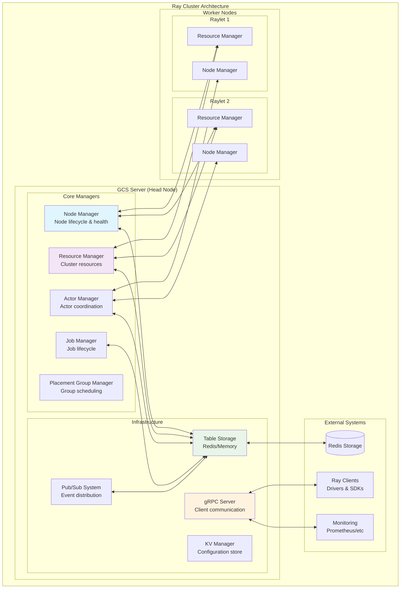

### GCS Server Design Principles

1. **Single Source of Truth**: All authoritative cluster state lives in GCS
2. **Event-Driven Architecture**: State changes trigger cascading updates
3. **Scalable Storage**: Pluggable backend storage (Redis, Memory)
4. **Fault Recovery**: Persistent state enables cluster recovery
5. **Performance Optimization**: Caching and batching for high throughput

## Core Components

The GCS server consists of several specialized managers working together:

### Component Initialization Order

From `src/ray/gcs/gcs_server/gcs_server.h:140-180`:

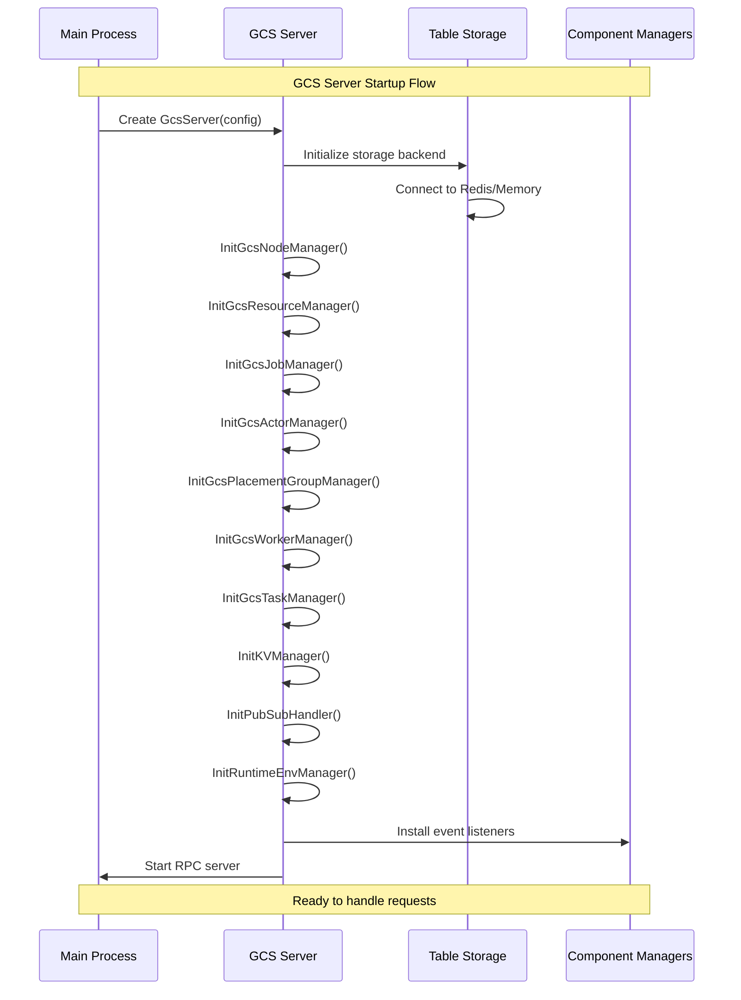

### GCS Server Configuration

From `src/ray/gcs/gcs_server/gcs_server.h:47-62`:

```cpp
struct GcsServerConfig {
  std::string grpc_server_name = "GcsServer";
  uint16_t grpc_server_port = 0;               // GCS RPC port
  uint16_t grpc_server_thread_num = 1;         // RPC thread pool size
  std::string redis_username;                 // Redis authentication
  std::string redis_password;
  std::string redis_address;                  // Redis host address  
  uint16_t redis_port = 6379;                 // Redis port
  bool enable_redis_ssl = false;              // TLS encryption
  bool retry_redis = true;                    // Connection retry logic
  bool enable_sharding_conn = false;          // Redis sharding
  std::string node_ip_address;                // GCS server IP
  std::string log_dir;                        // Logging directory
  std::string raylet_config_list;             // Raylet configurations
  std::string session_name;                   // Cluster session ID
};
```

## Node Lifecycle Management

The GCS Node Manager is responsible for tracking all nodes in the cluster and their health status.

### Node State Machine

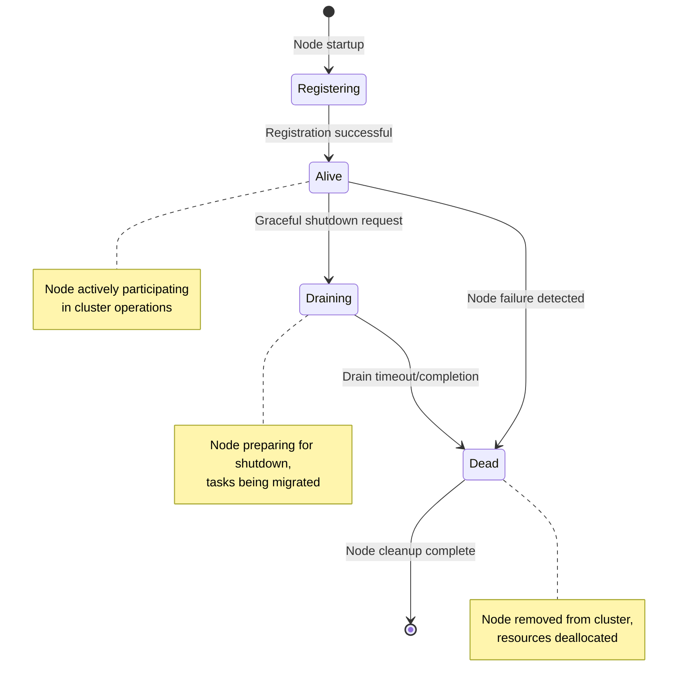

### Node Registration Protocol

From `src/ray/gcs/gcs_server/gcs_node_manager.h:54-62`:

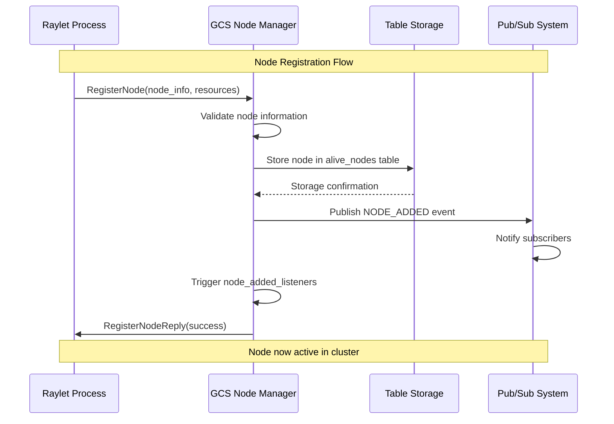

**Node Information Structure:**

```cpp
// From gcs.proto - rpc::GcsNodeInfo
message GcsNodeInfo {
  bytes node_id = 1;                    // Unique node identifier
  string node_manager_address = 2;      // Node IP address
  int32 node_manager_port = 3;         // Node manager port
  int32 object_manager_port = 4;       // Object manager port
  string node_name = 5;                // Human-readable name
  map<string, double> resources_total = 6;  // Total node resources
  GcsNodeState state = 7;              // Current node state
  NodeDeathInfo death_info = 8;        // Death information if dead
  int64 start_time_ms = 9;            // Node startup timestamp
}

enum GcsNodeState {
  ALIVE = 0;      // Node operational
  DEAD = 1;       // Node failed/removed
  DRAINING = 2;   // Node shutting down gracefully
}
```

### Health Monitoring and Failure Detection

**Health Check Mechanisms:**

1. **Periodic Heartbeats**: Raylets send regular health updates
2. **Resource Reports**: Nodes report resource usage changes
3. **Task Status Updates**: Monitor task execution health
4. **Network Connectivity**: Detect network partitions

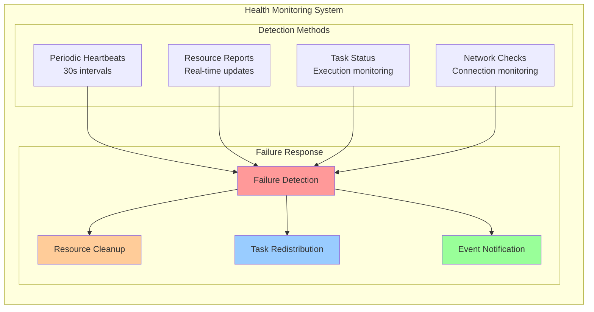

## Resource Management

The GCS Resource Manager maintains a global view of all cluster resources and coordinates scheduling decisions.

### Resource Architecture

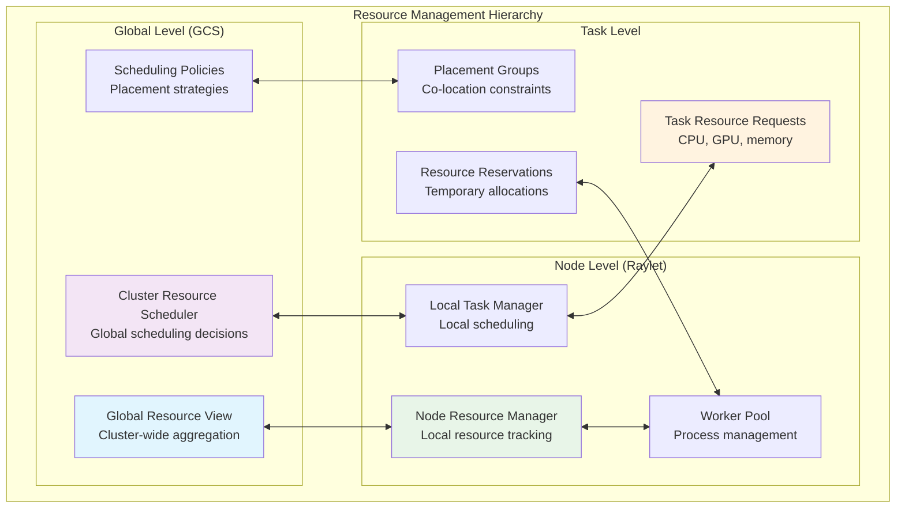

### Resource Types and Management

**Core Resource Types:**

```cpp
// Resource categories managed by GCS
enum ResourceType {
  CPU,           // Compute cores
  GPU,           // Graphics processors  
  MEMORY,        // RAM allocation
  OBJECT_STORE_MEMORY,  // Plasma store memory
  CUSTOM         // User-defined resources
};

// Resource scheduling information
struct ResourceSchedulingState {
  map<string, double> total;      // Total available resources
  map<string, double> available;  // Currently available resources
  map<string, double> used;       // Currently used resources
  vector<TaskSpec> pending_tasks; // Tasks waiting for resources
};
```

### Resource Synchronization Protocol

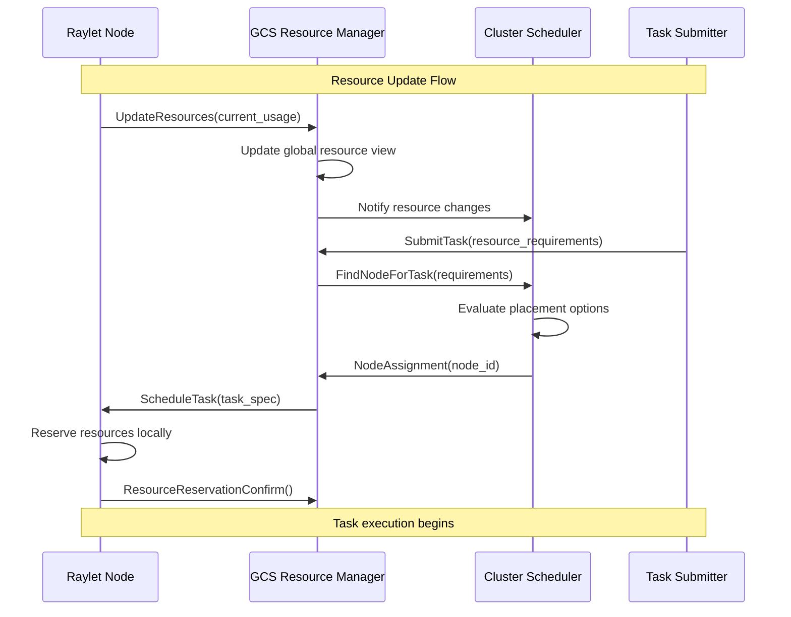

## Actor Management

The GCS Actor Manager handles the distributed coordination of Ray actors, including creation, placement, and lifecycle management.

### Actor Lifecycle Management

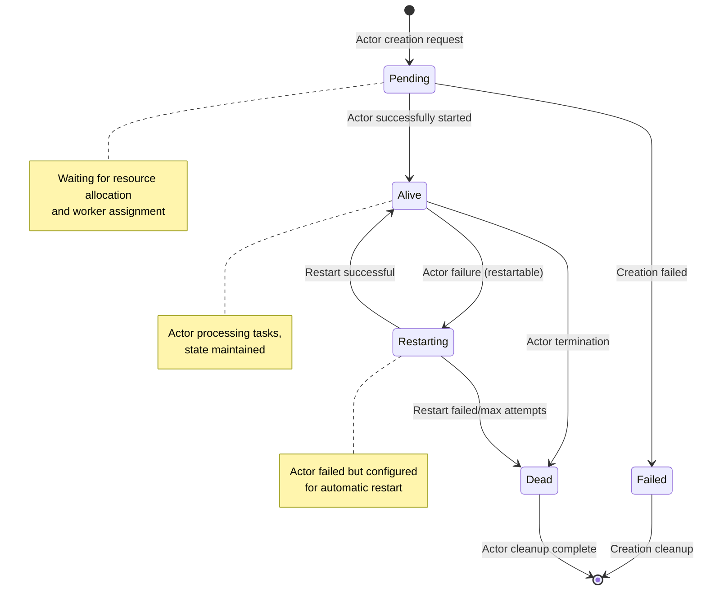

### Actor Creation Protocol

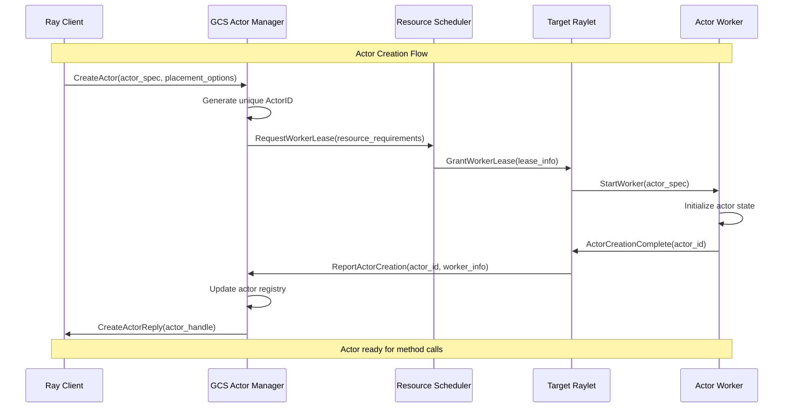

### Actor Placement Strategies

**Placement Group Integration:**

```cpp
// Actor placement within placement groups
struct ActorPlacementSpec {
  PlacementGroupID placement_group_id;    // Target placement group
  int bundle_index;                       // Specific bundle in group
  PlacementStrategy strategy;             // PACK, SPREAD, STRICT_PACK
  map<string, double> resource_requirements;  // Resource needs
  vector<NodeID> blacklist_nodes;        // Nodes to avoid
};
```

## Job Management

The GCS Job Manager coordinates job submission, tracking, and resource cleanup across the cluster.

### Job Lifecycle Architecture

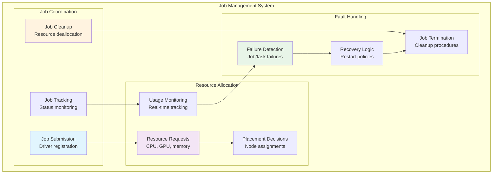

### Job State Management

```cpp
// Job states tracked by GCS
enum JobState {
  PENDING = 0;     // Job submitted, awaiting resources
  RUNNING = 1;     // Job executing tasks
  STOPPED = 2;     // Job terminated normally
  FAILED = 3;      // Job failed due to error
};

// Job information maintained by GCS
struct JobInfo {
  JobID job_id;                          // Unique job identifier
  JobState state;                        // Current job state
  string driver_ip_address;              // Driver node IP
  int64_t driver_pid;                    // Driver process ID
  int64_t start_time;                    // Job start timestamp
  int64_t end_time;                      // Job end timestamp (if finished)
  map<string, double> resource_mapping;  // Allocated resources
  JobConfig config;                      // Job configuration
};
```

## Storage and Persistence

The GCS uses pluggable storage backends to persist critical cluster state and enable recovery.

### Storage Architecture

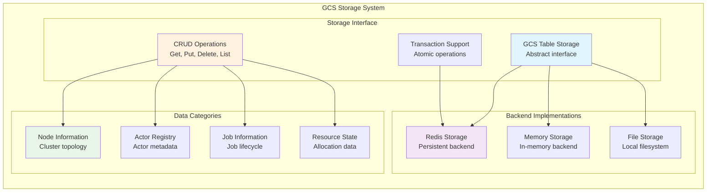

### Storage Configuration Options

From `src/ray/gcs/gcs_server/gcs_server.h:98-104`:

```cpp
enum class StorageType {
  UNKNOWN = 0,
  IN_MEMORY = 1,      // Fast, non-persistent storage
  REDIS_PERSIST = 2,  // Persistent Redis storage
};

// Storage configuration constants
static constexpr char kInMemoryStorage[] = "memory";
static constexpr char kRedisStorage[] = "redis";
```

**Storage Type Selection:**

| Storage Type | Use Case | Persistence | Performance | Fault Tolerance |
|-------------|----------|-------------|-------------|-----------------|
| Memory | Development/Testing | No | Highest | None |
| Redis | Production | Yes | High | Full recovery |
| File | Local debugging | Yes | Medium | Local only |

### Data Persistence Patterns

**Critical Data Categories:**

1. **Node Registry**: All registered nodes and their states
2. **Actor Registry**: Actor metadata and placement information  
3. **Job Registry**: Job specifications and execution state
4. **Resource State**: Cluster resource allocation and usage
5. **Configuration**: Cluster and component configurations

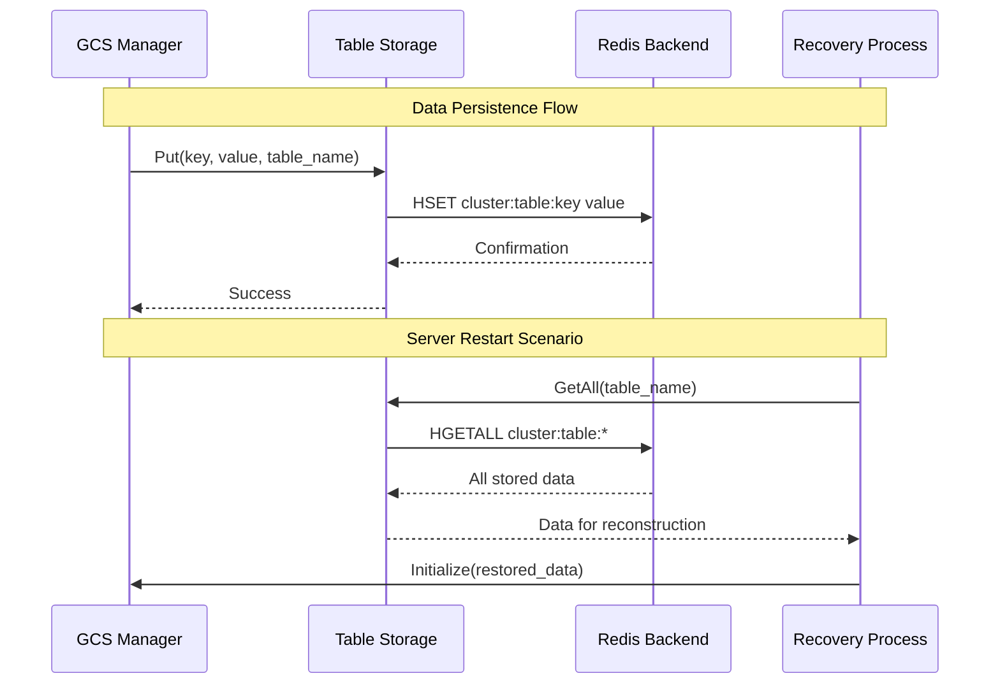

## Communication and RPC

The GCS server provides gRPC-based APIs for all cluster components to interact with global state.

### RPC Service Architecture

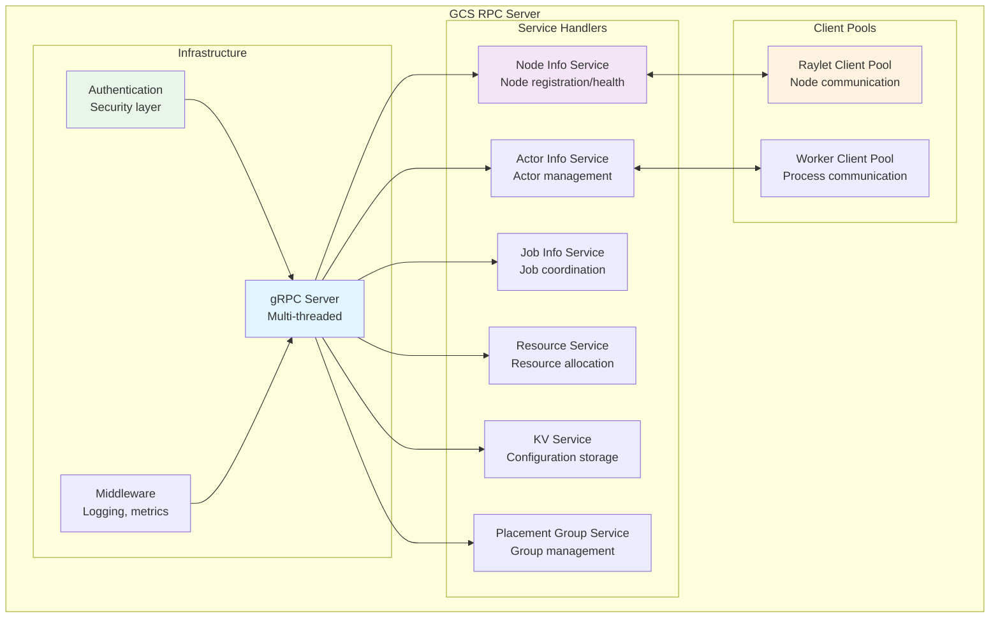

### Key RPC Interfaces

**Node Management RPCs:**

```cpp
// From gcs_service.proto
service NodeInfoGcsService {
  rpc RegisterNode(RegisterNodeRequest) returns (RegisterNodeReply);
  rpc UnregisterNode(UnregisterNodeRequest) returns (UnregisterNodeReply);
  rpc GetAllNodeInfo(GetAllNodeInfoRequest) returns (GetAllNodeInfoReply);
  rpc CheckAlive(CheckAliveRequest) returns (CheckAliveReply);
  rpc DrainNode(DrainNodeRequest) returns (DrainNodeReply);
}
```

**Actor Management RPCs:**

```cpp
service ActorInfoGcsService {
  rpc CreateActor(CreateActorRequest) returns (CreateActorReply);
  rpc GetActorInfo(GetActorInfoRequest) returns (GetActorInfoReply);
  rpc KillActorViaGcs(KillActorViaGcsRequest) returns (KillActorViaGcsReply);
  rpc ListNamedActors(ListNamedActorsRequest) returns (ListNamedActorsReply);
}
```

### Performance Optimization

**RPC Performance Characteristics:**

| Operation Type | Typical Latency | Throughput | Optimization |
|---------------|-----------------|------------|--------------|
| Node registration | 1-5ms | 1K ops/s | Batched updates |
| Actor creation | 5-20ms | 500 ops/s | Async processing |
| Resource queries | < 1ms | 10K ops/s | Local caching |
| Job submission | 2-10ms | 1K ops/s | Pipeline processing |

## Fault Tolerance and Recovery

The GCS implements comprehensive fault tolerance mechanisms to ensure cluster resilience.

### Recovery Architecture

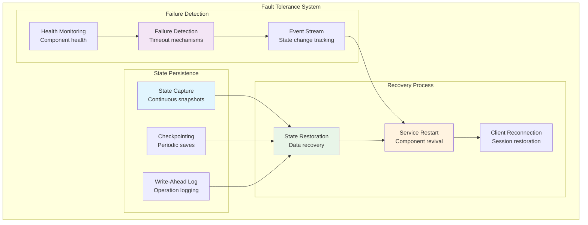

### GCS Server Recovery Process

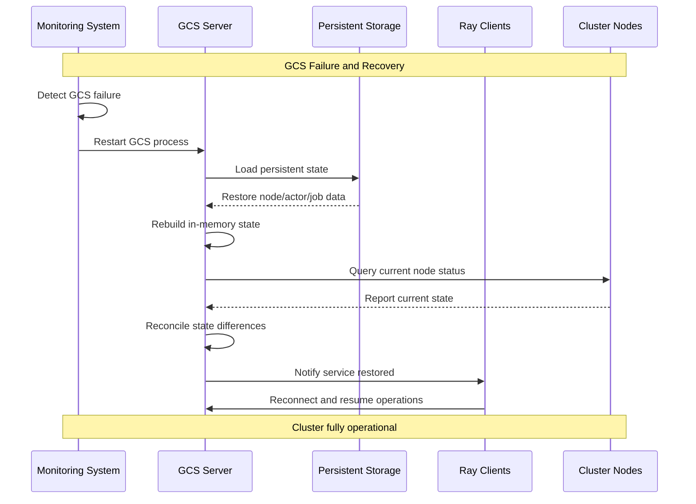

### Recovery Scenarios

**1. GCS Server Crash:**
- Persistent storage preserves critical state
- New GCS instance loads saved data
- Nodes re-register and update status
- Clients reconnect automatically

**2. Storage Backend Failure:**
- GCS switches to backup storage
- In-memory state provides temporary continuity
- Storage recovery restores full persistence

**3. Network Partition:**
- GCS maintains authoritative state
- Nodes operate in degraded mode
- State synchronization on partition heal

## Performance Characteristics

### Scalability Metrics

**GCS Server Performance:**

| Metric | Small Cluster (10 nodes) | Medium Cluster (100 nodes) | Large Cluster (1000 nodes) |
|--------|---------------------------|-----------------------------|-----------------------------|
| Node registration throughput | 100 ops/s | 500 ops/s | 1K ops/s |
| Actor creation latency | 5ms | 10ms | 20ms |
| Resource query latency | 0.5ms | 1ms | 2ms |
| Memory usage | 100MB | 500MB | 2GB |
| Storage size | 10MB | 100MB | 1GB |

### Optimization Strategies

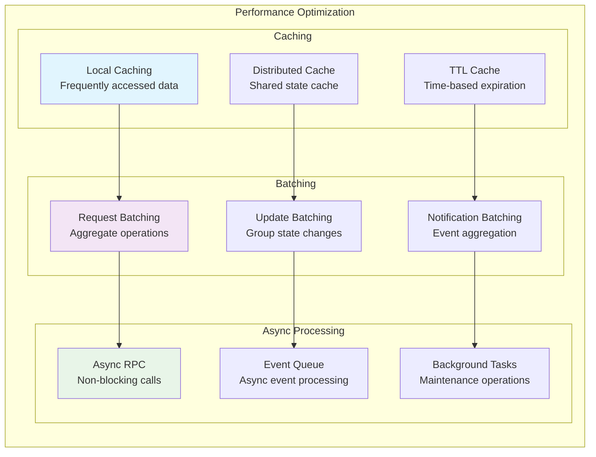

## Implementation Details

### Core Code Structure

**GCS Server Main Loop:**

From `src/ray/gcs/gcs_server/gcs_server_main.cc:45-190`:

```cpp
int main(int argc, char *argv[]) {
  // Parse command line arguments
  gflags::ParseCommandLineFlags(&argc, &argv, true);
  
  // Configure logging and stream redirection
  InitShutdownRAII ray_log_shutdown_raii(/*...*/);
  
  // Initialize configuration
  RayConfig::instance().initialize(config_list);
  
  // Create main IO service
  instrumented_io_context main_service(/*enable_lag_probe=*/true);
  
  // Initialize metrics collection
  ray::stats::Init(global_tags, metrics_agent_port, WorkerID::Nil());
  
  // Create and configure GCS server
  ray::gcs::GcsServerConfig gcs_server_config;
  ray::gcs::GcsServer gcs_server(gcs_server_config, main_service);
  
  // Set up signal handlers for graceful shutdown
  boost::asio::signal_set signals(main_service);
  signals.async_wait(shutdown_handler);
  
  // Start the server and run main loop
  gcs_server.Start();
  main_service.run();
}
```

**Component Initialization Pattern:**

```cpp
class GcsServer {
  void DoStart(const GcsInitData &gcs_init_data) {
    // Initialize storage backend first
    gcs_table_storage_ = CreateStorage();
    
    // Initialize core managers
    InitGcsNodeManager(gcs_init_data);
    InitGcsResourceManager(gcs_init_data);
    InitGcsJobManager(gcs_init_data);
    InitGcsActorManager(gcs_init_data);
    InitGcsPlacementGroupManager(gcs_init_data);
    
    // Initialize supporting services
    InitKVManager();
    InitPubSubHandler();
    InitRuntimeEnvManager();
    
    // Install cross-component event listeners
    InstallEventListeners();
    
    // Start RPC server
    rpc_server_.Run();
  }
};
```

### Critical Code Paths

**Node Registration Handler:**

```cpp
void GcsNodeManager::HandleRegisterNode(
    rpc::RegisterNodeRequest request,
    rpc::RegisterNodeReply *reply,
    rpc::SendReplyCallback send_reply_callback) {
  
  NodeID node_id = NodeID::FromBinary(request.node_info().node_id());
  
  // Create node info from request
  auto node = std::make_shared<rpc::GcsNodeInfo>(request.node_info());
  
  // Add to alive nodes and storage
  AddNode(node);
  
  // Publish node added event
  RAY_CHECK_OK(gcs_publisher_->PublishNodeInfo(node_id, *node, nullptr));
  
  // Notify listeners
  for (auto &listener : node_added_listeners_) {
    listener(node);
  }
  
  send_reply_callback(Status::OK(), nullptr, nullptr);
}
```

### Error Handling Patterns

**Graceful Degradation:**

```cpp
// Example error handling in resource management
Status GcsResourceManager::UpdateResourceUsage(const NodeID &node_id,
                                              const ResourceUsageMap &usage) {
  // Try to update local state first
  auto status = UpdateLocalResourceView(node_id, usage);
  if (!status.ok()) {
    RAY_LOG(WARNING) << "Failed to update local resource view: " << status;
    // Continue with degraded functionality
  }
  
  // Try to persist to storage
  status = PersistResourceUsage(node_id, usage);
  if (!status.ok()) {
    RAY_LOG(ERROR) << "Failed to persist resource usage: " << status;
    // Queue for retry
    retry_queue_.push({node_id, usage});
  }
  
  return Status::OK();  // Always succeed for availability
}
```

## Code Modification Guidelines

### Adding New GCS Components

**1. Manager Component Pattern:**

To add a new manager (e.g., GcsCustomManager):

```cpp
// 1. Create header file: gcs_custom_manager.h
class GcsCustomManager : public rpc::CustomServiceHandler {
public:
  GcsCustomManager(GcsPublisher *publisher, 
                   GcsTableStorage *storage,
                   instrumented_io_context &io_context);
  
  // Implement RPC handlers
  void HandleCustomRequest(rpc::CustomRequest request,
                          rpc::CustomReply *reply,
                          rpc::SendReplyCallback callback) override;
                          
  // Initialize from persistent data
  void Initialize(const GcsInitData &init_data);
  
private:
  GcsPublisher *gcs_publisher_;
  GcsTableStorage *gcs_table_storage_;
  // Component-specific state
};

// 2. Add to GcsServer initialization
void GcsServer::InitGcsCustomManager(const GcsInitData &init_data) {
  gcs_custom_manager_ = std::make_unique<GcsCustomManager>(
      gcs_publisher_.get(), gcs_table_storage_.get(), main_service_);
  gcs_custom_manager_->Initialize(init_data);
}
```

**2. Adding New RPC Services:**

```cpp
// 1. Define in protobuf (gcs_service.proto)
service CustomGcsService {
  rpc CustomOperation(CustomRequest) returns (CustomReply);
}

// 2. Register in RPC server
void GcsServer::StartRpcServer() {
  rpc_server_.RegisterService(gcs_custom_manager_.get());
  rpc_server_.Run();
}
```

**3. State Persistence Integration:**

```cpp
// Add to storage initialization
void GcsCustomManager::Initialize(const GcsInitData &init_data) {
  // Load persistent state
  auto custom_data = gcs_table_storage_->CustomTable().GetAll();
  
  // Rebuild in-memory state
  for (const auto &[key, value] : custom_data) {
    RestoreCustomState(key, value);
  }
}

// Persist state changes
void GcsCustomManager::PersistCustomData(const Key &key, const Value &value) {
  auto status = gcs_table_storage_->CustomTable().Put(key, value, nullptr);
  if (!status.ok()) {
    RAY_LOG(ERROR) << "Failed to persist custom data: " << status;
  }
}
```

### Testing and Validation

**Unit Testing Pattern:**

```cpp
class GcsCustomManagerTest : public ::testing::Test {
protected:
  void SetUp() override {
    gcs_publisher_ = std::make_shared<GcsPublisher>(/*...*/);
    store_client_ = std::make_shared<MemoryStoreClient>();
    gcs_table_storage_ = std::make_shared<GcsTableStorage>(store_client_);
    
    manager_ = std::make_unique<GcsCustomManager>(
        gcs_publisher_.get(), gcs_table_storage_.get(), io_context_);
  }
  
  instrumented_io_context io_context_;
  std::unique_ptr<GcsCustomManager> manager_;
  // Test fixtures
};

TEST_F(GcsCustomManagerTest, HandleCustomRequest) {
  // Test RPC handling logic
  rpc::CustomRequest request;
  rpc::CustomReply reply;
  auto callback = [](Status status, 
                     std::function<void()> success,
                     std::function<void()> failure) {
    EXPECT_TRUE(status.ok());
  };
  
  manager_->HandleCustomRequest(request, &reply, callback);
}
```

**Integration Testing:**

```bash
# Test GCS server functionality
cd /home/ssiddique/ray
bazel test //src/ray/gcs/gcs_server/test:gcs_server_test
bazel test //src/ray/gcs/gcs_server/test:gcs_server_integration_test

# Test specific managers
bazel test //src/ray/gcs/gcs_server/test:gcs_node_manager_test
bazel test //src/ray/gcs/gcs_server/test:gcs_actor_manager_test
```

**Performance Testing:**

```python
# GCS server load testing
import ray
import time
import concurrent.futures

@ray.remote
def stress_test_actor():
    return "alive"

# Test actor creation throughput
start_time = time.time()
actors = [stress_test_actor.remote() for _ in range(1000)]
results = ray.get(actors)
end_time = time.time()

throughput = len(actors) / (end_time - start_time)
print(f"Actor creation throughput: {throughput:.2f} actors/sec")
```

---

*This comprehensive guide is based on Ray's GCS server source code, particularly files in `src/ray/gcs/gcs_server/`. For the most current implementation details, refer to the source files and protobuf definitions in the Ray repository.*
