# Part II: Core Ray Services
# Chapter 8: Distributed Object Store

# Ray Distributed Object Store: Comprehensive Technical Guide

## Table of Contents
1. [Introduction](#introduction)
2. [Architecture Overview](#architecture-overview)
3. [Local Storage: Plasma Store](#local-storage-plasma-store)
4. [Distributed Management: Object Manager](#distributed-management-object-manager)
5. [Global Coordination: Object Directory](#global-coordination-object-directory)
6. [Object Lifecycle Management](#object-lifecycle-management)
7. [Memory Management and Spilling](#memory-management-and-spilling)
8. [Performance Characteristics](#performance-characteristics)
9. [Implementation Details](#implementation-details)
10. [Code Modification Guidelines](#code-modification-guidelines)

## Introduction

Ray's distributed object store is a sophisticated system that provides efficient storage, retrieval, and movement of large data objects across a distributed cluster. The system consists of three main components:

1. **Plasma Store**: High-performance local object storage using shared memory
2. **Object Manager**: Distributed object transfer and coordination 
3. **Object Directory**: Global metadata tracking via GCS (Global Control Service)

The object store is designed to handle massive datasets efficiently while providing transparent access patterns for Ray applications.

## Architecture Overview

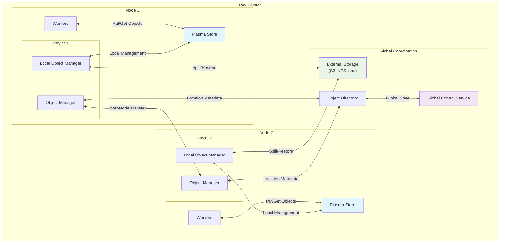

### Key Design Principles

1. **Zero-Copy Access**: Objects stored in shared memory for direct access
2. **Distributed Transparency**: Objects appear local regardless of actual location
3. **Automatic Spilling**: Graceful handling of memory pressure
4. **Fault Tolerance**: Reconstruction and replication capabilities
5. **Performance Optimization**: Chunked transfers and bandwidth management

## Local Storage: Plasma Store

The Plasma Store provides high-performance local object storage using memory-mapped shared memory.

### Plasma Architecture

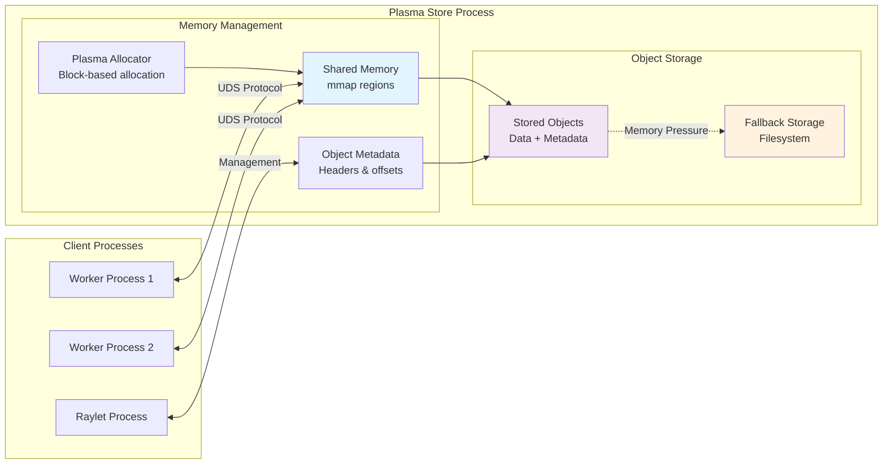

### Object Storage Structure

From `src/ray/object_manager/plasma/plasma.h:35-70`:

```cpp
struct PlasmaObject {
  MEMFD_TYPE store_fd;          // Memory-mapped file descriptor
  ptrdiff_t header_offset;      // Object header location
  ptrdiff_t data_offset;        // Object data location  
  ptrdiff_t metadata_offset;    // Object metadata location
  int64_t data_size;           // Size of object data
  int64_t metadata_size;       // Size of object metadata
  int64_t allocated_size;      // Total allocated space
  int device_num;              // Device identifier
  int64_t mmap_size;          // Memory-mapped region size
  bool fallback_allocated;     // Whether using fallback storage
  bool is_experimental_mutable_object; // Mutable object flag
};
```

### Memory Allocation Strategy

**Block-Based Allocation:**
- Objects allocated in 64-byte aligned blocks (`kBlockSize = 64`)
- Minimizes fragmentation through power-of-2 sizing
- Supports both main memory and fallback filesystem storage

**Memory Layout:**
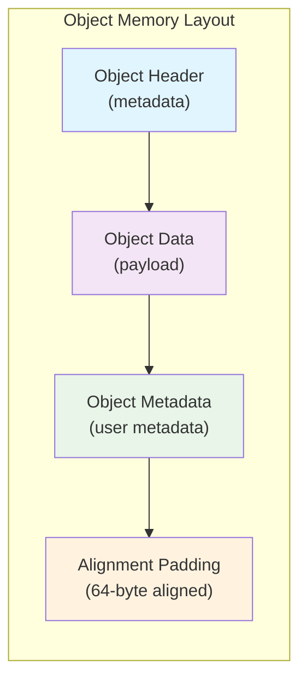

## Distributed Management: Object Manager

The Object Manager handles inter-node object transfers and distributed coordination.

### Object Manager Architecture

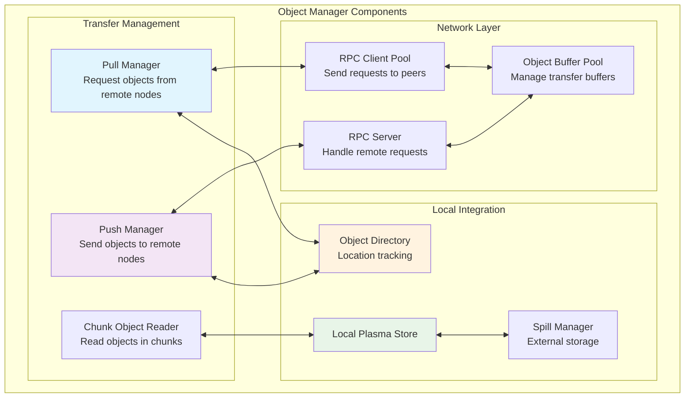

### Object Transfer Protocol

Ray uses a sophisticated chunked transfer protocol for large objects:

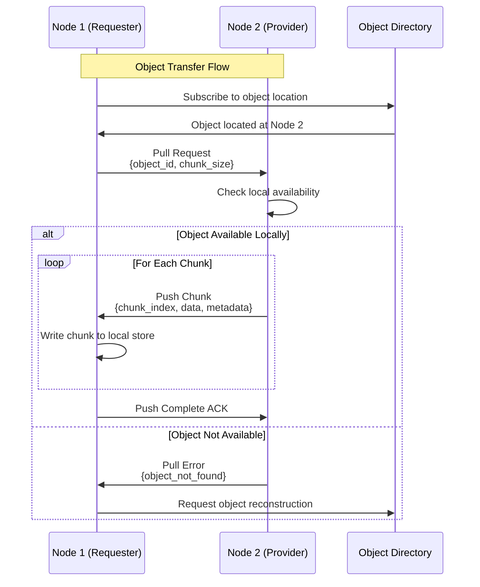

### Configuration and Performance Tuning

From `src/ray/object_manager/object_manager.h:40-75`:

```cpp
struct ObjectManagerConfig {
  std::string object_manager_address;    // Network address
  int object_manager_port;               // Listening port
  unsigned int timer_freq_ms;            // Timer frequency
  unsigned int pull_timeout_ms;          // Pull request timeout
  uint64_t object_chunk_size;           // Chunk size for transfers
  uint64_t max_bytes_in_flight;         // Max concurrent transfer bytes
  std::string store_socket_name;         // Plasma store socket
  int push_timeout_ms;                   // Push timeout
  int rpc_service_threads_number;        // RPC thread pool size
  int64_t object_store_memory;          // Total memory allocation
  std::string plasma_directory;          // Shared memory directory
  std::string fallback_directory;        // Fallback storage directory
  bool huge_pages;                       // Enable huge page support
};
```

**Key Performance Parameters:**

| Parameter | Default | Impact |
|-----------|---------|---------|
| `object_chunk_size` | 1MB | Transfer granularity, affects latency/throughput |
| `max_bytes_in_flight` | 256MB | Max concurrent transfer bandwidth |
| `pull_timeout_ms` | 10s | Request timeout, affects fault tolerance |
| `rpc_service_threads_number` | min(max(2, cpu/4), 8) | Concurrency level |

## Global Coordination: Object Directory

The Object Directory provides cluster-wide object location tracking and metadata management.

### Object Directory Design

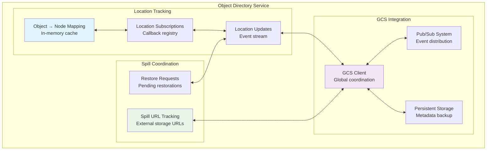

### Object Location Subscription Model

From `src/ray/object_manager/object_directory.h:33-70`:

```cpp
using OnLocationsFound = std::function<void(
    const ObjectID &object_id,
    const std::unordered_set<NodeID> &node_locations,
    const std::string &spilled_url,
    const NodeID &spilled_node_id,
    bool pending_creation,
    size_t object_size)>;

class IObjectDirectory {
  virtual Status SubscribeObjectLocations(
      const UniqueID &callback_id,
      const ObjectID &object_id,
      const rpc::Address &owner_address,
      const OnLocationsFound &callback) = 0;
      
  virtual void ReportObjectAdded(
      const ObjectID &object_id,
      const NodeID &node_id,
      const ObjectInfo &object_info) = 0;
      
  virtual void ReportObjectSpilled(
      const ObjectID &object_id,
      const NodeID &node_id,
      const rpc::Address &owner_address,
      const std::string &spilled_url,
      const ObjectID &generator_id,
      bool spilled_to_local_storage) = 0;
};
```

**Location Update Flow:**
1. **Object Creation**: Node reports object addition to directory
2. **Subscription**: Interested nodes subscribe to object locations
3. **Notification**: Directory notifies subscribers of location changes
4. **Transfer**: Subscribers initiate object transfers as needed

## Object Lifecycle Management

Ray objects go through a well-defined lifecycle from creation to deletion.

### Object Lifecycle States

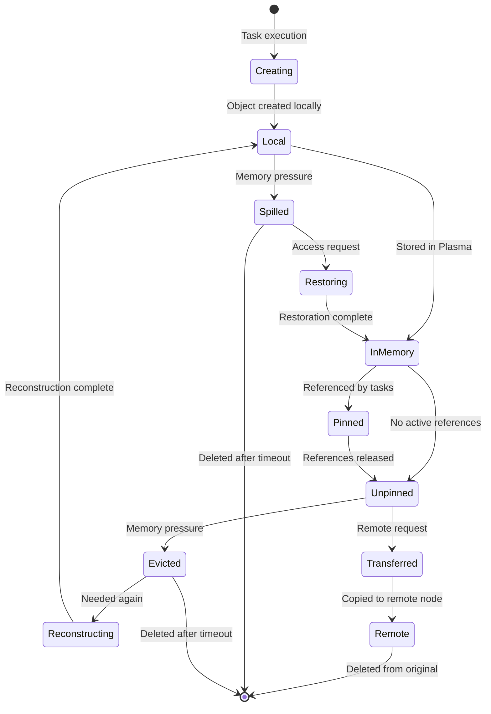

### Object Pinning and Reference Counting

From `src/ray/raylet/local_object_manager.h:67-75`:

```cpp
void PinObjectsAndWaitForFree(
    const std::vector<ObjectID> &object_ids,
    std::vector<std::unique_ptr<RayObject>> &&objects,
    const rpc::Address &owner_address,
    const ObjectID &generator_id = ObjectID::Nil());

struct LocalObjectInfo {
  rpc::Address owner_address;      // Object owner for reference counting
  bool is_freed = false;          // Whether object can be freed
  std::optional<ObjectID> generator_id;  // For dynamically created objects
  size_t object_size;             // Object size for memory tracking
};
```

**Reference Counting Protocol:**

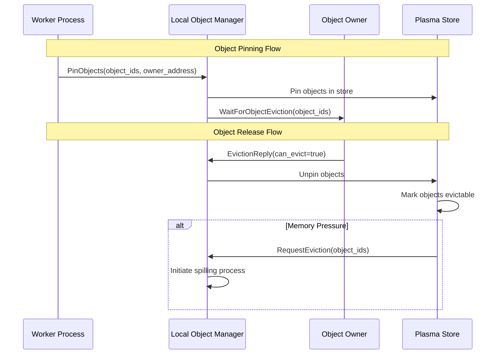

## Memory Management and Spilling

Ray implements sophisticated memory management with automatic spilling to external storage.

### Memory Management Architecture

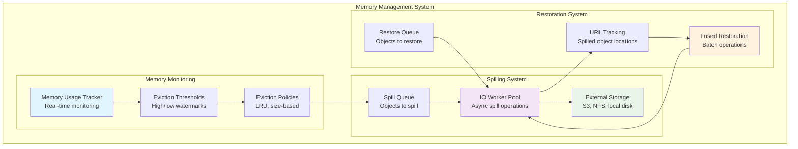

### Spilling Algorithm

From `src/ray/raylet/local_object_manager.h:206-228`:

```cpp
// Spill objects asynchronously when space is needed
bool TryToSpillObjects();

// Internal spilling implementation with batching
void SpillObjectsInternal(
    const std::vector<ObjectID> &objects_ids,
    std::function<void(const ray::Status &)> callback);

// Handle spilling completion and update metadata
void OnObjectSpilled(
    const std::vector<ObjectID> &object_ids,
    const rpc::SpillObjectsReply &worker_reply);
```

**Spilling Decision Algorithm:**

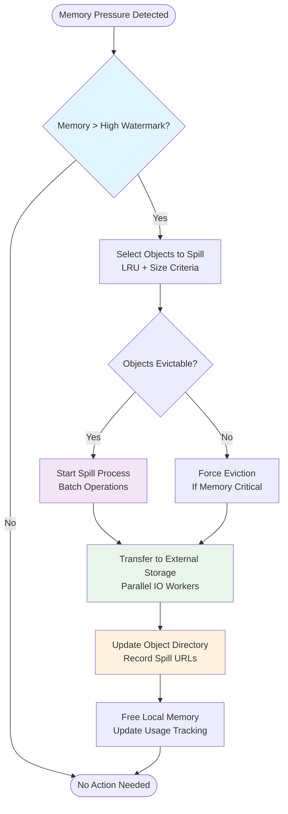

### Restoration and Fused Operations

**Fused Restoration** combines multiple small objects into single operations for efficiency:

```cpp
// Maximum number of objects to fuse in single operation
int64_t max_fused_object_count_;

// Restore spilled object from external storage
void AsyncRestoreSpilledObject(
    const ObjectID &object_id,
    int64_t object_size,
    const std::string &object_url,
    std::function<void(const ray::Status &)> callback);
```

## Performance Characteristics

### Throughput and Latency Analysis

**Local Operations:**

| Operation | Latency | Throughput | Notes |
|-----------|---------|------------|-------|
| Local object access | < 1μs | ~50 GB/s | Direct shared memory access |
| Object creation | 1-10μs | ~10 GB/s | Memory allocation + metadata |
| Object deletion | < 1μs | ~20 GB/s | Reference counting + cleanup |

**Distributed Operations:**

| Operation | Latency | Throughput | Notes |
|-----------|---------|------------|-------|
| Remote object pull | 1-10ms + transfer_time | ~1-5 GB/s per node | Network + chunking overhead |
| Object location lookup | 0.1-1ms | ~10K ops/s | Object directory query |
| Spilling to S3 | 10-100ms + transfer_time | ~100-500 MB/s | Network + storage latency |

**Memory Management:**

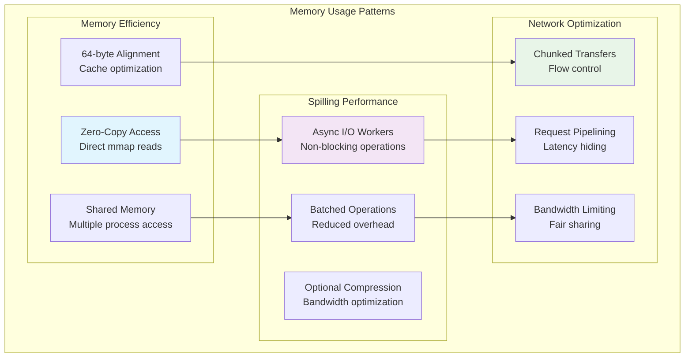

## Implementation Details

### Critical Code Paths

**Object Manager Core Loop** (`src/ray/object_manager/object_manager.cc`):

```cpp
class ObjectManager : public ObjectManagerInterface {
  // Handle pull request from remote nodes
  void HandlePull(rpc::PullRequest request,
                  rpc::PullReply *reply,
                  rpc::SendReplyCallback send_reply_callback) override;
  
  // Handle push from remote nodes  
  void HandlePush(rpc::PushRequest request,
                  rpc::PushReply *reply,
                  rpc::SendReplyCallback send_reply_callback) override;
  
  // Pull objects from remote nodes
  uint64_t Pull(const std::vector<rpc::ObjectReference> &object_refs,
                BundlePriority prio,
                const TaskMetricsKey &task_key) override;
};
```

**Local Object Manager Operations**:

```cpp
class LocalObjectManager {
  // Pin objects and wait for owner to free them
  void PinObjectsAndWaitForFree(
      const std::vector<ObjectID> &object_ids,
      std::vector<std::unique_ptr<RayObject>> &&objects,
      const rpc::Address &owner_address,
      const ObjectID &generator_id);
  
  // Spill objects to external storage
  void SpillObjectUptoMaxThroughput();
  
  // Restore objects from external storage
  void AsyncRestoreSpilledObject(
      const ObjectID &object_id,
      int64_t object_size, 
      const std::string &object_url,
      std::function<void(const ray::Status &)> callback);
};
```

### Error Handling and Recovery

**Fault Tolerance Mechanisms:**

1. **Object Reconstruction**: If objects are lost, Ray can reconstruct them by re-executing the tasks that created them
2. **Replication**: Critical objects can be replicated across multiple nodes
3. **Spill Redundancy**: Objects spilled to external storage maintain multiple copies
4. **Network Resilience**: Failed transfers are automatically retried with exponential backoff

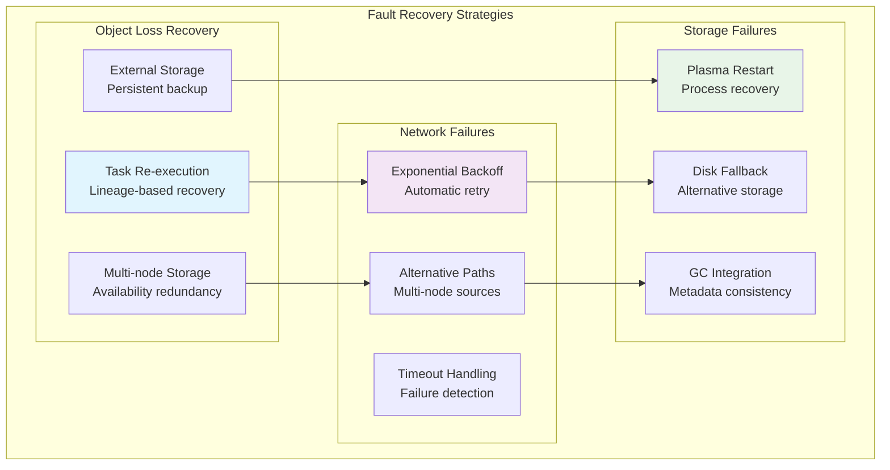

## Code Modification Guidelines

### Adding New Object Store Features

**1. Local Storage Modifications:**

To modify Plasma store behavior, focus on these key files:
- `src/ray/object_manager/plasma/plasma.cc` - Core storage logic
- `src/ray/object_manager/plasma/plasma_allocator.cc` - Memory allocation
- `src/ray/raylet/local_object_manager.cc` - Raylet integration

**2. Distributed Transfer Modifications:**

For object transfer improvements:
- `src/ray/object_manager/object_manager.cc` - Main transfer logic
- `src/ray/object_manager/pull_manager.cc` - Pull request handling
- `src/ray/object_manager/push_manager.cc` - Push request handling

**3. Spilling and External Storage:**

For spilling enhancements:
- `src/ray/raylet/local_object_manager.cc` - Spilling coordination
- External storage interfaces in worker processes

### Example: Adding a New Spilling Strategy

```cpp
// In LocalObjectManager class
bool TryToSpillObjectsCustomStrategy() {
  // 1. Implement custom object selection logic
  std::vector<ObjectID> objects_to_spill = SelectObjectsCustomCriteria();
  
  // 2. Check if objects meet spilling requirements
  if (objects_to_spill.empty() || 
      total_size < min_spilling_size_) {
    return false;
  }
  
  // 3. Initiate spilling with custom parameters
  SpillObjectsInternal(objects_to_spill, 
                      [this](const ray::Status &status) {
                        // Custom completion handling
                      });
  return true;
}
```

### Testing and Validation

**Key Testing Areas:**

1. **Unit Tests**: Individual component functionality
2. **Integration Tests**: Cross-component interactions  
3. **Performance Tests**: Throughput and latency benchmarks
4. **Fault Injection**: Network failures, storage failures, node crashes
5. **Scale Tests**: Large object handling, many-node clusters

**Performance Validation Commands:**

```bash
# Test object store throughput
ray start --head --object-store-memory=8000000000
python -c "
import ray
import numpy as np
ray.init()
# Test large object creation/access patterns
obj = ray.put(np.random.rand(100000000))  # ~800MB object
result = ray.get(obj)
"

# Monitor object store stats
ray status --verbose
```

---

*This guide is based on Ray's source code, particularly the object manager, plasma store, and local object manager implementations. For the most current details, refer to the source files in `src/ray/object_manager/` and `src/ray/raylet/`.*
