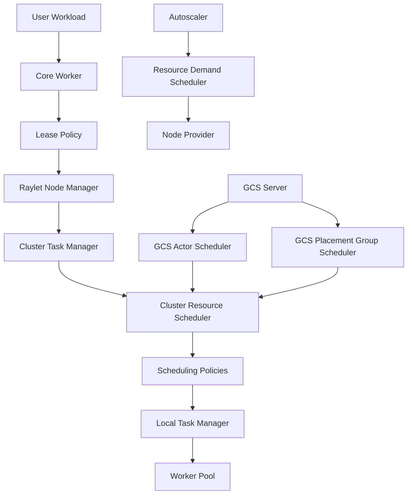
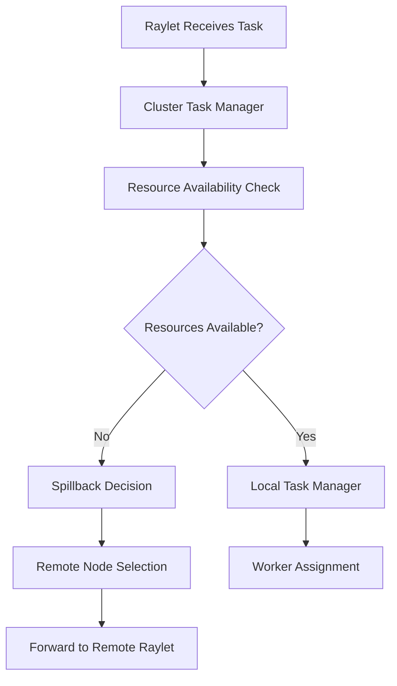
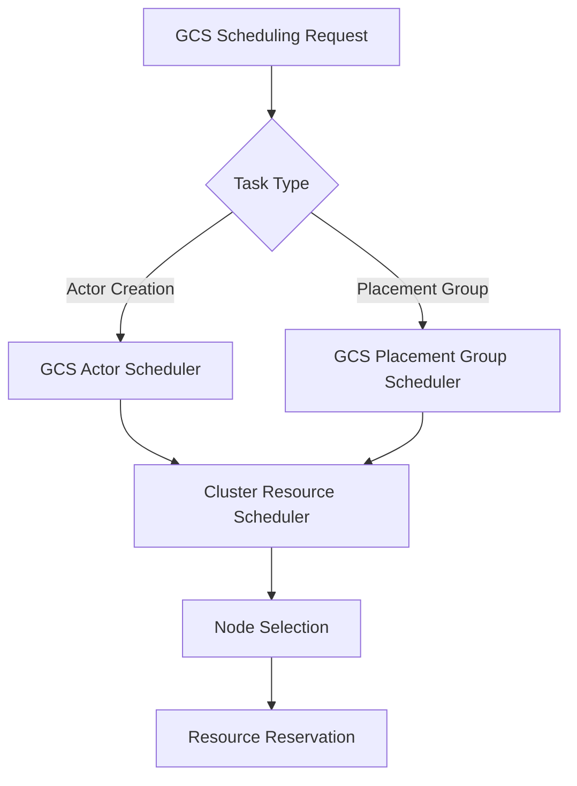
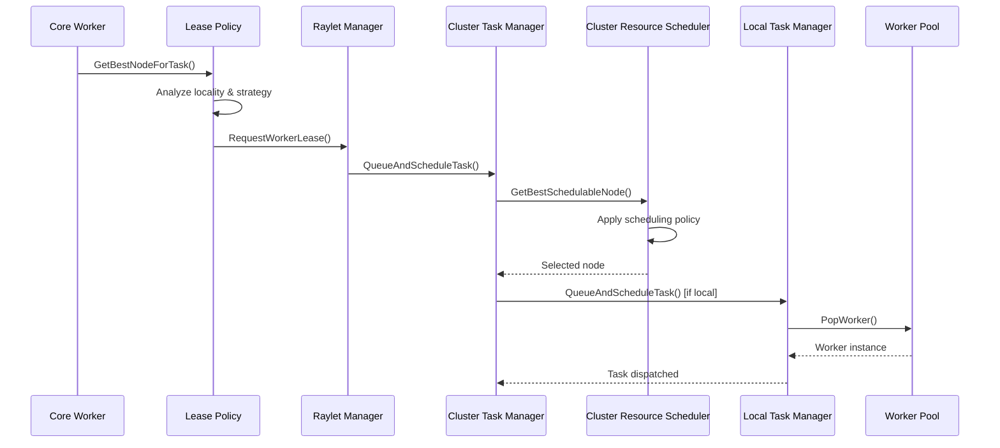
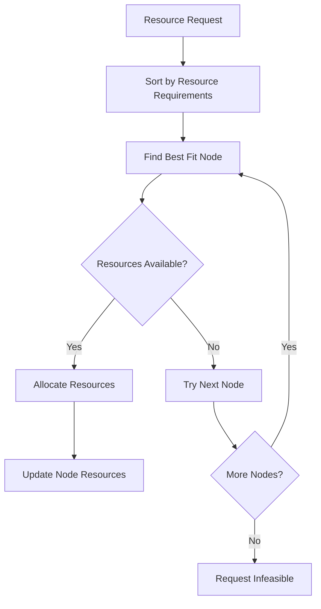
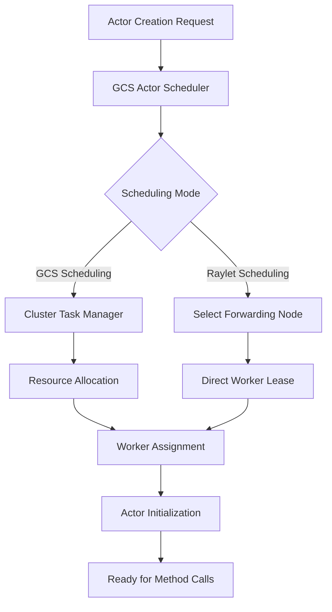
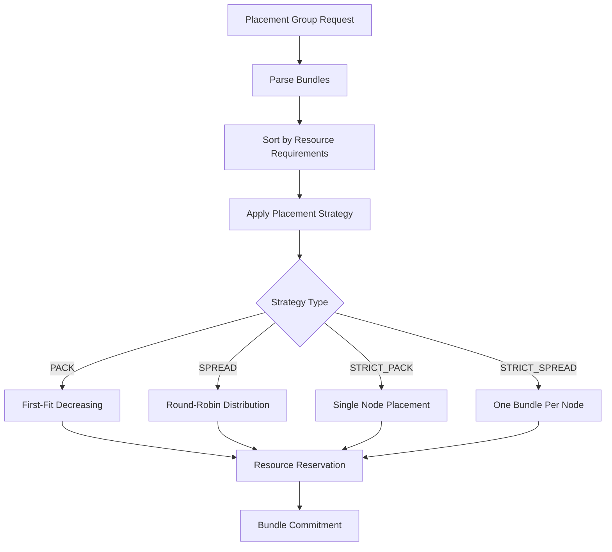
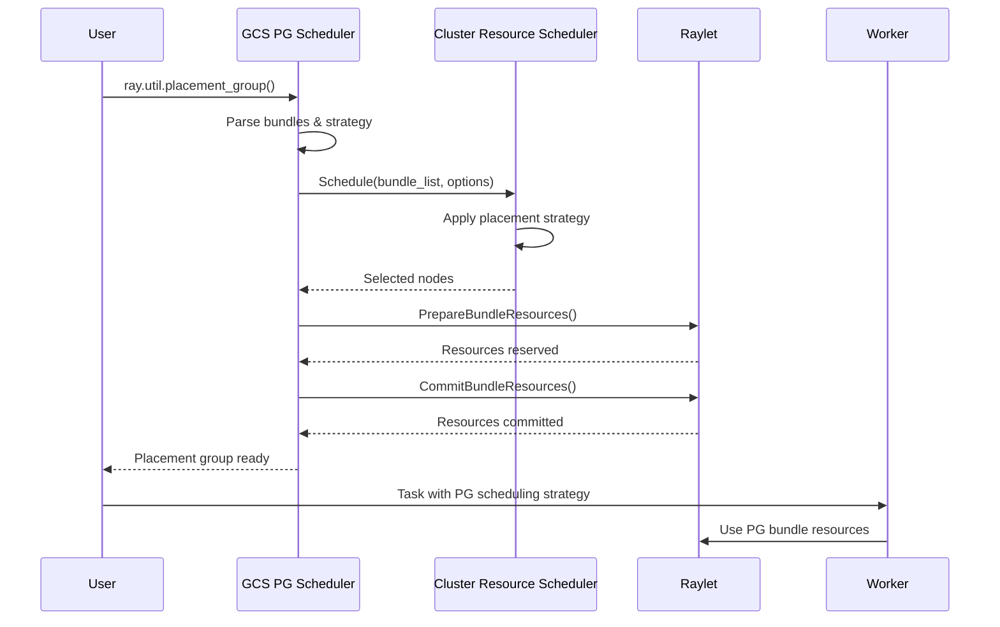
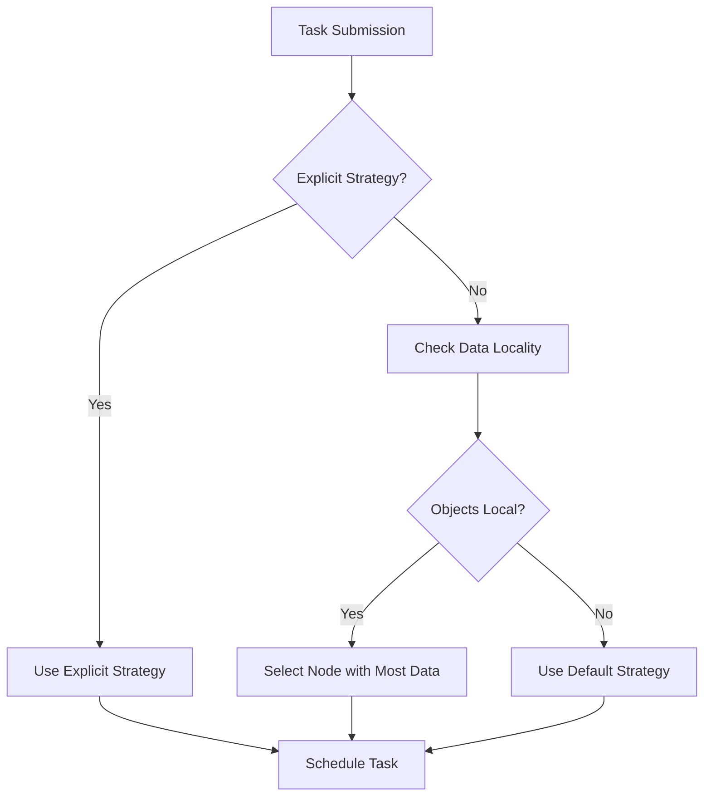
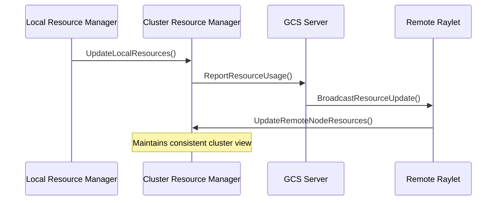

# Part III: Advanced Ray Systems
# Chapter 9: Distributed Scheduling Implementation

## Table of Contents

1. [Introduction](#introduction)
2. [Scheduling Architecture Overview](#scheduling-architecture-overview)
3. [Core Scheduling Components](#core-scheduling-components)
4. [Resource Management and Allocation](#resource-management-and-allocation)
5. [Task Scheduling Algorithms](#task-scheduling-algorithms)
6. [Actor Placement and Scheduling](#actor-placement-and-scheduling)
7. [Placement Group Scheduling](#placement-group-scheduling)
8. [Scheduling Strategies](#scheduling-strategies)
9. [Node Affinity and Label-Based Scheduling](#node-affinity-and-label-based-scheduling)
10. [Locality-Aware Scheduling](#locality-aware-scheduling)
11. [Cluster Resource Scheduling](#cluster-resource-scheduling)
12. [Autoscaler Integration](#autoscaler-integration)
13. [Performance Characteristics](#performance-characteristics)
14. [Configuration and Tuning](#configuration-and-tuning)
15. [Implementation Deep Dive](#implementation-deep-dive)
16. [Testing and Verification](#testing-and-verification)
17. [Best Practices](#best-practices)
18. [Troubleshooting](#troubleshooting)

## Introduction

Ray's distributed scheduling system is a sophisticated multi-layered scheduler designed to efficiently allocate resources and place tasks/actors across a distributed cluster. This chapter dives deep into the scheduling implementation, covering complex scheduling scenarios including resource constraints, placement groups, locality preferences, and autoscaling decisions while maintaining high performance and fault tolerance.

### What is Ray?

Ray is an open-source unified framework for scaling AI workloads. It provides:
- **Distributed Computing**: Scale Python workloads across multiple machines
- **Unified API**: Single interface for tasks, actors, and data processing
- **Fault Tolerance**: Built-in error handling and recovery mechanisms
- **Resource Management**: Efficient allocation of CPU, GPU, and memory resources
- **Ecosystem**: Libraries for ML (Ray Train), reinforcement learning (Ray RLlib), hyperparameter tuning (Ray Tune), and more

### Key Features

- **Multi-level Scheduling**: Task-level, actor-level, and placement group scheduling
- **Resource-Aware**: CPU, GPU, memory, and custom resource scheduling
- **Placement Strategies**: PACK, SPREAD, STRICT_PACK, STRICT_SPREAD
- **Locality Optimization**: Data locality-aware task placement
- **Dynamic Scaling**: Integration with autoscaler for cluster growth/shrinkage
- **Label-Based Scheduling**: Node affinity and label constraints
- **Performance Optimization**: Efficient algorithms for large-scale clusters

### Scheduling Hierarchy



## Scheduling Architecture Overview

### Multi-Level Scheduling Architecture

Ray implements a hierarchical scheduling architecture with multiple decision points:

#### 1. Client-Side Scheduling


**Location**: `src/ray/core_worker/lease_policy.cc`

The client-side scheduling makes initial placement decisions based on:
- Data locality (object location)
- Scheduling strategies (spread, node affinity)
- Resource requirements

#### 2. Raylet-Level Scheduling


**Location**: `src/ray/raylet/scheduling/cluster_task_manager.cc`

#### 3. GCS-Level Scheduling


**Location**: `src/ray/gcs/gcs_server/gcs_actor_scheduler.cc`

### Core Scheduling Flow



## Core Scheduling Components

### ClusterResourceScheduler

**Location**: `src/ray/raylet/scheduling/cluster_resource_scheduler.h`

The central coordinator for cluster-wide resource scheduling decisions.

```cpp
class ClusterResourceScheduler {
  // Core scheduling method
  scheduling::NodeID GetBestSchedulableNode(
      const ResourceRequest &resource_request,
      const rpc::SchedulingStrategy &scheduling_strategy,
      bool actor_creation,
      bool force_spillback,
      const std::string &preferred_node_id,
      int64_t *total_violations,
      bool *is_infeasible);
      
  // Bundle scheduling for placement groups
  SchedulingResult Schedule(
      const std::vector<const ResourceRequest *> &resource_request_list,
      SchedulingOptions options);
}
```

**Key Responsibilities**:
- Node feasibility checking
- Resource availability tracking
- Scheduling strategy implementation
- Placement group bundle scheduling

### ClusterTaskManager

**Location**: `src/ray/raylet/scheduling/cluster_task_manager.h`

Manages task queuing and scheduling at the cluster level.

```cpp
class ClusterTaskManager {
  void QueueAndScheduleTask(
      RayTask task,
      bool grant_or_reject,
      bool is_selected_based_on_locality,
      rpc::RequestWorkerLeaseReply *reply,
      rpc::SendReplyCallback send_reply_callback);
      
  void ScheduleAndDispatchTasks();
}
```

**Scheduling Queues**:
- `tasks_to_schedule_`: Tasks waiting for resources
- `infeasible_tasks_`: Tasks that cannot be scheduled

### LocalTaskManager

**Location**: `src/ray/raylet/local_task_manager.h`

Handles local task execution and worker management.

```cpp
class LocalTaskManager {
  void QueueAndScheduleTask(std::shared_ptr<internal::Work> work);
  void ScheduleAndDispatchTasks();
  bool TrySpillback(const std::shared_ptr<internal::Work> &work,
                    bool &is_infeasible);
}
```

**Fairness Policy**: Implements CPU-fair scheduling to prevent resource starvation:

```cpp
// From src/ray/raylet/local_task_manager.cc
if (total_cpu_requests_ > total_cpus) {
  RAY_LOG(DEBUG) << "Applying fairness policy. Total CPU requests ("
                 << total_cpu_requests_ << ") exceed total CPUs (" 
                 << total_cpus << ")";
  // Apply fair dispatching logic
}
```

### Scheduling Policies

**Location**: `src/ray/raylet/scheduling/policy/`

Ray implements multiple scheduling policies:

#### HybridSchedulingPolicy
- Default scheduling strategy
- Balances locality and load distribution
- Configurable spread threshold

#### SpreadSchedulingPolicy  
- Distributes tasks across nodes
- Minimizes resource contention
- Used for embarrassingly parallel workloads

#### NodeAffinitySchedulingPolicy
- Hard/soft node constraints
- Supports spillback on unavailability
- Critical for stateful workloads

#### NodeLabelSchedulingPolicy
```cpp
class NodeLabelSchedulingPolicy : public ISchedulingPolicy {
  scheduling::NodeID Schedule(const ResourceRequest &resource_request,
                              SchedulingOptions options) override;
private:
  bool IsNodeMatchLabelExpression(const Node &node,
                                  const rpc::LabelMatchExpression &expression);
};
```

### Scheduling Context and Options

**Location**: `src/ray/raylet/scheduling/policy/scheduling_options.h`

```cpp
struct SchedulingOptions {
  SchedulingType scheduling_type;
  float spread_threshold;
  bool avoid_local_node;
  bool require_node_available;
  bool avoid_gpu_nodes;
  double max_cpu_fraction_per_node; // For placement groups
  
  static SchedulingOptions Hybrid(bool avoid_local_node,
                                  bool require_node_available,
                                  const std::string &preferred_node_id);
                                  
  static SchedulingOptions BundlePack(double max_cpu_fraction_per_node = 1.0);
  static SchedulingOptions BundleStrictSpread(double max_cpu_fraction_per_node = 1.0);
};
```

## Resource Management and Allocation

### Resource Model

Ray uses a multi-dimensional resource model:

```cpp
// Resource types from src/ray/common/scheduling/scheduling_ids.h
enum PredefinedResources {
  CPU = 0,
  MEM = 1,
  GPU = 2,
  OBJECT_STORE_MEM = 3,
  // Custom resources start from 4
};
```

### Resource Request Structure

```cpp
class ResourceRequest {
  ResourceSet resource_set_;           // Required resources
  LabelSelector label_selector_;       // Node label requirements
  bool requires_object_store_memory_;  // Memory constraint flag
  
  bool IsEmpty() const;
  const ResourceSet &GetResourceSet() const;
  bool RequiresObjectStoreMemory() const;
};
```

### NodeResources

**Location**: `src/ray/common/scheduling/cluster_resource_data.h`

```cpp
struct NodeResources {
  NodeResourceSet total;      // Total node capacity
  NodeResourceSet available; // Currently available
  NodeResourceSet normal_task_resources; // Reserved for tasks
  absl::flat_hash_map<std::string, std::string> labels; // Node labels
  bool object_pulls_queued;   // Object store status
  
  bool IsAvailable(const ResourceRequest &resource_request) const;
  bool IsFeasible(const ResourceRequest &resource_request) const;
  bool HasRequiredLabels(const LabelSelector &label_selector) const;
  float CalculateCriticalResourceUtilization() const;
};
```

### Resource Allocation Algorithm

```cpp
bool ClusterResourceScheduler::IsSchedulable(
    const ResourceRequest &resource_request,
    scheduling::NodeID node_id) const {
  
  return cluster_resource_manager_->HasAvailableResources(
             node_id,
             resource_request,
             /*ignore_object_store_memory_requirement*/ 
             node_id == local_node_id_) &&
         NodeAvailable(node_id);
}
```

### Dynamic Resource Management

```cpp
// From src/ray/raylet/scheduling/cluster_resource_scheduler_test.cc
TEST_F(ClusterResourceSchedulerTest, DynamicResourceTest) {
  // Add dynamic resources at runtime
  resource_scheduler.GetLocalResourceManager().AddLocalResourceInstances(
      scheduling::ResourceID("custom123"), {0., 1.0, 1.0});
      
  // Verify schedulability
  auto result = resource_scheduler.GetBestSchedulableNode(resource_request, ...);
  ASSERT_FALSE(result.IsNil());
}
```

### Resource Binpacking

Ray implements sophisticated binpacking for resource allocation:



## Task Scheduling Algorithms

### Hybrid Scheduling Algorithm

**Default Strategy**: Balances locality and load distribution

```cpp
// Configuration from src/ray/raylet/scheduling/cluster_resource_scheduler.cc
best_node_id = scheduling_policy_->Schedule(
    resource_request,
    SchedulingOptions::Hybrid(
        /*avoid_local_node*/ force_spillback,
        /*require_node_available*/ force_spillback,
        preferred_node_id));
```

**Algorithm Steps**:
1. **Score Calculation**: Based on resource utilization
2. **Top-K Selection**: Choose from best k nodes (default: 20% of cluster)
3. **Random Selection**: Within top-k for load balancing

**Scoring Function**:
```cpp
float NodeResources::CalculateCriticalResourceUtilization() const {
  float highest = 0;
  for (const auto &i : {CPU, MEM, OBJECT_STORE_MEM}) {
    float utilization = 1 - (available / total);
    if (utilization > highest) {
      highest = utilization;
    }
  }
  return highest;
}
```

### Spread Scheduling Algorithm

**Purpose**: Distribute tasks across maximum number of nodes

```cpp
// From scheduling policy tests
TEST_F(SchedulingPolicyTest, SpreadSchedulingStrategyTest) {
  rpc::SchedulingStrategy scheduling_strategy;
  scheduling_strategy.mutable_spread_scheduling_strategy();
  
  auto node_id = resource_scheduler.GetBestSchedulableNode(
      resource_request, LabelSelector(), scheduling_strategy, ...);
}
```

**Implementation**:
- Prioritizes nodes with lowest task count
- Avoids resource hotspots
- Maximizes fault tolerance

### Node Affinity Scheduling

**Hard Affinity**: Must run on specific node
```cpp
if (IsHardNodeAffinitySchedulingStrategy(scheduling_strategy)) {
  // Must schedule on specified node or fail
  best_node_id = scheduling_policy_->Schedule(
      resource_request,
      SchedulingOptions::NodeAffinity(
          force_spillback, force_spillback,
          scheduling_strategy.node_affinity_scheduling_strategy().node_id(),
          /*soft=*/false, /*spill_on_unavailable=*/false,
          /*fail_on_unavailable=*/true));
}
```

**Soft Affinity**: Prefer specific node but allow spillback
```cpp
scheduling_strategy.mutable_node_affinity_scheduling_strategy()->set_soft(true);
// Will try preferred node first, then other nodes
```

### Fair Scheduling

**CPU Fair Scheduling**: Prevents starvation across scheduling classes

```cpp
// From src/ray/raylet/local_task_manager.cc
if (total_cpu_requests_ > total_cpus) {
  // Calculate fair share per scheduling class
  double fair_share = total_cpus / num_classes_with_cpu;
  
  // Apply throttling based on fair share
  for (auto &[scheduling_class, dispatch_queue] : tasks_to_dispatch_) {
    double cpu_request = /* CPU required by this class */;
    if (cpu_request > fair_share) {
      // Throttle this class
      next_update_time = current_time + throttle_delay;
    }
  }
}
```

## Actor Placement and Scheduling

### Actor Scheduling Architecture

**Location**: `src/ray/gcs/gcs_server/gcs_actor_scheduler.cc`

Ray provides two actor scheduling modes:

#### 1. GCS-Based Actor Scheduling
```cpp
void GcsActorScheduler::ScheduleByGcs(std::shared_ptr<GcsActor> actor) {
  // Create task for actor creation
  auto task = std::make_shared<RayTask>(actor->GetCreationTaskSpecification());
  
  // Use cluster task manager for scheduling
  cluster_task_manager_.QueueAndScheduleTask(
      std::move(task),
      /*grant_or_reject*/ false,
      /*is_selected_based_on_locality*/ false,
      reply.get(),
      send_reply_callback);
}
```

#### 2. Raylet-Based Actor Scheduling
```cpp
void GcsActorScheduler::ScheduleByRaylet(std::shared_ptr<GcsActor> actor) {
  // Select forwarding node
  auto node_id = SelectForwardingNode(actor);
  
  // Lease worker directly from node
  LeaseWorkerFromNode(actor, node.value());
}
```

### Actor Resource Requirements

**Placement vs Execution Resources**:

```cpp
// From src/ray/common/task/task_spec.cc
const auto &resource_set = 
    (is_actor_creation_task && should_report_placement_resources)
        ? GetRequiredPlacementResources()  // For scheduling decisions
        : GetRequiredResources();          // For execution
```

**Actor Creation Example**:
```python
@ray.remote(num_cpus=2, num_gpus=1, memory=1000)
class MyActor:
    def __init__(self):
        pass
        
    def method(self):
        pass

# Actor placement considers both creation and method resources
actor = MyActor.remote()
```

### Actor Lifecycle and Scheduling



### Actor Scheduling Considerations

**Resource Lifetime**: Actors hold resources for their entire lifetime
```cpp
if (task_spec.IsActorCreationTask()) {
  // The actor belongs to this worker now
  worker->SetLifetimeAllocatedInstances(allocated_instances);
} else {
  worker->SetAllocatedInstances(allocated_instances);
}
```

**Scheduling Class**: Actors use placement resources for scheduling decisions
```cpp
TEST(TaskSpecTest, TestActorSchedulingClass) {
  // Actor's scheduling class determined by placement resources
  TaskSpecification actor_task(actor_task_spec_proto);
  TaskSpecification regular_task(regular_task_spec_proto);
  
  ASSERT_EQ(regular_task.GetSchedulingClass(), actor_task.GetSchedulingClass());
}
```

## Placement Group Scheduling

### Placement Group Architecture

**Location**: `src/ray/gcs/gcs_server/gcs_placement_group_scheduler.cc`

Placement groups enable gang scheduling of related resources across multiple nodes.

```cpp
class GcsPlacementGroupScheduler {
  void SchedulePlacementGroup(
      std::shared_ptr<GcsPlacementGroup> placement_group,
      PGSchedulingFailureCallback failure_callback,
      PGSchedulingSuccessfulCallback success_callback);
}
```

### Bundle Specification

**Location**: `src/ray/common/bundle_spec.h`

```cpp
class BundleSpecification {
  BundleID BundleId() const;
  PlacementGroupID PlacementGroupId() const;
  NodeID NodeId() const;
  int64_t Index() const;
  const ResourceRequest &GetRequiredResources() const;
  const absl::flat_hash_map<std::string, double> &GetFormattedResources() const;
};
```

### Placement Strategies

#### PACK Strategy
```cpp
case rpc::PlacementStrategy::PACK:
  return SchedulingOptions::BundlePack(max_cpu_fraction_per_node);
```
- **Goal**: Minimize number of nodes used
- **Use Case**: Maximize locality, minimize network overhead
- **Algorithm**: First-fit decreasing binpacking

#### SPREAD Strategy  
```cpp
case rpc::PlacementStrategy::SPREAD:
  return SchedulingOptions::BundleSpread(max_cpu_fraction_per_node);
```
- **Goal**: Distribute bundles across nodes
- **Use Case**: Fault tolerance, load distribution
- **Algorithm**: Round-robin placement with load balancing

#### STRICT_PACK Strategy
```cpp
case rpc::PlacementStrategy::STRICT_PACK:
  return SchedulingOptions::BundleStrictPack(
      max_cpu_fraction_per_node,
      soft_target_node_id);
```
- **Goal**: All bundles on single node (if possible)
- **Use Case**: Shared memory, minimal latency
- **Algorithm**: Single-node placement with fallback

#### STRICT_SPREAD Strategy
```cpp
case rpc::PlacementStrategy::STRICT_SPREAD:
  return SchedulingOptions::BundleStrictSpread(
      max_cpu_fraction_per_node, 
      CreateSchedulingContext(placement_group_id));
```
- **Goal**: Each bundle on different node
- **Use Case**: Maximum fault tolerance
- **Algorithm**: One bundle per node constraint

### Bundle Scheduling Algorithm



### Bundle Resource Formatting

Ray formats placement group resources with special naming:

```cpp
// From src/ray/common/bundle_spec.h
std::string FormatPlacementGroupResource(
    const std::string &original_resource_name,
    const std::string &group_id_str,
    int64_t bundle_index) {
  
  if (bundle_index == -1) {
    // Wildcard resource: CPU_group_<group_id>
    return original_resource_name + "_group_" + group_id_str;
  } else {
    // Indexed resource: CPU_group_<bundle_index>_<group_id>
    return original_resource_name + "_group_" + 
           std::to_string(bundle_index) + "_" + group_id_str;
  }
}
```

### CPU Fraction Limits

**Purpose**: Prevent placement groups from monopolizing nodes

```cpp
bool AllocationWillExceedMaxCpuFraction(
    const NodeResources &node_resources,
    const ResourceRequest &bundle_resource_request,
    double max_cpu_fraction_per_node,
    double available_cpus_before_current_pg_request) {
    
  if (max_cpu_fraction_per_node == 1.0) {
    return false; // No limit
  }
  
  auto max_reservable_cpus = 
      max_cpu_fraction_per_node * node_resources.total.Get(cpu_id).Double();
      
  // Ensure at least 1 CPU is excluded from placement groups
  if (max_reservable_cpus > total_cpus - 1) {
    max_reservable_cpus = total_cpus - 1;
  }
  
  return cpus_used_by_pg_after > max_reservable_cpus;
}
```

### Placement Group Lifecycle



## Scheduling Strategies

### Strategy Types and Implementation

Ray supports multiple scheduling strategies through the `rpc::SchedulingStrategy` protocol buffer:

```cpp
// From src/ray/raylet/scheduling/cluster_resource_scheduler.cc
scheduling::NodeID ClusterResourceScheduler::GetBestSchedulableNode(
    const ResourceRequest &resource_request,
    const rpc::SchedulingStrategy &scheduling_strategy,
    bool actor_creation,
    bool force_spillback,
    const std::string &preferred_node_id,
    int64_t *total_violations,
    bool *is_infeasible) {
    
  if (scheduling_strategy.scheduling_strategy_case() ==
      rpc::SchedulingStrategy::SchedulingStrategyCase::kSpreadSchedulingStrategy) {
    best_node_id = scheduling_policy_->Schedule(
        resource_request,
        SchedulingOptions::Spread(force_spillback, force_spillback));
        
  } else if (scheduling_strategy.scheduling_strategy_case() ==
             rpc::SchedulingStrategy::SchedulingStrategyCase::
                 kNodeAffinitySchedulingStrategy) {
    best_node_id = scheduling_policy_->Schedule(
        resource_request,
        SchedulingOptions::NodeAffinity(/* ... */));
        
  } else if (scheduling_strategy.has_node_label_scheduling_strategy()) {
    best_node_id = scheduling_policy_->Schedule(
        resource_request, 
        SchedulingOptions::NodeLabelScheduling(scheduling_strategy));
  }
}
```

### DEFAULT Strategy

**Implementation**: Hybrid policy with configurable parameters

```python
# Environment variables controlling DEFAULT strategy
RAY_scheduler_spread_threshold = 0.5      # Utilization threshold
RAY_scheduler_top_k_fraction = 0.2        # Top-k selection ratio  
RAY_scheduler_top_k_absolute = 5          # Minimum top-k count
```

**Algorithm**:
1. Calculate node scores based on resource utilization
2. Select top-k nodes with lowest scores
3. Randomly choose from top-k for load balancing

### SPREAD Strategy

**Purpose**: Maximize distribution across nodes

```python
import ray

@ray.remote(scheduling_strategy="SPREAD")
def distributed_task():
    return "Running on different nodes"

# Tasks will be distributed across available nodes
futures = [distributed_task.remote() for _ in range(100)]
```

**Implementation Details**:
- Prioritizes nodes with fewer running tasks
- Considers resource utilization as secondary factor
- Useful for embarrassingly parallel workloads

### Node Affinity Strategy

**Hard Affinity**: Must run on specific node
```python
import ray
from ray.util.scheduling_strategies import NodeAffinitySchedulingStrategy

@ray.remote(scheduling_strategy=NodeAffinitySchedulingStrategy(
    node_id="specific-node-id", 
    soft=False
))
def pinned_task():
    return "Must run on specific node"
```

**Soft Affinity**: Prefer specific node with fallback
```python
@ray.remote(scheduling_strategy=NodeAffinitySchedulingStrategy(
    node_id="preferred-node-id", 
    soft=True
))
def preferred_task():
    return "Prefers specific node but can run elsewhere"
```

### Placement Group Strategy

**Bundle-Specific Scheduling**:
```python
import ray
from ray.util.placement_group import placement_group
from ray.util.scheduling_strategies import PlacementGroupSchedulingStrategy

# Create placement group
pg = placement_group([{"CPU": 2}, {"CPU": 2}], strategy="PACK")

@ray.remote(scheduling_strategy=PlacementGroupSchedulingStrategy(
    placement_group=pg,
    placement_group_bundle_index=0
))
def task_on_bundle_0():
    return "Running on bundle 0"

@ray.remote(scheduling_strategy=PlacementGroupSchedulingStrategy(
    placement_group=pg,
    placement_group_bundle_index=-1  # Any bundle
))
def task_on_any_bundle():
    return "Running on any available bundle"
``` 

## Node Affinity and Label-Based Scheduling

### Node Label Scheduling Policy

**Location**: `src/ray/raylet/scheduling/policy/node_label_scheduling_policy.cc`

Ray supports sophisticated label-based scheduling for fine-grained node selection:

```cpp
scheduling::NodeID NodeLabelSchedulingPolicy::Schedule(
    const ResourceRequest &resource_request,
    SchedulingOptions options) {
    
  // 1. Select feasible nodes
  auto hard_match_nodes = SelectFeasibleNodes(resource_request);
  
  // 2. Filter by hard expressions
  if (node_label_scheduling_strategy.hard().expressions().size() > 0) {
    hard_match_nodes = FilterNodesByLabelMatchExpressions(
        hard_match_nodes, node_label_scheduling_strategy.hard());
  }
  
  // 3. Filter by soft expressions  
  auto hard_and_soft_match_nodes = FilterNodesByLabelMatchExpressions(
      hard_match_nodes, node_label_scheduling_strategy.soft());
      
  return SelectBestNode(hard_match_nodes, hard_and_soft_match_nodes, resource_request);
}
```

### Label Matching Implementation

```cpp
bool NodeLabelSchedulingPolicy::IsNodeMatchLabelExpression(
    const Node &node, const rpc::LabelMatchExpression &expression) const {
    
  const auto &key = expression.key();
  const auto &operator_type = expression.operator_();
  const auto &values = expression.values();
  
  switch (operator_type) {
    case rpc::LabelMatchExpression::IN:
      return IsNodeLabelInValues(node, key, values);
    case rpc::LabelMatchExpression::NOT_IN:
      return !IsNodeLabelInValues(node, key, values);
    case rpc::LabelMatchExpression::EXISTS:
      return IsNodeLabelKeyExists(node, key);
    case rpc::LabelMatchExpression::DOES_NOT_EXIST:
      return !IsNodeLabelKeyExists(node, key);
  }
}
```

### Label Selector Usage

```python
import ray
from ray.util.scheduling_strategies import NodeLabelSchedulingStrategy

# Hard constraints (must match)
hard_constraints = {
    "ray.io/node-type": "gpu-node",
    "zone": "us-west-1a"
}

# Soft constraints (preferred)
soft_constraints = {
    "instance-type": "p3.2xlarge"
}

@ray.remote(scheduling_strategy=NodeLabelSchedulingStrategy(
    hard=hard_constraints,
    soft=soft_constraints
))
def gpu_task():
    return "Running on GPU node in preferred zone"
```

### Node Label Management

**Static Labels**: Set during node startup
```bash
# Set node labels via environment
export RAY_NODE_LABELS='{"zone":"us-west-1a","instance-type":"m5.large"}'
ray start --head
```

**Dynamic Labels**: Updated at runtime
```cpp
// From cluster resource data
struct NodeResources {
  absl::flat_hash_map<std::string, std::string> labels;
  
  bool HasRequiredLabels(const LabelSelector &label_selector) const;
  bool NodeLabelMatchesConstraint(const LabelConstraint &constraint) const;
};
```

## Locality-Aware Scheduling

### Locality-Aware Lease Policy

**Location**: `src/ray/core_worker/lease_policy.cc`

Ray implements data locality-aware scheduling to minimize data movement:

```cpp
std::pair<rpc::Address, bool> LocalityAwareLeasePolicy::GetBestNodeForTask(
    const TaskSpecification &spec) {
    
  // Check for explicit scheduling strategies first
  if (spec.IsSpreadSchedulingStrategy() || spec.IsNodeAffinitySchedulingStrategy()) {
    return std::make_pair(fallback_rpc_address_, false);
  }
  
  // Pick node based on locality
  if (auto node_id = GetBestNodeIdForTask(spec)) {
    if (auto addr = node_addr_factory_(node_id.value())) {
      return std::make_pair(addr.value(), true);
    }
  }
  
  return std::make_pair(fallback_rpc_address_, false);
}
```

### Locality Calculation

**Criteria**: Node with most object bytes local

```cpp
std::optional<NodeID> LocalityAwareLeasePolicy::GetBestNodeIdForTask(
    const TaskSpecification &spec) {
    
  const auto &dependencies = spec.GetDependencies();
  if (dependencies.empty()) {
    return std::nullopt;
  }
  
  // Calculate locality scores for each node
  absl::flat_hash_map<NodeID, int64_t> locality_scores;
  for (const auto &obj_id : dependencies) {
    auto locality_data = locality_data_provider_.GetLocalityData(obj_id);
    for (const auto &node_id : locality_data.nodes_containing_object) {
      locality_scores[node_id] += locality_data.object_size;
    }
  }
  
  // Return node with highest locality score
  return GetNodeWithMaxScore(locality_scores);
}
```

### Locality vs Strategy Priority



### Locality Testing

```cpp
// From src/ray/tests/test_scheduling.py
def test_locality_aware_leasing(ray_start_cluster):
    @ray.remote(resources={"pin": 1})
    def non_local():
        return ray._private.worker.global_worker.node.unique_id

    @ray.remote
    def f(x):
        return ray._private.worker.global_worker.node.unique_id

    # Test that task f() runs on the same node as non_local()
    # due to data locality
    assert ray.get(f.remote(non_local.remote())) == non_local_node.unique_id
```

## Cluster Resource Scheduling

### Cluster Resource Manager

**Location**: `src/ray/raylet/scheduling/cluster_resource_manager.h`

Maintains global view of cluster resources:

```cpp
class ClusterResourceManager {
  // Add or update node resources
  void AddOrUpdateNode(scheduling::NodeID node_id,
                       const NodeResources &node_resources);
                       
  // Check resource availability
  bool HasAvailableResources(scheduling::NodeID node_id,
                             const ResourceRequest &resource_request) const;
                             
  // Resource allocation
  bool SubtractNodeAvailableResources(scheduling::NodeID node_id,
                                      const ResourceRequest &resource_request);
};
```

### Resource Synchronization



### Resource Reporting

**Location**: `src/ray/raylet/scheduling/scheduler_resource_reporter.cc`

```cpp
void SchedulerResourceReporter::FillResourceUsage(rpc::ResourcesData &data) const {
  // Report resource demands by shape
  auto resource_load_by_shape = data.mutable_resource_load_by_shape();
  
  for (const auto &[scheduling_class, task_queue] : tasks_to_schedule_) {
    const auto &resources = scheduling_class_descriptor.resource_set.GetResourceMap();
    auto by_shape_entry = resource_load_by_shape->Add();
    
    for (const auto &resource : resources) {
      (*by_shape_entry->mutable_shape())[resource.first] = resource.second;
    }
    
    by_shape_entry->set_num_ready_requests_queued(task_queue.size());
  }
}
```

## Autoscaler Integration

### Resource Demand Scheduler

**Location**: `python/ray/autoscaler/v2/scheduler.py`

The autoscaler uses sophisticated scheduling algorithms to determine cluster scaling decisions:

```python
class ResourceDemandScheduler(IResourceScheduler):
    def schedule(self, request: SchedulingRequest) -> SchedulingReply:
        ctx = self.ScheduleContext.from_schedule_request(request)
        
        # 1. Enforce min workers per type
        self._enforce_min_workers_per_type(ctx)
        
        # 2. Enforce resource constraints
        infeasible_constraints = self._enforce_resource_constraints(
            ctx, request.cluster_resource_constraints)
            
        # 3. Schedule gang resource requests
        infeasible_gang_requests = self._sched_gang_resource_requests(
            ctx, request.gang_resource_requests)
            
        # 4. Schedule regular resource requests
        infeasible_requests = self._sched_resource_requests(
            ctx, ResourceRequestUtil.ungroup_by_count(request.resource_requests))
            
        # 5. Enforce idle termination
        self._enforce_idle_termination(ctx)
        
        return SchedulingReply(
            to_launch=ctx.get_launch_requests(),
            to_terminate=ctx.get_terminate_requests(),
            infeasible_resource_requests=infeasible_requests,
            infeasible_gang_resource_requests=infeasible_gang_requests,
            infeasible_cluster_resource_constraints=infeasible_constraints
        )
```

### Binpacking Algorithm

```python
def _try_schedule(
    ctx: ScheduleContext,
    requests_to_sched: List[ResourceRequest],
    resource_request_source: ResourceRequestSource,
) -> Tuple[List[SchedulingNode], List[ResourceRequest]]:
    
    # Sort requests by complexity for better binpacking
    def _sort_resource_request(req: ResourceRequest) -> Tuple:
        return (
            len(req.placement_constraints),
            len(req.resources_bundle.values()),
            sum(req.resources_bundle.values()),
            sorted(req.resources_bundle.items()),
        )
    
    requests_to_sched = sorted(
        requests_to_sched, key=_sort_resource_request, reverse=True)
    
    # Try scheduling on existing nodes first
    while len(requests_to_sched) > 0 and len(existing_nodes) > 0:
        best_node, requests_to_sched, existing_nodes = \
            self._sched_best_node(requests_to_sched, existing_nodes, resource_request_source)
        if best_node is None:
            break
        target_nodes.append(best_node)
    
    # Try scheduling on new nodes
    for node_type, num_available in node_type_available.items():
        if num_available > 0:
            new_node = SchedulingNode.from_node_config(
                ctx.get_node_type_configs()[node_type],
                status=SchedulingNodeStatus.TO_LAUNCH)
            # Try to schedule remaining requests on new node
```

### Placement Group Autoscaling

```python
def placement_groups_to_resource_demands(
    pending_placement_groups: List[PlacementGroupTableData],
) -> Tuple[List[ResourceDict], List[List[ResourceDict]]]:
    
    resource_demand_vector = []
    unconverted = []
    
    for placement_group in pending_placement_groups:
        shapes = [dict(bundle.unit_resources) for bundle in placement_group.bundles 
                  if bundle.node_id == b""]  # Only unplaced bundles
        
        if placement_group.strategy == PlacementStrategy.PACK:
            resource_demand_vector.extend(shapes)
        elif placement_group.strategy == PlacementStrategy.STRICT_PACK:
            # Combine all bundles into single demand
            combined = collections.defaultdict(float)
            for shape in shapes:
                for label, quantity in shape.items():
                    combined[label] += quantity
            resource_demand_vector.append(combined)
        elif placement_group.strategy == PlacementStrategy.STRICT_SPREAD:
            # Cannot be converted - needs special handling
            unconverted.append(shapes)
    
    return resource_demand_vector, unconverted
```

### Autoscaler Configuration

```yaml
# Example autoscaler configuration
cluster_name: ray-cluster
max_workers: 100
upscaling_speed: 1.0
idle_timeout_minutes: 5

available_node_types:
  ray.head.default:
    min_workers: 0
    max_workers: 0
    resources: {"CPU": 4}
    
  ray.worker.cpu:
    min_workers: 0
    max_workers: 50
    resources: {"CPU": 8, "memory": 32000000000}
    
  ray.worker.gpu:
    min_workers: 0
    max_workers: 10
    resources: {"CPU": 16, "GPU": 4, "memory": 64000000000}
```

## Performance Characteristics

### Scheduling Latency

**Typical Latencies**:
- Local scheduling: 1-5ms
- Remote scheduling: 10-50ms  
- Placement group creation: 100-1000ms
- Autoscaler response: 30-300s

### Scalability Metrics

**Cluster Size**: Ray scheduling tested up to 1000+ nodes

**Task Throughput**: 
- Simple tasks: 100K+ tasks/second
- Complex scheduling: 10K+ tasks/second
- Placement groups: 100+ groups/second

### Memory Usage

**Scheduler Memory Overhead**:
```cpp
// Per-node overhead in ClusterResourceManager
struct NodeResources {
  NodeResourceSet total;      // ~1KB per node
  NodeResourceSet available; // ~1KB per node  
  NodeResourceSet normal_task_resources; // ~1KB per node
  absl::flat_hash_map<std::string, std::string> labels; // Variable
};

// Total: ~3KB + labels per node
```

**Task Queue Memory**:
```cpp
// Per-task overhead in scheduling queues
class Work {
  RayTask task;                    // ~2KB per task
  TaskResourceInstances allocated; // ~500B per task
  WorkStatus state;               // ~100B per task
};

// Total: ~2.6KB per queued task
```

### Performance Optimization

**Top-K Selection**: Reduces scheduling complexity from O(N) to O(K)
```cpp
// Default configuration
RAY_scheduler_top_k_fraction = 0.2  // 20% of nodes
RAY_scheduler_top_k_absolute = 5    // Minimum 5 nodes
```

**Caching**: Resource views cached to avoid repeated calculations
```cpp
class ClusterResourceManager {
  // Cached resource calculations
  mutable absl::flat_hash_map<scheduling::NodeID, float> utilization_cache_;
  mutable int64_t cache_timestamp_;
};
```

## Configuration and Tuning

### Environment Variables

**Core Scheduling**:
```bash
# Spread threshold for hybrid scheduling
export RAY_scheduler_spread_threshold=0.5

# Top-k node selection
export RAY_scheduler_top_k_fraction=0.2
export RAY_scheduler_top_k_absolute=5

# Worker management
export RAY_num_workers_soft_limit=1000
export RAY_maximum_startup_concurrency=10
```

**Resource Management**:
```bash
# Object store memory scheduling
export RAY_object_store_memory=1000000000

# Pull manager configuration  
export RAY_object_manager_pull_timeout_ms=10000
export RAY_object_manager_max_bytes_in_flight=100000000
```

**Placement Groups**:
```bash
# CPU fraction limits
export RAY_placement_group_max_cpu_fraction_per_node=0.8

# Bundle scheduling timeout
export RAY_placement_group_bundle_resource_timeout_s=30
```

### Runtime Configuration

**Cluster Resource Constraints**:
```python
import ray

# Set cluster-wide resource constraints
ray.autoscaler.sdk.request_resources([
    {"CPU": 100, "GPU": 10},  # Ensure cluster can handle this workload
    {"memory": 1000000000}    # Minimum memory requirement
])
```

**Node Type Configuration**:
```python
# Configure node types for autoscaling
node_config = {
    "ray.worker.cpu": {
        "min_workers": 2,
        "max_workers": 20,
        "resources": {"CPU": 8, "memory": 32000000000}
    },
    "ray.worker.gpu": {
        "min_workers": 0, 
        "max_workers": 5,
        "resources": {"CPU": 16, "GPU": 4, "memory": 64000000000}
    }
}
```

### Performance Tuning

**For High Throughput**:
```bash
# Increase worker limits
export RAY_num_workers_soft_limit=2000
export RAY_maximum_startup_concurrency=50

# Reduce scheduling overhead
export RAY_scheduler_top_k_absolute=10
export RAY_scheduler_spread_threshold=0.3
```

**For Low Latency**:
```bash
# Prioritize local scheduling
export RAY_scheduler_spread_threshold=0.8
export RAY_scheduler_top_k_fraction=0.1

# Reduce worker startup time
export RAY_worker_lease_timeout_milliseconds=1000
```

**For Large Clusters**:
```bash
# Optimize for scale
export RAY_scheduler_top_k_fraction=0.1  # Top 10% of nodes
export RAY_raylet_report_resources_period_milliseconds=1000
export RAY_gcs_resource_report_poll_period_milliseconds=1000
```

## Best Practices

### Task Scheduling

**1. Use Appropriate Scheduling Strategies**:
```python
# For embarrassingly parallel workloads
@ray.remote(scheduling_strategy="SPREAD")
def parallel_task(data):
    return process(data)

# For data-dependent tasks (default locality-aware)
@ray.remote
def dependent_task(large_object):
    return analyze(large_object)

# For specific hardware requirements
@ray.remote(scheduling_strategy=NodeAffinitySchedulingStrategy(
    node_id=gpu_node_id, soft=True))
def gpu_task():
    return train_model()
```

**2. Resource Specification**:
```python
# Be specific about resource requirements
@ray.remote(num_cpus=2, num_gpus=1, memory=4000*1024*1024)
def resource_intensive_task():
    return compute()

# Use custom resources for specialized hardware
@ray.remote(resources={"accelerator": 1})
def accelerated_task():
    return specialized_compute()
```

### Actor Placement

**1. Consider Resource Lifetime**:
```python
# Actors hold resources for their lifetime
@ray.remote(num_cpus=4, num_gpus=1)
class ModelServer:
    def __init__(self):
        self.model = load_large_model()
    
    def predict(self, data):
        return self.model.predict(data)

# Create fewer, long-lived actors rather than many short-lived ones
server = ModelServer.remote()
```

**2. Use Placement Groups for Related Actors**:
```python
# Group related actors together
pg = placement_group([{"CPU": 4}, {"CPU": 4}, {"CPU": 4}], strategy="PACK")

actors = [
    Actor.options(scheduling_strategy=PlacementGroupSchedulingStrategy(
        placement_group=pg, placement_group_bundle_index=i
    )).remote() for i in range(3)
]
```

### Placement Group Design

**1. Choose Appropriate Strategies**:
```python
# For tightly coupled workloads
pg_pack = placement_group([{"CPU": 2, "GPU": 1}] * 4, strategy="PACK")

# For fault tolerance
pg_spread = placement_group([{"CPU": 2}] * 8, strategy="SPREAD")

# For strict requirements
pg_strict = placement_group([{"CPU": 4}] * 2, strategy="STRICT_SPREAD")
```

**2. Bundle Size Optimization**:
```python
# Avoid bundles larger than single node capacity
# Bad: Bundle requires more than any node has
bad_pg = placement_group([{"CPU": 64, "GPU": 8}])  # If max node has 32 CPU

# Good: Bundle fits on available nodes
good_pg = placement_group([{"CPU": 16, "GPU": 2}] * 4)
```

### Autoscaler Optimization

**1. Configure Appropriate Limits**:
```yaml
# Set realistic min/max workers
available_node_types:
  ray.worker.default:
    min_workers: 2      # Always keep some capacity
    max_workers: 100    # Prevent runaway scaling
    upscaling_speed: 2.0  # Scale up aggressively
```

**2. Use Resource Constraints**:
```python
# Ensure cluster can handle expected workload
ray.autoscaler.sdk.request_resources([
    {"CPU": 200, "memory": 500000000000},  # Expected peak usage
])
```

## Troubleshooting

### Common Scheduling Issues

**1. Tasks Stuck in Pending State**:

*Symptoms*: Tasks remain in PENDING_SCHEDULING state
*Causes*:
- Insufficient cluster resources
- Infeasible resource requirements
- Node affinity to unavailable nodes

*Debugging*:
```python
# Check cluster resources
print(ray.cluster_resources())
print(ray.available_resources())

# Check task resource requirements
@ray.remote(num_cpus=1)
def debug_task():
    return ray.get_runtime_context().get_assigned_resources()

# Check for infeasible tasks
ray.autoscaler.sdk.request_resources([{"CPU": 1000}])  # Will show if infeasible
```

**2. Poor Load Balancing**:

*Symptoms*: Some nodes overloaded while others idle
*Causes*:
- Inappropriate scheduling strategy
- Data locality overriding load balancing
- Sticky worker assignment

*Solutions*:
```python
# Use SPREAD strategy for better distribution
@ray.remote(scheduling_strategy="SPREAD")
def distributed_task():
    return compute()

# Adjust spread threshold
import os
os.environ["RAY_scheduler_spread_threshold"] = "0.3"
```

**3. Placement Group Creation Failures**:

*Symptoms*: Placement groups fail to create or timeout
*Causes*:
- Insufficient cluster capacity
- Conflicting resource constraints
- Network partitions

*Debugging*:
```python
import ray
from ray.util.placement_group import placement_group

# Check placement group status
pg = placement_group([{"CPU": 2}] * 4, strategy="STRICT_SPREAD")
print(pg.ready())  # False if creation failed

# Check bundle placement
print(ray.util.placement_group_table())
```

### Performance Issues

**1. High Scheduling Latency**:

*Symptoms*: Long delays between task submission and execution
*Causes*:
- Large cluster with inefficient node selection
- Complex placement constraints
- Resource fragmentation

*Solutions*:
```bash
# Reduce top-k selection size
export RAY_scheduler_top_k_fraction=0.1

# Increase spread threshold for faster local scheduling
export RAY_scheduler_spread_threshold=0.7
```

**2. Memory Issues in Scheduler**:

*Symptoms*: Raylet OOM, high memory usage in scheduling components
*Causes*:
- Large number of queued tasks
- Memory leaks in scheduling data structures
- Excessive resource tracking overhead

*Solutions*:
```bash
# Limit concurrent tasks
export RAY_num_workers_soft_limit=500

# Reduce resource reporting frequency
export RAY_raylet_report_resources_period_milliseconds=5000
```

### Debugging Tools

**1. Ray Status Commands**:
```bash
# Check cluster state
ray status

# Check resource usage
ray status --verbose

# Check placement groups
ray status --placement-groups
```

**2. Programmatic Debugging**:
```python
# Check scheduling state
import ray._private.state as state

# Get pending tasks
pending_tasks = state.tasks(filters=[("state", "=", "PENDING_SCHEDULING")])

# Get resource usage by node
nodes = state.nodes()
for node in nodes:
    print(f"Node {node['node_id']}: {node['resources_total']}")
```

**3. Logging Configuration**:
```bash
# Enable debug logging for scheduling
export RAY_LOG_LEVEL=DEBUG
export RAY_BACKEND_LOG_LEVEL=DEBUG

# Focus on specific components
export RAY_LOG_TO_STDERR=1
ray start --head --log-to-driver
```

### Monitoring and Observability

**1. Metrics Collection**:
```python
# Custom metrics for scheduling performance
import ray
from ray.util.metrics import Counter, Histogram

scheduling_latency = Histogram(
    "ray_scheduling_latency_seconds",
    description="Time from task submission to scheduling",
    boundaries=[0.001, 0.01, 0.1, 1.0, 10.0]
)

task_queue_size = Counter(
    "ray_task_queue_size",
    description="Number of tasks in scheduling queue"
)
```

**2. Dashboard Integration**:
- Use Ray Dashboard for real-time cluster monitoring
- Monitor resource utilization trends
- Track placement group creation success rates
- Observe task scheduling patterns

This comprehensive guide covers Ray's distributed scheduling system from architecture to implementation details, providing developers and operators with the knowledge needed to effectively use and optimize Ray's scheduling capabilities in production environments. 