# Part III: Advanced Ray Systems
# Chapter 10: Autoscaling System

# Ray Autoscaling - Comprehensive Technical Guide

## Table of Contents

1. [Introduction](#introduction)
2. [Autoscaling Architecture Overview](#autoscaling-architecture-overview)
3. [Core Autoscaling Components](#core-autoscaling-components)
4. [Resource Demand Detection](#resource-demand-detection)
5. [Node Lifecycle Management](#node-lifecycle-management)
6. [Scheduling and Binpacking Algorithms](#scheduling-and-binpacking-algorithms)
7. [Cloud Provider Integration](#cloud-provider-integration)
8. [Autoscaler Policies and Strategies](#autoscaler-policies-and-strategies)
9. [Load Metrics and Monitoring](#load-metrics-and-monitoring)
10. [Placement Group Autoscaling](#placement-group-autoscaling)
11. [Resource Constraints and Limits](#resource-constraints-and-limits)
12. [Multi-Cloud and Hybrid Deployments](#multi-cloud-and-hybrid-deployments)
13. [Performance Optimization](#performance-optimization)
14. [Configuration and Tuning](#configuration-and-tuning)
15. [Production Deployment](#production-deployment)
16. [Troubleshooting and Debugging](#troubleshooting-and-debugging)
17. [Best Practices](#best-practices)
18. [Advanced Topics](#advanced-topics)

## Introduction

Ray's autoscaling system is like having a smart assistant that watches your computing workload and automatically adjusts your cluster size. When you have more work to do, it adds more machines. When things quiet down, it removes unused machines to save money. Think of it as an intelligent resource manager that ensures you always have just the right amount of computing power for your needs.

### What Makes Ray Autoscaling Special?

**Smart Decision Making**: Unlike simple autoscalers that just count CPU usage, Ray's autoscaler understands the specific resources your tasks need - CPUs, GPUs, memory, and custom resources. It can predict exactly what type of machines you need before you run out of capacity.

**Lightning Fast**: The autoscaler can make scaling decisions in seconds, not minutes. It doesn't wait for machines to become overloaded - it anticipates demand and scales proactively.

**Cost Efficient**: By understanding your workload patterns, it minimizes cloud costs by spinning up the cheapest combination of machines that can handle your work.

**Multi-Cloud Ready**: Works seamlessly across AWS, GCP, Azure, Kubernetes, and even your local data center.

### Core Features


- **Resource-Aware Scaling**: Understands your exact compute needs (CPU, GPU, memory)
- **Placement Group Support**: Handles complex multi-node workloads that need specific arrangements
- **Intelligent Binpacking**: Finds the most cost-effective way to fit your workload
- **Preemptible Instance Support**: Uses cheaper spot/preemptible instances when appropriate
- **Custom Resource Types**: Supports specialized hardware like TPUs, FPGAs, or custom accelerators

## Autoscaling Architecture Overview

Think of Ray's autoscaling system as a well-orchestrated team where each component has a specific job, but they all work together seamlessly.

### The Big Picture: How It All Works Together

```mermaid
graph TB
    subgraph "📊 Monitoring Layer"
        LM[Load Metrics<br/>📈 Watches cluster usage]
        RD[Resource Demand<br/>🎯 Detects what's needed]
    end
    
    subgraph "🧠 Intelligence Layer"
        AS[Autoscaler Core<br/>🤖 Makes scaling decisions]
        RS[Resource Scheduler<br/>⚖️ Plans optimal cluster shape]
    end
    
    subgraph "🔧 Execution Layer"
        IM[Instance Manager<br/>🏗️ Manages node lifecycle]
        NP[Node Providers<br/>☁️ Talks to cloud APIs]
    end
    
    subgraph "☁️ Cloud Infrastructure"
        AWS[AWS EC2<br/>🟠 Amazon Cloud]
        GCP[GCP Compute<br/>🔵 Google Cloud]
        AZURE[Azure VMs<br/>🟣 Microsoft Cloud]
        K8S[Kubernetes<br/>⚙️ Container Platform]
    end
    
    LM --> AS
    RD --> AS
    AS --> RS
    RS --> IM
    IM --> NP
    NP --> AWS
    NP --> GCP
    NP --> AZURE
    NP --> K8S
    
    style LM fill:#e3f2fd,stroke:#1976d2,stroke-width:2px,color:#000
    style RD fill:#f1f8e9,stroke:#388e3c,stroke-width:2px,color:#000
    style AS fill:#fff3e0,stroke:#f57c00,stroke-width:2px,color:#000
    style RS fill:#fce4ec,stroke:#c2185b,stroke-width:2px,color:#000
    style IM fill:#e8eaf6,stroke:#3f51b5,stroke-width:2px,color:#000
    style NP fill:#f3e5f5,stroke:#7b1fa2,stroke-width:2px,color:#000
    style AWS fill:#ff6d00,stroke:#e65100,stroke-width:2px,color:#fff
    style GCP fill:#2196f3,stroke:#0d47a1,stroke-width:2px,color:#fff
    style AZURE fill:#9c27b0,stroke:#4a148c,stroke-width:2px,color:#fff
    style K8S fill:#4caf50,stroke:#1b5e20,stroke-width:2px,color:#fff
```



### What Happens During Autoscaling (In Plain English)

1. **👀 Watching Phase**: The system continuously monitors your cluster, tracking how many tasks are waiting, what resources they need, and how busy each machine is.

2. **🤔 Thinking Phase**: When it notices unmet demand, the autoscaler calculates the optimal mix of machines to add, considering costs, availability, and your constraints.

3. **🚀 Acting Phase**: It launches new machines through cloud APIs, installs Ray software, and integrates them into your cluster.

4. **🧹 Cleanup Phase**: When machines sit idle too long, it safely removes them to save costs.

### Multi-Level Decision Making

Ray's autoscaler operates at multiple levels to make optimal decisions:

```mermaid
graph TD
    subgraph "🎯 Application Level"
        TASKS[Tasks & Actors<br/>📋 Your actual workload]
        PG[Placement Groups<br/>🏗️ Complex arrangements]
    end
    
    subgraph "⚖️ Resource Level"
        CPU[CPU Requirements<br/>🔧 Processing power]
        GPU[GPU Requirements<br/>🎮 Graphics/ML acceleration]
        MEM[Memory Requirements<br/>💾 RAM needs]
        CUSTOM[Custom Resources<br/>🔬 Special hardware]
    end
    
    subgraph "🏗️ Infrastructure Level"
        NODES[Node Types<br/>🖥️ Machine configurations]
        REGIONS[Availability Zones<br/>🌍 Geographic distribution]
        COSTS[Cost Optimization<br/>💰 Budget efficiency]
    end
    
    TASKS --> CPU
    TASKS --> GPU
    TASKS --> MEM
    PG --> NODES
    CPU --> NODES
    GPU --> NODES
    MEM --> NODES
    CUSTOM --> NODES
    NODES --> REGIONS
    NODES --> COSTS
    
    style TASKS fill:#e1f5fe,stroke:#01579b,stroke-width:2px,color:#000
    style PG fill:#f3e5f5,stroke:#4a148c,stroke-width:2px,color:#000
    style CPU fill:#e8f5e8,stroke:#1b5e20,stroke-width:2px,color:#000
    style GPU fill:#fff3e0,stroke:#e65100,stroke-width:2px,color:#000
    style MEM fill:#fce4ec,stroke:#880e4f,stroke-width:2px,color:#000
    style CUSTOM fill:#f1f8e9,stroke:#388e3c,stroke-width:2px,color:#000
    style NODES fill:#e3f2fd,stroke:#1976d2,stroke-width:2px,color:#000
    style REGIONS fill:#fff8e1,stroke:#f57c00,stroke-width:2px,color:#000
    style COSTS fill:#e8eaf6,stroke:#3f51b5,stroke-width:2px,color:#000
```



## Core Autoscaling Components

Let's dive into the key players that make Ray's autoscaling system work. Think of these as different departments in a company, each with specific responsibilities.

### 1. StandardAutoscaler - The Main Controller

**Location**: `python/ray/autoscaler/_private/autoscaler.py`

This is the "CEO" of the autoscaling system - it coordinates everything and makes the final decisions.

```python
class StandardAutoscaler:
    def __init__(self, config_reader, load_metrics, gcs_client, ...):
        # The brain of the operation
        self.provider = self._get_node_provider(provider_config, cluster_name)
        self.resource_demand_scheduler = ResourceDemandScheduler(...)
        self.load_metrics = load_metrics
        
        # Key configuration settings
        self.max_workers = config.get("max_workers", 0)
        self.upscaling_speed = config.get("upscaling_speed", 1.0)
        self.idle_timeout_minutes = config.get("idle_timeout_minutes", 5)
```

**What It Does (In Simple Terms)**:
- Wakes up every few seconds to check if the cluster needs changes
- Decides when to add new machines (scale up)
- Decides when to remove idle machines (scale down)
- Ensures the cluster never exceeds your budget or size limits

**Key Responsibilities**:

```mermaid
graph LR
    A["🔍 Monitor Demand"] --> B["📊 Analyze Resources"]
    B --> C["🎯 Make Decisions"]
    C --> D["🚀 Execute Changes"]
    D --> E["📝 Update Status"]
    E --> A
    
    style A fill:#e3f2fd,stroke:#1976d2,stroke-width:2px,color:#000
    style B fill:#f1f8e9,stroke:#388e3c,stroke-width:2px,color:#000
    style C fill:#fff3e0,stroke:#f57c00,stroke-width:2px,color:#000
    style D fill:#fce4ec,stroke:#c2185b,stroke-width:2px,color:#000
    style E fill:#e8eaf6,stroke:#3f51b5,stroke-width:2px,color:#000
```


### 2. ResourceDemandScheduler - The Smart Planner

**Location**: `python/ray/autoscaler/_private/resource_demand_scheduler.py`

This component is like a smart logistics coordinator that figures out the most efficient way to arrange your computing resources.

```python
class ResourceDemandScheduler:
    def get_nodes_to_launch(self, 
                           resource_demands,           # What you need
                           unused_resources_by_ip,     # What's available
                           pending_placement_groups,   # Complex arrangements
                           max_resources_by_ip):       # Machine capacities
        
        # Step 1: Understand current cluster state
        node_resources, node_type_counts = self.calculate_node_resources(...)
        
        # Step 2: Respect minimum worker requirements
        adjusted_min_workers = self._add_min_workers_nodes(...)
        
        # Step 3: Handle placement groups (complex workloads)
        spread_pg_nodes = self.reserve_and_allocate_spread(...)
        
        # Step 4: Use "bin packing" to find optimal machine mix
        nodes_to_add, unfulfilled = get_nodes_for(...)
        
        return total_nodes_to_add, final_unfulfilled
```

**The Bin Packing Magic**: Think of this like playing Tetris with cloud machines. You have different shaped "resource blocks" (your tasks) and different sized "containers" (machine types). The scheduler finds the combination that wastes the least space and costs the least money.

```mermaid
graph TD
    subgraph "🧩 Resource Demands"
        T1["Task A<br/>2 CPU, 1 GPU<br/>🔧🎮"]
        T2["Task B<br/>4 CPU, 0 GPU<br/>🔧🔧🔧🔧"]
        T3["Task C<br/>1 CPU, 2 GPU<br/>🔧🎮🎮"]
    end
    
    subgraph "🏗️ Available Machine Types"
        M1["Small Instance<br/>4 CPU, 0 GPU<br/>$0.10/hour<br/>💰"]
        M2["GPU Instance<br/>8 CPU, 4 GPU<br/>$2.40/hour<br/>💰💰💰"]
        M3["Balanced Instance<br/>16 CPU, 2 GPU<br/>$1.20/hour<br/>💰💰"]
    end
    
    subgraph "🎯 Optimal Allocation"
        SOLUTION["1x GPU Instance<br/>Fits all tasks<br/>Total: $2.40/hour<br/>✅ Cost Efficient"]
    end
    
    T1 --> SOLUTION
    T2 --> SOLUTION
    T3 --> SOLUTION
    M2 --> SOLUTION
    
    style T1 fill:#e1f5fe,stroke:#01579b,stroke-width:2px,color:#000
    style T2 fill:#f3e5f5,stroke:#4a148c,stroke-width:2px,color:#000
    style T3 fill:#e8f5e8,stroke:#1b5e20,stroke-width:2px,color:#000
    style M1 fill:#fff3e0,stroke:#e65100,stroke-width:2px,color:#000
    style M2 fill:#fce4ec,stroke:#880e4f,stroke-width:2px,color:#000
    style M3 fill:#f1f8e9,stroke:#388e3c,stroke-width:2px,color:#000
    style SOLUTION fill:#e3f2fd,stroke:#1976d2,stroke-width:3px,color:#000
```



### 3. LoadMetrics - The Cluster Monitor

**Location**: `python/ray/autoscaler/_private/load_metrics.py`

This is like having a health monitor attached to your cluster that constantly reports vital signs.

```python
class LoadMetrics:
    def __init__(self):
        # Tracks what resources each machine has
        self.static_resources_by_ip = {}      # Total capacity
        self.dynamic_resources_by_ip = {}     # Currently available
        
        # Tracks what work is waiting
        self.pending_resource_requests = []   # Individual tasks
        self.pending_placement_groups = []    # Complex arrangements
        
        # Tracks cluster health
        self.last_heartbeat_time_by_ip = {}   # When we last heard from nodes
        self.last_heartbeat_failed = {}       # Which nodes are unresponsive
```

**What It Monitors**:

```mermaid
graph TB
    subgraph "📊 Cluster Vital Signs"
        CPU_USAGE["CPU Usage<br/>🔧 How busy processors are"]
        GPU_USAGE["GPU Usage<br/>🎮 Graphics card utilization"]
        MEMORY_USAGE["Memory Usage<br/>💾 RAM consumption"]
        DISK_USAGE["Disk Usage<br/>💿 Storage utilization"]
    end
    
    subgraph "📋 Workload Queue"
        PENDING_TASKS["Pending Tasks<br/>⏳ Work waiting to start"]
        PLACEMENT_GROUPS["Placement Groups<br/>🏗️ Complex arrangements"]
        RESOURCE_REQUESTS["Resource Requests<br/>🎯 Specific demands"]
    end
    
    subgraph "💓 Node Health"
        HEARTBEATS["Node Heartbeats<br/>💗 Alive/Dead status"]
        RESPONSE_TIME["Response Times<br/>⚡ Performance metrics"]
        ERROR_RATES["Error Rates<br/>🚨 Failure indicators"]
    end
    
    CPU_USAGE --> DECISION["🤖 Scaling Decision"]
    GPU_USAGE --> DECISION
    MEMORY_USAGE --> DECISION
    PENDING_TASKS --> DECISION
    PLACEMENT_GROUPS --> DECISION
    HEARTBEATS --> DECISION
    
    style CPU_USAGE fill:#e3f2fd,stroke:#1976d2,stroke-width:2px,color:#000
    style GPU_USAGE fill:#f1f8e9,stroke:#388e3c,stroke-width:2px,color:#000
    style MEMORY_USAGE fill:#fff3e0,stroke:#f57c00,stroke-width:2px,color:#000
    style DISK_USAGE fill:#fce4ec,stroke:#c2185b,stroke-width:2px,color:#000
    style PENDING_TASKS fill:#e8eaf6,stroke:#3f51b5,stroke-width:2px,color:#000
    style PLACEMENT_GROUPS fill:#f3e5f5,stroke:#7b1fa2,stroke-width:2px,color:#000
    style RESOURCE_REQUESTS fill:#e1f5fe,stroke:#01579b,stroke-width:2px,color:#000
    style HEARTBEATS fill:#e8f5e8,stroke:#1b5e20,stroke-width:2px,color:#000
    style RESPONSE_TIME fill:#fff8e1,stroke:#ef6c00,stroke-width:2px,color:#000
    style ERROR_RATES fill:#ffebee,stroke:#c62828,stroke-width:2px,color:#000
    style DECISION fill:#e0f2f1,stroke:#00695c,stroke-width:3px,color:#000
```


### 4. Node Providers - The Cloud Connectors

**Location**: `python/ray/autoscaler/_private/providers.py`

These are like specialized translators that know how to talk to different cloud providers. Each provider speaks its own "language" (API), but Ray abstracts this complexity.

```python
# AWS Provider
class AWSNodeProvider(NodeProvider):
    def create_node(self, node_config, tags, count):
        # Launches EC2 instances using AWS API
        response = self.ec2.run_instances(
            ImageId=node_config["ImageId"],
            InstanceType=node_config["InstanceType"],
            MinCount=count, MaxCount=count,
            SubnetId=node_config["SubnetId"]
        )
        return [instance.id for instance in response["Instances"]]

# GCP Provider  
class GCPNodeProvider(NodeProvider):
    def create_node(self, node_config, tags, count):
        # Launches Compute Engine instances using GCP API
        operation = self.compute.instances().insert(
            project=self.project_id,
            zone=self.zone,
            body=instance_config
        ).execute()
        return operation["targetId"]
```

**Supported Cloud Providers**:

```mermaid
graph LR
    subgraph "☁️ Major Cloud Providers"
        AWS["🟠 Amazon Web Services<br/>EC2, Spot Instances"]
        GCP["🔵 Google Cloud Platform<br/>Compute Engine, Preemptible"]
        AZURE["🟣 Microsoft Azure<br/>Virtual Machines, Spot VMs"]
    end
    
    subgraph "🏗️ Container Platforms"
        K8S["⚙️ Kubernetes<br/>Any K8s cluster"]
        KUBERAY["🚀 KubeRay Operator<br/>K8s-native Ray"]
    end
    
    subgraph "🏠 On-Premise & Hybrid"
        LOCAL["🏠 Local Provider<br/>Your own machines"]
        VSPHERE["🔧 VMware vSphere<br/>Private cloud"]
        EXTERNAL["🔌 External Provider<br/>Custom integrations"]
    end
    
    RAY_AUTOSCALER["🤖 Ray Autoscaler<br/>Universal Interface"] --> AWS
    RAY_AUTOSCALER --> GCP
    RAY_AUTOSCALER --> AZURE
    RAY_AUTOSCALER --> K8S
    RAY_AUTOSCALER --> KUBERAY
    RAY_AUTOSCALER --> LOCAL
    RAY_AUTOSCALER --> VSPHERE
    RAY_AUTOSCALER --> EXTERNAL
    
    style RAY_AUTOSCALER fill:#e0f2f1,stroke:#00695c,stroke-width:3px,color:#000
    style AWS fill:#ff6d00,stroke:#e65100,stroke-width:2px,color:#fff
    style GCP fill:#2196f3,stroke:#0d47a1,stroke-width:2px,color:#fff
    style AZURE fill:#9c27b0,stroke:#4a148c,stroke-width:2px,color:#fff
    style K8S fill:#4caf50,stroke:#1b5e20,stroke-width:2px,color:#fff
    style KUBERAY fill:#00bcd4,stroke:#006064,stroke-width:2px,color:#fff
    style LOCAL fill:#795548,stroke:#3e2723,stroke-width:2px,color:#fff
    style VSPHERE fill:#607d8b,stroke:#263238,stroke-width:2px,color:#fff
    style EXTERNAL fill:#ff9800,stroke:#e65100,stroke-width:2px,color:#fff
```


### 5. GCS Autoscaler State Manager - The Central Coordinator

**Location**: `src/ray/gcs/gcs_server/gcs_autoscaler_state_manager.cc`

This component runs inside Ray's Global Control Service (GCS) and acts as the central hub for all autoscaling information.

```cpp
class GcsAutoscalerStateManager {
    void UpdateResourceLoadAndUsage(rpc::ResourcesData data) {
        // Receives resource reports from all nodes
        NodeID node_id = NodeID::FromBinary(data.node_id());
        node_resource_info_[node_id] = std::move(data);
    }
    
    void GetPendingResourceRequests(rpc::autoscaler::ClusterResourceState *state) {
        // Aggregates demand from all nodes
        auto aggregate_load = GetAggregatedResourceLoad();
        for (const auto &[shape, demand] : aggregate_load) {
            if (demand.num_ready_requests_queued() > 0) {
                // Add to autoscaling demand
                auto pending_req = state->add_pending_resource_requests();
                pending_req->set_count(demand.num_ready_requests_queued());
            }
        }
    }
};
```

**Role in the System**:

```mermaid
graph TB
    subgraph "🏭 Individual Raylets"
        R1["Raylet 1<br/>📊 Reports: 4 CPU, 2 pending tasks"]
        R2["Raylet 2<br/>📊 Reports: 8 CPU, 1 GPU, 0 pending"]
        R3["Raylet 3<br/>📊 Reports: 2 CPU, 5 pending tasks"]
    end
    
    subgraph "🏛️ Global Control Service (GCS)"
        GCS_ASM["GCS Autoscaler State Manager<br/>🧠 Central Intelligence"]
    end
    
    subgraph "🤖 Autoscaler"
        AUTOSCALER["StandardAutoscaler<br/>🎯 Decision Maker"]
    end
    
    R1 --> GCS_ASM
    R2 --> GCS_ASM
    R3 --> GCS_ASM
    GCS_ASM --> AUTOSCALER
    
    GCS_ASM -.-> AGG_STATE["📈 Aggregated State<br/>Total: 14 CPU, 1 GPU<br/>Pending: 7 tasks"]
    
    style R1 fill:#e3f2fd,stroke:#1976d2,stroke-width:2px,color:#000
    style R2 fill:#f1f8e9,stroke:#388e3c,stroke-width:2px,color:#000
    style R3 fill:#fff3e0,stroke:#f57c00,stroke-width:2px,color:#000
    style GCS_ASM fill:#fce4ec,stroke:#c2185b,stroke-width:3px,color:#000
    style AUTOSCALER fill:#e8eaf6,stroke:#3f51b5,stroke-width:2px,color:#000
    style AGG_STATE fill:#e0f2f1,stroke:#00695c,stroke-width:2px,color:#000
```


## Resource Demand Detection

Understanding how Ray detects and measures resource demand is crucial because this drives all autoscaling decisions. Think of it like a restaurant that needs to predict how many customers will arrive and what they'll order.

### How Ray Sees Resource Demand

Ray tracks demand at multiple levels, each providing different insights:

```mermaid
graph TB
    subgraph "🎯 Immediate Demand (Next Few Seconds)"
        QUEUED_TASKS["Queued Tasks<br/>📋 Tasks ready to run<br/>⏱️ Need resources NOW"]
        ACTOR_CREATION["Actor Creation<br/>🎭 Long-running processes<br/>🏠 Need permanent homes"]
    end
    
    subgraph "📊 Aggregate Demand (Next Few Minutes)"
        PLACEMENT_GROUPS["Placement Groups<br/>🏗️ Complex multi-node workloads<br/>🎯 Need coordinated resources"]
        RESOURCE_REQUESTS["Resource Requests<br/>🎪 User predictions<br/>📈 Expected future load"]
    end
    
    subgraph "🔮 Predictive Demand (Next Hour+)"
        AUTOSCALING_HINTS["Autoscaling Hints<br/>🧠 ML-based predictions<br/>📊 Historical patterns"]
        MIN_WORKERS["Min Workers Config<br/>⚡ Always-on capacity<br/>🛡️ Performance guarantee"]
    end
    
    QUEUED_TASKS --> DECISION["🤖 Scaling Decision<br/>🎯 Add N nodes of type X"]
    ACTOR_CREATION --> DECISION
    PLACEMENT_GROUPS --> DECISION
    RESOURCE_REQUESTS --> DECISION
    AUTOSCALING_HINTS --> DECISION
    MIN_WORKERS --> DECISION
    
    style QUEUED_TASKS fill:#ffcdd2,stroke:#d32f2f,stroke-width:2px,color:#000
    style ACTOR_CREATION fill:#ffcdd2,stroke:#d32f2f,stroke-width:2px,color:#000
    style PLACEMENT_GROUPS fill:#fff3e0,stroke:#f57c00,stroke-width:2px,color:#000
    style RESOURCE_REQUESTS fill:#fff3e0,stroke:#f57c00,stroke-width:2px,color:#000
    style AUTOSCALING_HINTS fill:#e8f5e8,stroke:#1b5e20,stroke-width:2px,color:#000
    style MIN_WORKERS fill:#e8f5e8,stroke:#1b5e20,stroke-width:2px,color:#000
    style DECISION fill:#e3f2fd,stroke:#1976d2,stroke-width:3px,color:#000
```



### Resource Demand Aggregation Process

Here's how Ray collects and processes demand information:

```python
# From python/ray/autoscaler/_private/load_metrics.py
class LoadMetrics:
    def summary(self) -> LoadMetricsSummary:
        # Step 1: Collect demand from each node's queued tasks
        aggregate_load = {}
        for node_ip, resource_data in self.resource_usage_by_ip.items():
            for resource_shape, demand in resource_data.items():
                total_demand = (demand.num_ready_requests_queued() + 
                               demand.num_infeasible_requests_queued() +
                               demand.backlog_size())
                if total_demand > 0:
                    aggregate_load[resource_shape] = total_demand
        
        # Step 2: Add placement group demands
        pg_demands = self._get_placement_group_demands()
        
        # Step 3: Add explicit resource requests
        explicit_requests = self.resource_requests or []
        
        return LoadMetricsSummary(
            resource_demand=aggregate_load,
            pg_demand=pg_demands,
            request_demand=explicit_requests
        )
```

### Types of Resource Shapes

Ray thinks about resources in "shapes" - specific combinations of resources that tasks need:

```mermaid
graph LR
    subgraph "🔧 Simple Shapes"
        CPU_ONLY["CPU Only<br/>{'CPU': 2}<br/>🔧🔧 Web servers, APIs"]
        MEMORY_HEAVY["Memory Heavy<br/>{'CPU': 1, 'memory': 16GB}<br/>🔧💾 Data processing"]
    end
    
    subgraph "🎮 GPU Shapes"
        GPU_TRAINING["GPU Training<br/>{'CPU': 8, 'GPU': 4}<br/>🔧🔧🎮🎮 ML training"]
        GPU_INFERENCE["GPU Inference<br/>{'CPU': 2, 'GPU': 1}<br/>🔧🎮 Model serving"]
    end
    
    subgraph "🔬 Custom Shapes"
        TPU_SHAPE["TPU Workload<br/>{'CPU': 4, 'TPU': 8}<br/>🔧🧠 Specialized ML"]
        MIXED_SHAPE["Mixed Resources<br/>{'CPU': 4, 'GPU': 2, 'FPGA': 1}<br/>🔧🎮⚡ Complex compute"]
    end
    
    style CPU_ONLY fill:#e3f2fd,stroke:#1976d2,stroke-width:2px,color:#000
    style MEMORY_HEAVY fill:#f1f8e9,stroke:#388e3c,stroke-width:2px,color:#000
    style GPU_TRAINING fill:#fff3e0,stroke:#f57c00,stroke-width:2px,color:#000
    style GPU_INFERENCE fill:#fce4ec,stroke:#c2185b,stroke-width:2px,color:#000
    style TPU_SHAPE fill:#e8eaf6,stroke:#3f51b5,stroke-width:2px,color:#000
    style MIXED_SHAPE fill:#f3e5f5,stroke:#7b1fa2,stroke-width:2px,color:#000
```



### Real-Time Demand Tracking

The GCS continuously receives updates from all cluster nodes about their resource usage and pending work:

```cpp
// From src/ray/gcs/gcs_server/gcs_autoscaler_state_manager.cc
void GcsAutoscalerStateManager::UpdateResourceLoadAndUsage(rpc::ResourcesData data) {
    NodeID node_id = NodeID::FromBinary(data.node_id());
    
    // Update this node's resource information
    auto &node_info = node_resource_info_[node_id];
    node_info.second = std::move(data);
    node_info.first = absl::Now();  // Last update time
    
    // The data includes:
    // - Total resources on this node
    // - Currently available resources  
    // - Resource demands by shape (queued tasks)
    // - Object store memory usage
    // - Placement group demands
}
```

### Demand Processing Pipeline

Here's the complete flow of how demand information travels through the system:


### Intelligent Demand Prediction

Ray doesn't just react to current demand - it predicts future needs:

```python
# Proactive scaling based on trends
def _should_scale_up_preemptively(self, load_metrics):
    # Look at demand growth rate
    current_demand = len(load_metrics.pending_tasks)
    demand_growth_rate = (current_demand - self.last_demand) / self.update_interval
    
    # If demand is growing quickly, scale up before we run out
    if demand_growth_rate > self.preemptive_threshold:
        return True
        
    # Look at placement group patterns
    pending_pgs = load_metrics.pending_placement_groups
    if len(pending_pgs) > 0:
        # Placement groups often come in batches
        return True
        
    return False
``` 