# Part III: Advanced Ray Systems
# Chapter 11: High Availability and Fault Tolerance

# Ray High Availability: Comprehensive Technical Guide

## Table of Contents
1. [Introduction](#introduction)
2. [Architecture Overview](#architecture-overview)
3. [Core HA Components](#core-ha-components)
4. [GCS Fault Tolerance](#gcs-fault-tolerance)
5. [Node Failure Handling](#node-failure-handling)
6. [Actor Fault Tolerance](#actor-fault-tolerance)
7. [Object Fault Tolerance](#object-fault-tolerance)
8. [Network Partition Recovery](#network-partition-recovery)
9. [Health Monitoring](#health-monitoring)
10. [Recovery Mechanisms](#recovery-mechanisms)
11. [Performance Impact](#performance-impact)
12. [Implementation Details](#implementation-details)
13. [Configuration Guidelines](#configuration-guidelines)

## Introduction

Ray's High Availability (HA) system provides **comprehensive fault tolerance** across all layers of the distributed system. It ensures that Ray clusters can survive and recover from various types of failures including node crashes, network partitions, process failures, and storage outages. The HA system is designed to minimize downtime and maintain service continuity while preserving data consistency and system reliability.

### Key Principles

1. **Layered Fault Tolerance**: Different components have specialized recovery mechanisms
2. **Automatic Recovery**: Most failures are handled automatically without manual intervention
3. **Graceful Degradation**: System continues operating with reduced capacity during failures
4. **State Preservation**: Critical state is persisted to enable recovery after failures
5. **Minimal Performance Impact**: HA mechanisms are optimized for production workloads

### Failure Types Handled

- **Head Node Failures**: GCS server crashes, head node hardware failures
- **Worker Node Failures**: Raylet crashes, worker node hardware failures  
- **Process Failures**: Actor crashes, task failures, worker process exits
- **Network Partitions**: Network splits, connectivity issues
- **Storage Failures**: Redis outages, disk failures, I/O errors
- **Resource Exhaustion**: Memory pressure, CPU saturation, disk space

## Architecture Overview

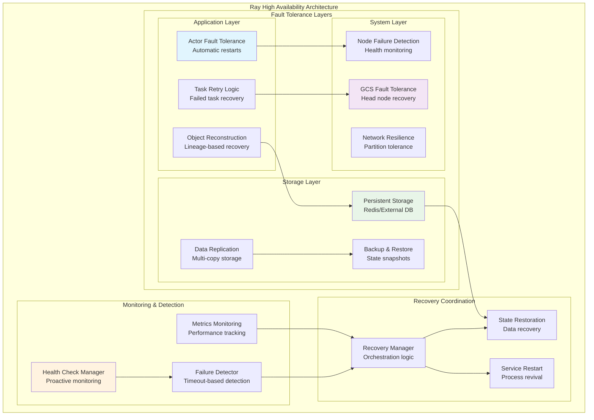

### HA Design Philosophy

**Failure Isolation**: Failures in one component don't cascade to others
**Fast Recovery**: Minimize time between failure detection and recovery completion
**Consistency Preservation**: Maintain data consistency during recovery operations
**Observability**: Comprehensive monitoring and alerting for failure scenarios

## Core HA Components

The Ray HA system consists of several interconnected components working together to provide comprehensive fault tolerance.

### Component Interaction Model

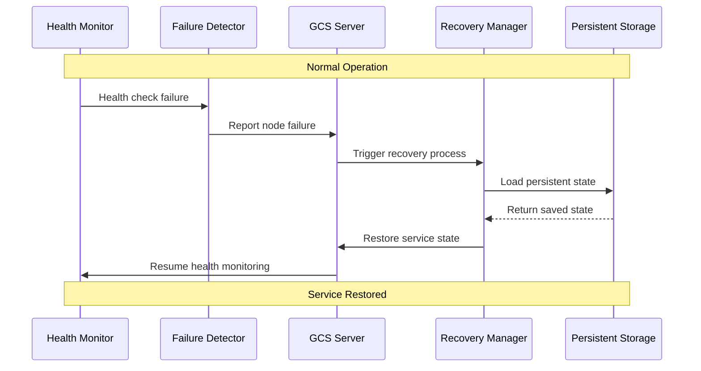

### HA Component Responsibilities

| Component | Primary Function | Failure Types Handled | Recovery Method |
|-----------|------------------|----------------------|-----------------|
| GCS Health Manager | Node health monitoring | Process crashes, network issues | Proactive health checks |
| Actor Manager | Actor lifecycle | Actor process failures | Automatic restart with state |
| Object Manager | Object availability | Data loss, node failures | Lineage reconstruction |
| Node Manager | Cluster membership | Node crashes, departures | Membership updates |
| Storage Manager | State persistence | Storage failures | Backup/restore operations |

## GCS Fault Tolerance

The Global Control Service (GCS) is the central coordination point, making its fault tolerance critical for cluster survival.

### GCS HA Architecture

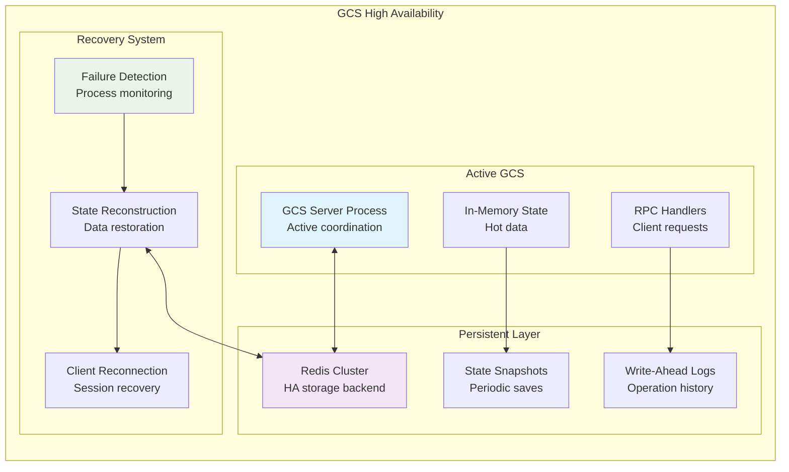

### GCS Recovery Process

From `python/ray/tests/test_gcs_fault_tolerance.py:45-100`:

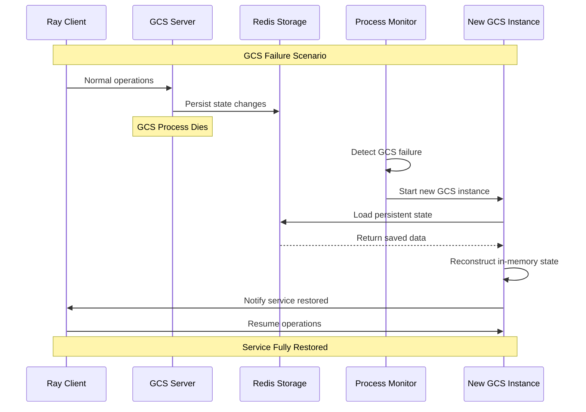

**GCS Recovery Configuration:**

```cpp
// From test configuration
struct GCSRecoveryConfig {
  int64_t gcs_rpc_server_reconnect_timeout_s = 60;  // Reconnection timeout
  int64_t gcs_server_request_timeout_seconds = 10;  // Request timeout
  int64_t redis_db_connect_retries = 50;            // Redis retry attempts
  bool enable_external_redis = true;                // Use persistent Redis
};
```

### Critical State Preserved

1. **Node Registry**: All active and failed nodes
2. **Actor Information**: Actor metadata and placement
3. **Job State**: Running and completed jobs
4. **Resource Allocation**: Cluster resource assignments
5. **Placement Groups**: Group configurations and status

## Node Failure Handling

Ray implements sophisticated node failure detection and recovery mechanisms to maintain cluster health.

### Node State Transitions

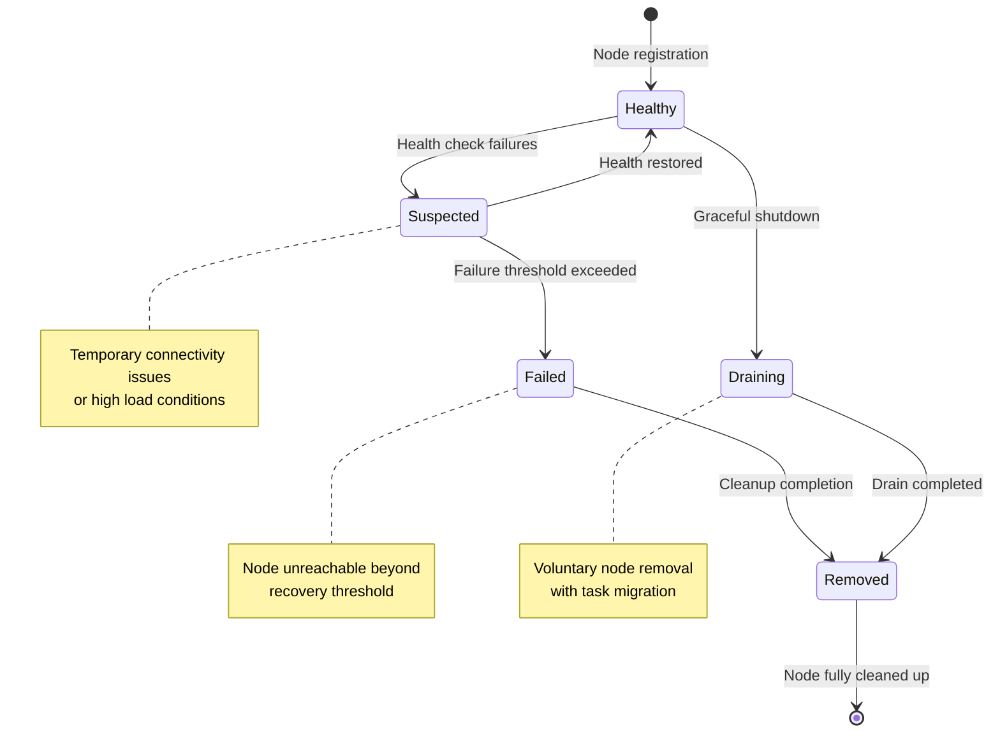

### Health Check Protocol

From `src/ray/gcs/gcs_server/gcs_health_check_manager.h:40-60`:

```cpp
class GcsHealthCheckManager {
  // Health check configuration
  int64_t initial_delay_ms_;    // Delay before first check
  int64_t timeout_ms_;         // Timeout per health check
  int64_t period_ms_;          // Interval between checks  
  int64_t failure_threshold_;  // Failures before marking dead
  
  // Health check process
  void StartHealthCheck() {
    // Send gRPC health check to node
    stub_->Check(request_, &response_, [this](Status status) {
      if (status.ok()) {
        health_check_remaining_ = failure_threshold_;  // Reset counter
        ScheduleNextCheck();
      } else {
        health_check_remaining_--;
        if (health_check_remaining_ <= 0) {
          manager_->FailNode(node_id_);  // Mark node as failed
        } else {
          ScheduleNextCheck();  // Retry after delay
        }
      }
    });
  }
};
```

### Node Failure Impact and Recovery

**Immediate Effects:**
- All running tasks on the node are terminated
- Actors hosted on the node become unavailable
- Objects stored locally are marked as lost
- Resource allocations are freed

**Recovery Actions:**
- Failed tasks are automatically retried on healthy nodes
- Actors with `max_restarts > 0` are restarted elsewhere
- Lost objects are reconstructed via lineage if possible
- Resource scheduling excludes the failed node

## Actor Fault Tolerance

Ray actors can automatically recover from failures through configurable restart policies and state management.

### Actor Restart Mechanisms

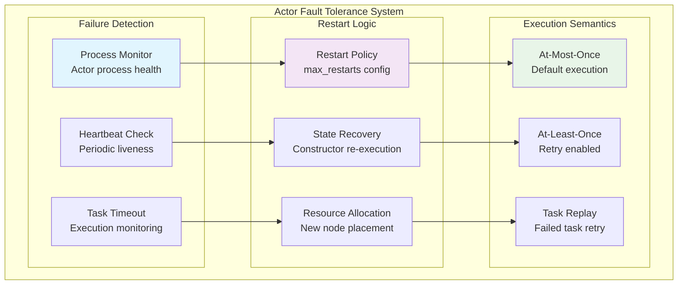

### Actor Restart Configuration

From `doc/source/ray-core/doc_code/actor_restart.py:8-15`:

```python
@ray.remote(max_restarts=4, max_task_retries=-1)
class FaultTolerantActor:
    def __init__(self):
        self.counter = 0
        # Actor state is reconstructed by re-running constructor
    
    def increment_and_possibly_fail(self):
        if self.counter == 10:
            os._exit(0)  # Simulate actor failure
        self.counter += 1
        return self.counter
```

**Restart Policy Parameters:**

| Parameter | Default | Description | Effect |
|-----------|---------|-------------|---------|
| `max_restarts` | 0 | Maximum actor restarts | Controls restart attempts |
| `max_task_retries` | 0 | Task retry attempts | Enables at-least-once semantics |
| `max_pending_calls` | -1 | Queue size limit | Prevents memory overflow |

### Actor Lifecycle During Failures

```mermaid
sequenceDiagram
    participant Client as Ray Client
    participant ActorMgr as Actor Manager
    participant Node1 as Original Node
    participant Node2 as Recovery Node
    participant Actor as Actor Instance
    
    Note over Client,Actor: Normal Operation
    
    Client->>Actor: Method call
    Actor->>Client: Return result
    
    Note over Actor: Actor Process Dies
    
    Node1->>ActorMgr: Report actor failure
    ActorMgr->>ActorMgr: Check restart policy
    ActorMgr->>Node2: Schedule actor restart
    
    Node2->>Actor: Re-run constructor
    Actor->>Node2: Actor ready
    Node2->>ActorMgr: Report restart success
    
    ActorMgr->>Client: Redirect future calls
    Client->>Actor: Resume method calls
    
    Note over Client,Actor: Actor Recovered
```

## Object Fault Tolerance

Ray provides automatic object recovery through lineage reconstruction and data replication.

### Object Recovery Architecture

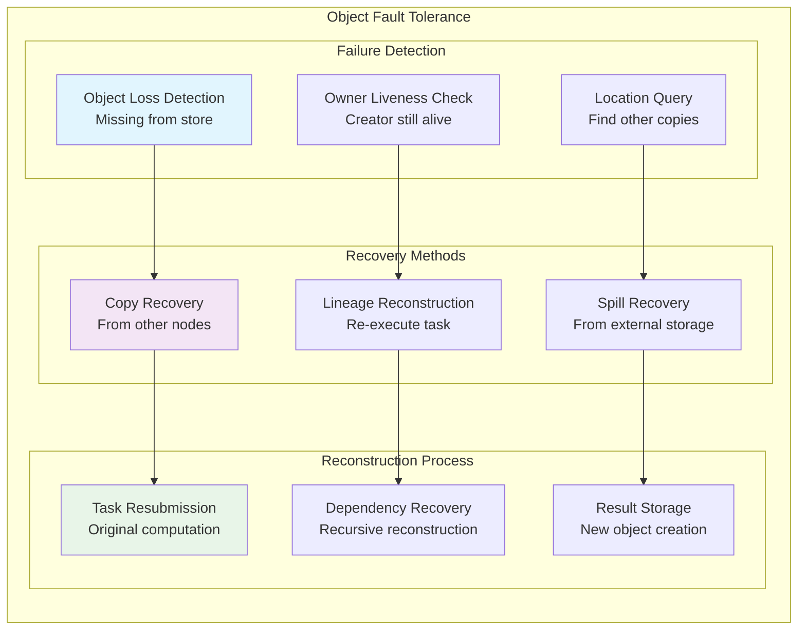

### Object Recovery Algorithm

From `src/ray/core_worker/object_recovery_manager.h:70-90`:

```cpp
// Object recovery algorithm steps:
bool RecoverObject(const ObjectID &object_id) {
  // 1. Check object ownership and missing status
  if (!IsObjectMissing(object_id) || !IsObjectOwned(object_id)) {
    return false;  // Cannot recover
  }
  
  // 2. Look for existing copies on other nodes
  auto locations = GetObjectLocations(object_id);
  if (!locations.empty()) {
    return PinObjectFromLocation(object_id, locations);
  }
  
  // 3. Attempt lineage reconstruction
  auto task_spec = GetCreationTaskSpec(object_id);
  if (task_spec.has_value()) {
    return ResubmitTask(task_spec.value());
  }
  
  return false;  // Object not recoverable
}
```

### Object Recovery Limitations

**Recoverable Objects:**
- Objects created by deterministic tasks
- Objects with living owners
- Objects with available lineage information

**Non-Recoverable Objects:**
- Objects created by `ray.put()` (no lineage)
- Objects with dead owners
- Objects from non-deterministic tasks
- Objects exceeding retry limits

## Health Monitoring

Ray implements comprehensive health monitoring across all cluster components.

### Multi-Layer Health Monitoring

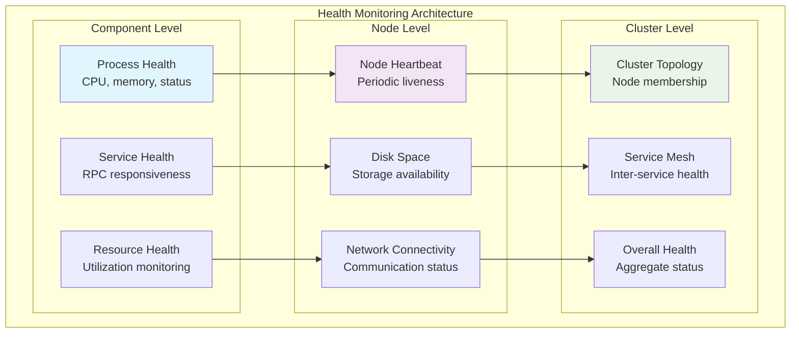

### Health Check Implementation

**GCS Health Check Manager Configuration:**

```cpp
// Health check parameters
struct HealthCheckConfig {
  int64_t initial_delay_ms = 5000;        // Delay before first check
  int64_t timeout_ms = 10000;             // Timeout per check
  int64_t period_ms = 30000;              // Check interval
  int64_t failure_threshold = 3;          // Failures before marking dead
};

// Health check process
class HealthCheckContext {
  void StartHealthCheck() {
    auto deadline = std::chrono::steady_clock::now() + 
                   std::chrono::milliseconds(timeout_ms_);
    
    stub_->async()->Check(&context_, &request_, &response_, 
                         [this](grpc::Status status) {
      if (status.ok()) {
        ResetFailureCount();
        ScheduleNextCheck();
      } else {
        IncrementFailureCount();
        if (failure_count_ >= failure_threshold_) {
          ReportNodeFailure();
        } else {
          ScheduleNextCheck();
        }
      }
    });
  }
};
```

## Recovery Mechanisms

Ray implements several coordinated recovery mechanisms to handle different failure scenarios.

### Recovery Strategy Selection

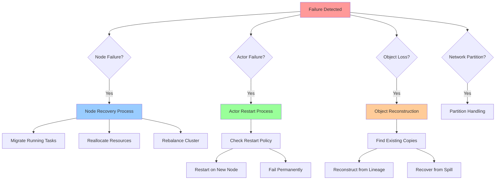

### Recovery Coordination Protocol

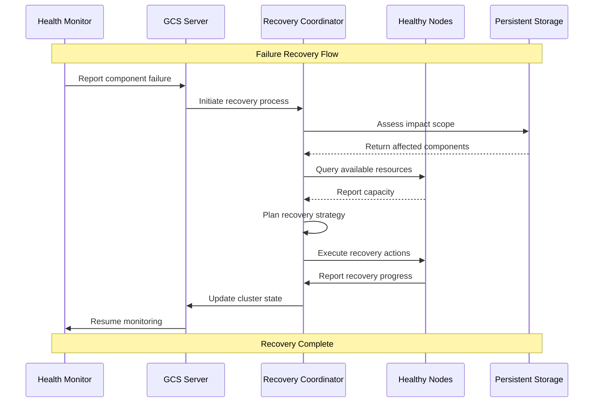

### Performance Impact Analysis

**Recovery Time Objectives:**

| Component | Detection Time | Recovery Time | Availability Target |
|-----------|---------------|---------------|-------------------|
| Node failure | 30-90 seconds | 2-5 minutes | 99.9% |
| Actor failure | 1-10 seconds | 5-30 seconds | 99.95% |
| Object loss | Near-instant | 10-60 seconds | 99.99% |
| GCS failure | 10-30 seconds | 30-120 seconds | 99.9% |

**Throughput Impact During Recovery:**

- **Node Failure**: 10-30% throughput reduction during task migration
- **Actor Restart**: Minimal impact on other actors
- **Object Reconstruction**: Temporary latency increase for dependent tasks
- **Network Partition**: Proportional to partition size

## Implementation Details

### Critical Recovery Code Paths

**Node Failure Handler:**

```cpp
// From GcsNodeManager::OnNodeFailure
void GcsNodeManager::OnNodeFailure(const NodeID &node_id,
                                  const StatusCallback &callback) {
  auto node = GetAliveNode(node_id);
  if (!node) return;  // Node already marked dead
  
  // Remove from alive nodes and mark as dead
  auto death_info = InferDeathInfo(node_id);
  auto dead_node = RemoveNode(node_id, death_info);
  
  // Notify all listeners (resource manager, actor manager, etc.)
  for (auto &listener : node_removed_listeners_) {
    listener(dead_node);
  }
  
  // Persist state change
  RAY_CHECK_OK(gcs_table_storage_->NodeTable().Put(
      node_id, *dead_node, callback));
}
```

**Actor Restart Logic:**

```cpp
// Actor restart decision process
bool ShouldRestartActor(const ActorID &actor_id) {
  auto actor_info = GetActorInfo(actor_id);
  if (!actor_info) return false;
  
  int current_restarts = actor_info->num_restarts();
  int max_restarts = actor_info->max_restarts();
  
  // Check restart policy
  if (max_restarts == 0) return false;           // No restarts allowed
  if (max_restarts == -1) return true;           // Infinite restarts
  return current_restarts < max_restarts;        // Within limit
}
```

### Error Handling Patterns

**Graceful Degradation Example:**

```cpp
Status HandleObjectRecovery(const ObjectID &object_id) {
  // Try multiple recovery strategies in order
  if (auto status = TryPinFromOtherNodes(object_id); status.ok()) {
    return status;
  }
  
  if (auto status = TryLineageReconstruction(object_id); status.ok()) {
    return status;
  }
  
  if (auto status = TrySpillRecovery(object_id); status.ok()) {
    return status;
  }
  
  // All recovery methods failed
  return Status::ObjectLost("Object cannot be recovered");
}
```

## Configuration Guidelines

### Ray Cluster Configuration

```cpp
// From ray/core/src/ray/ray_config.h
struct RayConfig {
  int64_t gcs_rpc_server_reconnect_timeout_s = 60;  // Reconnection timeout
  int64_t gcs_server_request_timeout_seconds = 10;  // Request timeout
  int64_t redis_db_connect_retries = 50;            // Redis retry attempts
  bool enable_external_redis = true;                // Use persistent Redis
};
```

### Health Monitoring Configuration

```cpp
// From ray/core/src/ray/ray_config.h
struct HealthCheckConfig {
  int64_t initial_delay_ms = 5000;        // Delay before first check
  int64_t timeout_ms = 10000;             // Timeout per check
  int64_t period_ms = 30000;              // Check interval
  int64_t failure_threshold = 3;          // Failures before marking dead
};
```

### Recovery Configuration

```cpp
// From ray/core/src/ray/ray_config.h
struct GCSRecoveryConfig {
  int64_t gcs_rpc_server_reconnect_timeout_s = 60;  // Reconnection timeout
  int64_t gcs_server_request_timeout_seconds = 10;  // Request timeout
  int64_t redis_db_connect_retries = 50;            // Redis retry attempts
  bool enable_external_redis = true;                // Use persistent Redis
};
```

## Network Partition Recovery

Ray handles network partitions through timeout-based detection and coordinated recovery.

### Partition Detection and Isolation

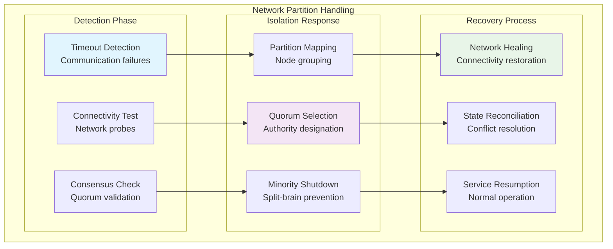

### Split-Brain Prevention

**Quorum-Based Decision Making:**

```cpp
// Partition handling logic
class PartitionDetector {
  bool ShouldShutdownOnPartition() {
    size_t visible_nodes = GetVisibleNodeCount();
    size_t total_nodes = GetTotalNodeCount();
    
    // Require majority quorum to continue operation
    return visible_nodes <= total_nodes / 2;
  }
  
  void HandleNetworkPartition() {
    if (ShouldShutdownOnPartition()) {
      RAY_LOG(WARNING) << "Node in minority partition, shutting down";
      InitiateGracefulShutdown();
    } else {
      RAY_LOG(INFO) << "Node in majority partition, continuing operation";
      MarkMinorityNodesAsFailed();
    }
  }
};
```

## Production Deployment Best Practices

### Redis High Availability Setup

**Redis Cluster Configuration:**

```yaml
# Redis HA configuration for GCS persistence
apiVersion: v1
kind: ConfigMap
metadata:
  name: redis-config
data:
  redis.conf: |
    # High availability settings
    save 900 1      # Save if at least 1 key changed in 900 seconds
    save 300 10     # Save if at least 10 keys changed in 300 seconds
    save 60 10000   # Save if at least 10000 keys changed in 60 seconds
    
    # Replication settings
    replica-read-only yes
    replica-serve-stale-data yes
    
    # Persistence settings
    appendonly yes
    appendfsync everysec
    
    # Memory management
    maxmemory-policy allkeys-lru
    
    # Network settings
    timeout 300
    tcp-keepalive 300
```

### KubeRay HA Configuration

**RayService with GCS Fault Tolerance:**

```yaml
apiVersion: ray.io/v1alpha1
kind: RayService
metadata:
  name: rayservice-ha
spec:
  serviceUnhealthySecondThreshold: 900
  deploymentUnhealthySecondThreshold: 300
  rayClusterConfig:
    headGroupSpec:
      template:
        spec:
          containers:
          - name: ray-head
            image: rayproject/ray:2.8.0
            env:
            # GCS fault tolerance configuration
            - name: RAY_external_storage_namespace
              value: "ray-cluster"
            - name: RAY_redis_address
              value: "redis-master:6379"
            - name: RAY_gcs_rpc_server_reconnect_timeout_s
              value: "60"
            - name: RAY_gcs_server_request_timeout_seconds
              value: "10"
            - name: RAY_redis_db_connect_retries
              value: "50"
            resources:
              limits:
                cpu: "2"
                memory: "4Gi"
              requests:
                cpu: "1"
                memory: "2Gi"
    workerGroupSpecs:
    - replicas: 3
      minReplicas: 1
      maxReplicas: 10
      groupName: worker-group
      template:
        spec:
          containers:
          - name: ray-worker
            image: rayproject/ray:2.8.0
            resources:
              limits:
                cpu: "4"
                memory: "8Gi"
              requests:
                cpu: "2"
                memory: "4Gi"
```

### Health Check Configuration

**Comprehensive Health Monitoring:**

```python
# Application-level health monitoring
import ray
import time
import logging

@ray.remote
class HealthMonitor:
    def __init__(self):
        self.start_time = time.time()
        self.check_interval = 30  # seconds
        
    def check_cluster_health(self):
        """Comprehensive cluster health check"""
        health_status = {
            'timestamp': time.time(),
            'uptime': time.time() - self.start_time,
            'nodes': {},
            'actors': {},
            'objects': {}
        }
        
        # Check node health
        nodes = ray.nodes()
        for node in nodes:
            health_status['nodes'][node['NodeID']] = {
                'alive': node['Alive'],
                'resources': node['Resources'],
                'cpu_usage': node.get('cpu', 0),
                'memory_usage': node.get('memory', 0)
            }
        
        # Check actor health  
        try:
            actors = ray.util.state.list_actors()
            for actor in actors:
                health_status['actors'][actor['actor_id']] = {
                    'state': actor['state'],
                    'pid': actor.get('pid'),
                    'node_id': actor.get('node_id')
                }
        except Exception as e:
            logging.warning(f"Failed to get actor status: {e}")
        
        return health_status
    
    def monitor_continuously(self):
        """Continuous health monitoring loop"""
        while True:
            try:
                health = self.check_cluster_health()
                
                # Log unhealthy components
                dead_nodes = [nid for nid, info in health['nodes'].items() 
                             if not info['alive']]
                if dead_nodes:
                    logging.warning(f"Dead nodes detected: {dead_nodes}")
                
                failed_actors = [aid for aid, info in health['actors'].items()
                               if info['state'] == 'FAILED']
                if failed_actors:
                    logging.warning(f"Failed actors detected: {failed_actors}")
                    
            except Exception as e:
                logging.error(f"Health check failed: {e}")
            
            time.sleep(self.check_interval)
```

## Testing and Validation

### Chaos Engineering for HA Testing

**Node Failure Simulation:**

```python
import ray
import psutil
import random
import time

@ray.remote
class ChaosAgent:
    """Simulates various failure scenarios for HA testing"""
    
    def simulate_node_failure(self, duration_seconds=60):
        """Simulate node failure by stopping raylet process"""
        try:
            # Find raylet process
            for proc in psutil.process_iter(['pid', 'name']):
                if 'raylet' in proc.info['name']:
                    proc.terminate()
                    break
            
            time.sleep(duration_seconds)
            
            # Raylet should be restarted by process manager
            return "Node failure simulation completed"
        except Exception as e:
            return f"Simulation failed: {e}"
    
    def simulate_memory_pressure(self, allocation_mb=1000):
        """Simulate memory pressure"""
        data = []
        try:
            # Allocate memory to create pressure
            for _ in range(allocation_mb):
                data.append(b'x' * 1024 * 1024)  # 1MB chunks
            
            time.sleep(30)  # Hold memory for 30 seconds
            return "Memory pressure simulation completed"
        except MemoryError:
            return "Memory exhausted as expected"
        finally:
            del data  # Release memory

    def simulate_network_partition(self, target_nodes, duration_seconds=60):
        """Simulate network partition using iptables rules"""
        import subprocess
        
        try:
            # Block traffic to/from target nodes
            for node in target_nodes:
                subprocess.run(['iptables', '-A', 'INPUT', '-s', node, '-j', 'DROP'])
                subprocess.run(['iptables', '-A', 'OUTPUT', '-d', node, '-j', 'DROP'])
            
            time.sleep(duration_seconds)
            
            # Restore connectivity
            for node in target_nodes:
                subprocess.run(['iptables', '-D', 'INPUT', '-s', node, '-j', 'DROP'])
                subprocess.run(['iptables', '-D', 'OUTPUT', '-d', node, '-j', 'DROP'])
                
            return "Network partition simulation completed"
        except Exception as e:
            return f"Network simulation failed: {e}"
```

**HA Test Suite:**

```python
import pytest
import ray
import time

class TestRayHighAvailability:
    
    def setup_method(self):
        """Setup test cluster"""
        ray.init(address='ray://localhost:10001')
    
    def teardown_method(self):
        """Cleanup after test"""
        ray.shutdown()
    
    def test_actor_restart_on_failure(self):
        """Test actor automatic restart after failure"""
        
        @ray.remote(max_restarts=3)
        class TestActor:
            def __init__(self):
                self.counter = 0
            
            def increment(self):
                self.counter += 1
                if self.counter == 5:
                    import os
                    os._exit(1)  # Simulate crash
                return self.counter
        
        actor = TestActor.remote()
        
        # Should succeed for first 4 calls
        for i in range(4):
            result = ray.get(actor.increment.remote())
            assert result == i + 1
        
        # 5th call causes crash, but actor should restart
        with pytest.raises(ray.exceptions.RayActorError):
            ray.get(actor.increment.remote())
        
        # Actor should be restarted and accessible
        time.sleep(5)  # Wait for restart
        result = ray.get(actor.increment.remote())
        assert result == 1  # Counter reset after restart
    
    def test_object_reconstruction(self):
        """Test object reconstruction after data loss"""
        
        @ray.remote
        def create_data(size_mb):
            return b'x' * (size_mb * 1024 * 1024)
        
        # Create object
        obj_ref = create_data.remote(10)
        original_data = ray.get(obj_ref)
        
        # Simulate object loss (this is hard to do directly)
        # In practice, you'd kill the node storing the object
        
        # Object should be reconstructible
        reconstructed_data = ray.get(obj_ref)
        assert original_data == reconstructed_data
    
    def test_gcs_recovery(self):
        """Test GCS server recovery (requires external Redis)"""
        
        # Submit some actors and tasks
        @ray.remote
        class PersistentActor:
            def get_pid(self):
                import os
                return os.getpid()
        
        actors = [PersistentActor.remote() for _ in range(5)]
        pids_before = ray.get([actor.get_pid.remote() for actor in actors])
        
        # Kill GCS server (in real test, you'd restart GCS process)
        # This requires external coordination
        
        # Verify actors survive GCS restart
        time.sleep(10)  # Wait for GCS recovery
        pids_after = ray.get([actor.get_pid.remote() for actor in actors])
        
        # Actor PIDs should be unchanged (actors survived)
        assert pids_before == pids_after
```

### Performance Benchmarking

**HA Overhead Measurement:**

```python
import ray
import time
import statistics

def benchmark_ha_overhead():
    """Measure performance overhead of HA features"""
    
    # Baseline: No HA features
    ray.init(address='ray://localhost:10001')
    
    @ray.remote
    class BaselineActor:
        def compute(self, data):
            return sum(data)
    
    # Benchmark baseline
    actor = BaselineActor.remote()
    data = list(range(10000))
    
    start_time = time.time()
    futures = [actor.compute.remote(data) for _ in range(100)]
    results = ray.get(futures)
    baseline_time = time.time() - start_time
    
    ray.shutdown()
    
    # HA enabled: With fault tolerance
    ray.init(address='ray://localhost:10001')
    
    @ray.remote(max_restarts=3, max_task_retries=2)
    class HAEnabledActor:
        def compute(self, data):
            return sum(data)
    
    # Benchmark with HA
    actor = HAEnabledActor.remote()
    
    start_time = time.time()
    futures = [actor.compute.remote(data) for _ in range(100)]
    results = ray.get(futures)
    ha_time = time.time() - start_time
    
    overhead_percent = ((ha_time - baseline_time) / baseline_time) * 100
    
    print(f"Baseline time: {baseline_time:.2f}s")
    print(f"HA enabled time: {ha_time:.2f}s")
    print(f"HA overhead: {overhead_percent:.2f}%")
    
    return overhead_percent

if __name__ == "__main__":
    overhead = benchmark_ha_overhead()
    assert overhead < 10, f"HA overhead too high: {overhead}%"
```

## Best Practices and Recommendations

### Production Deployment Checklist

**Infrastructure Setup:**
- [ ] Deploy Redis cluster with replication and persistence
- [ ] Configure external storage for object spilling
- [ ] Set up monitoring and alerting systems
- [ ] Implement automated backup procedures
- [ ] Configure network policies and firewalls

**Ray Configuration:**
- [ ] Enable GCS fault tolerance with external Redis
- [ ] Configure appropriate health check intervals
- [ ] Set reasonable retry limits for tasks and actors
- [ ] Tune memory and resource allocation
- [ ] Enable comprehensive logging and metrics

**Application Design:**
- [ ] Design actors with restart capabilities
- [ ] Implement idempotent task functions
- [ ] Avoid storing critical state only in memory
- [ ] Use placement groups for co-location requirements
- [ ] Handle exceptions and failures gracefully

### Common Pitfalls and Solutions

| Problem | Cause | Solution |
|---------|--------|----------|
| Split-brain scenarios | Network partitions | Use quorum-based decisions |
| Data loss after failures | No persistent storage | Enable external Redis |
| Long recovery times | Aggressive health checks | Tune timeout parameters |
| Resource leaks | Failed cleanup | Implement proper error handling |
| Cascading failures | Tight coupling | Design for failure isolation |

### Monitoring and Alerting

**Key Metrics to Monitor:**

```python
# Essential HA metrics
ha_metrics = {
    'node_failures_per_hour': 'Rate of node failures',
    'actor_restart_rate': 'Actor restart frequency',
    'object_reconstruction_time': 'Time to reconstruct lost objects',
    'gcs_recovery_time': 'GCS server recovery duration',
    'network_partition_events': 'Network split occurrences',
    'health_check_failures': 'Health check failure rate',
    'storage_backend_availability': 'Redis/storage uptime',
    'cluster_resource_utilization': 'Resource usage efficiency'
}

# Alert thresholds
alert_thresholds = {
    'node_failure_rate': 5,           # More than 5 failures per hour
    'actor_restart_rate': 10,         # More than 10 restarts per minute
    'gcs_recovery_time': 300,         # More than 5 minutes
    'health_check_failure_rate': 20,  # More than 20% failure rate
    'storage_availability': 99.9      # Less than 99.9% uptime
}
```

---

*This comprehensive guide covers Ray's High Availability features, implementation details, and production deployment best practices. For the most current implementation details, refer to the source files in the Ray repository, particularly `src/ray/gcs/gcs_server/`, `src/ray/core_worker/`, and the fault tolerance documentation in `doc/source/ray-core/fault_tolerance/`.*
