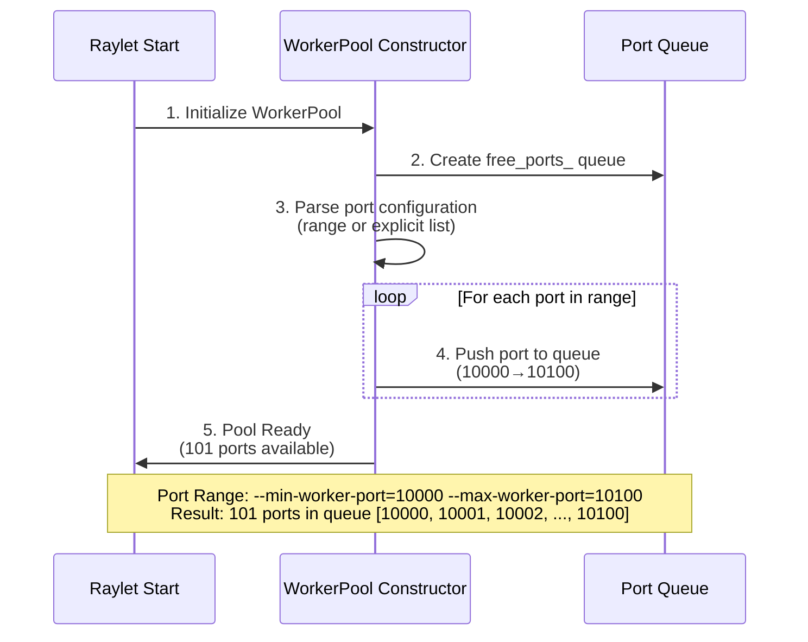
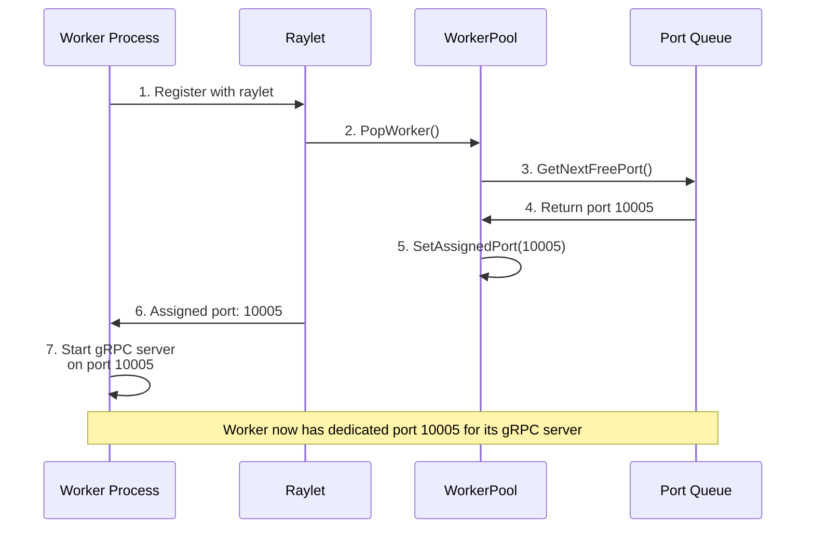
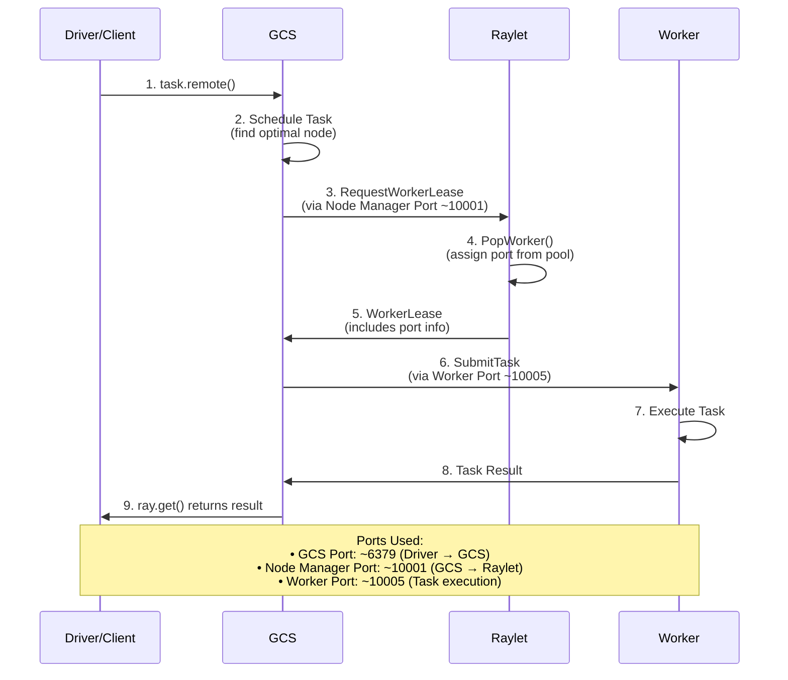
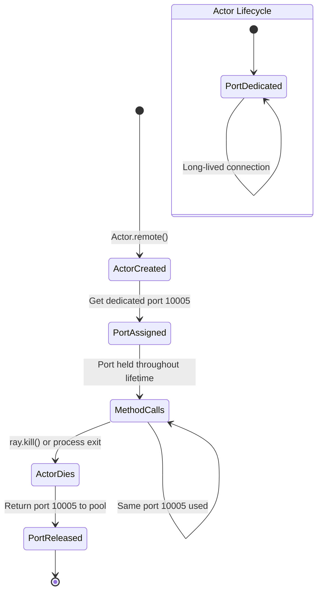
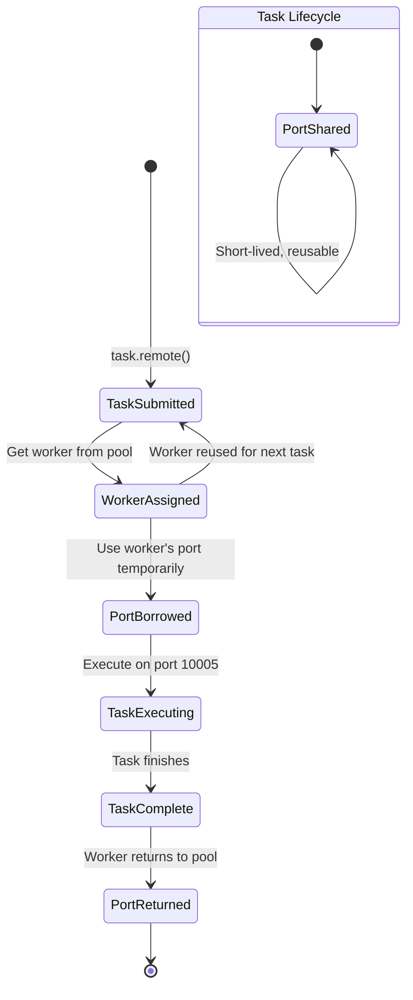
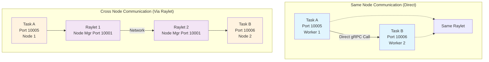
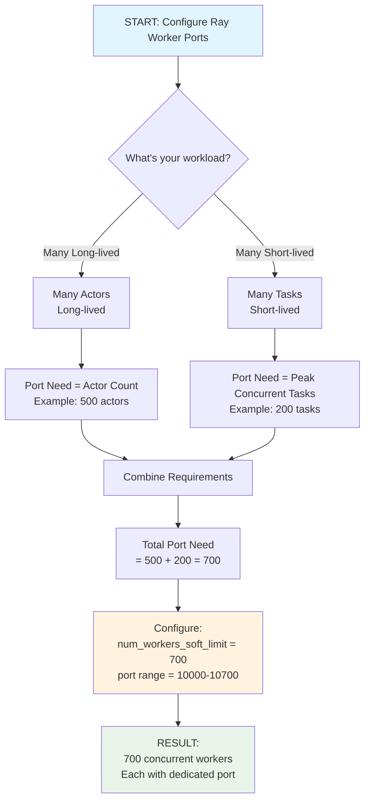
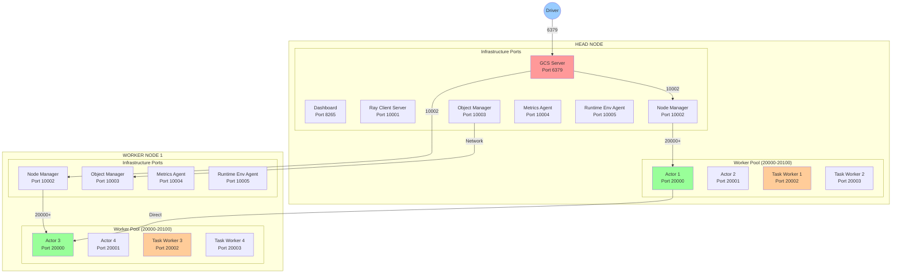
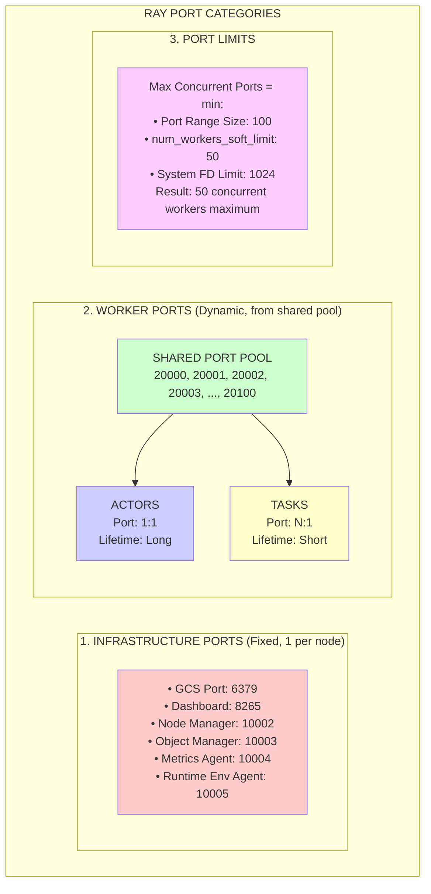

# Part IV: System Internals
# Chapter 13: Port Assignment and Management

# Ray Port Assignment: Complete Guide

## Overview

This document provides a comprehensive explanation of how Ray allocates and manages ports for actors and tasks. Understanding this mechanism is crucial for configuring Ray clusters properly, especially in environments with strict firewall rules or limited port availability.

## Key Concepts

### 1. **Single Port Pool Architecture**
Ray uses a **unified port pool** managed by the `WorkerPool` class for both actors and tasks. This is not separate pools - it's one shared resource.

**Code Reference**: `src/ray/raylet/worker_pool.h:834`
```cpp
/// Keeps track of unused ports that newly-created workers can bind on.
/// If null, workers will not be passed ports and will choose them randomly.
std::unique_ptr<std::queue<int>> free_ports_;
```

### 2. **Port Allocation Model**
- **One port per worker** (regardless of CPU usage)
- **Both actors and tasks** use the same pool
- **Ports are assigned** when workers register with the raylet
- **Ports are returned** to the pool when workers terminate

## Port Pool Creation

### Port Pool Initialization
The port pool is created during `WorkerPool` construction with ports from either:

1. **Port Range** (min_worker_port to max_worker_port)
2. **Explicit Port List** (worker_port_list)

**Code Reference**: `src/ray/raylet/worker_pool.cc:148-161`
```cpp
// Initialize free ports list with all ports in the specified range.
if (!worker_ports.empty()) {
  free_ports_ = std::make_unique<std::queue<int>>();
  for (int port : worker_ports) {
    free_ports_->push(port);
  }
} else if (min_worker_port != 0 && max_worker_port != 0) {
  free_ports_ = std::make_unique<std::queue<int>>();
  if (max_worker_port == 0) {
    max_worker_port = 65535;  // Maximum valid port number
  }
  for (int port = min_worker_port; port <= max_worker_port; port++) {
    free_ports_->push(port);
  }
}
```

### Configuration Options

#### Method 1: Port Range
```bash
# Command line
ray start --min-worker-port=10000 --max-worker-port=10100

# Python API
ray.init(min_worker_port=10000, max_worker_port=10100)
```

#### Method 2: Explicit Port List
```bash
# Command line
ray start --worker-port-list="10000,10001,10002,10003"

# Python API  
ray.init(worker_port_list=[10000, 10001, 10002, 10003])
```

**Code Reference**: `src/ray/raylet/main.cc:55-60`
```cpp
DEFINE_int32(min_worker_port, 0, "The lowest port that workers' gRPC servers will bind on.");
DEFINE_int32(max_worker_port, 0, "The highest port that workers' gRPC servers will bind on.");
DEFINE_string(worker_port_list, "", "An explicit list of ports that workers' gRPC servers will bind on.");
```

## Port Assignment Process

### Worker Registration and Port Assignment
When any worker (task or actor) starts, it follows this exact process:

**Code Reference**: `src/ray/raylet/worker_pool.cc:796-812`
```cpp
// The port that this worker's gRPC server should listen on
int port = 0;
Status status = GetNextFreePort(&port);
if (!status.ok()) {
  return PopWorkerStatus::Failed;
}
worker->SetAssignedPort(port);
```

### Port Allocation Function
**Code Reference**: `src/ray/raylet/worker_pool.cc:683-701`
```cpp
Status WorkerPool::GetNextFreePort(int *port) {
  if (free_ports_ == nullptr || free_ports_->empty()) {
    return Status::Invalid(
        "No available ports. Please specify a wider port range using --min-worker-port and "
        "--max-worker-port.");
  }
  
  // Try up to the current number of ports.
  int current_size = free_ports_->size();
  for (int i = 0; i < current_size; i++) {
    *port = free_ports_->front();
    free_ports_->pop();
    
    if (IsPortAvailable(*port)) {
      return Status::OK();
    } else {
      // Port is occupied, try next one
      free_ports_->push(*port);
    }
  }
  
  return Status::Invalid(
      "No available ports. Please specify a wider port range using --min-worker-port and "
      "--max-worker-port.");
}
```

## Actor vs Task Port Usage

### Actors: Long-lived Port Dedication
```python
@ray.remote
class MyActor:
    def method(self):
        return "Hello"

# This actor gets a dedicated port for its entire lifetime
actor = MyActor.remote()
```

**Characteristics**:
- **Dedicated Port**: Each actor gets its own port
- **Long-lived**: Port is held until actor terminates/dies
- **Persistent**: Same port for all method calls on the actor
- **gRPC Server**: Actor runs a gRPC server on its assigned port

### Tasks: Short-lived Port Usage
```python
@ray.remote
def my_task():
    return "Hello"

# This task gets a port from the pool temporarily
future = my_task.remote()
```

**Characteristics**:
- **Temporary Port**: Task gets port from pool when worker is assigned
- **Short-lived**: Port returned to pool when task completes
- **Worker Reuse**: Same worker (and port) can execute multiple sequential tasks
- **Pooled Workers**: Tasks share a pool of workers

## Worker Pool Size Limits

### The `num_workers_soft_limit` Configuration
This is the **critical parameter** that controls maximum port usage.

**Code Reference**: `src/ray/raylet/node_manager.cc:130-150`
```cpp
[this, config]() {
  // Callback to determine the maximum number of idle workers to keep around.
  if (config.num_workers_soft_limit >= 0) {
    return config.num_workers_soft_limit;
  }
  // If no limit is provided, use the available number of CPUs,
  // assuming that each incoming task will likely require 1 CPU.
  return static_cast<int64_t>(
      cluster_resource_scheduler_->GetLocalResourceManager()
          .GetLocalAvailableCpus());
}
```

**Default Behavior**: `num_workers_soft_limit = -1` → **defaults to CPU count**

**Code Reference**: `src/ray/common/ray_config_def.h:617-624`
```cpp
/// The soft limit of the number of workers to keep around.
/// We apply this limit to the idle workers instead of total workers,
/// because the total number of workers used depends on the
/// application. -1 means using the available number of CPUs.
RAY_CONFIG(int64_t, num_workers_soft_limit, -1)
```

### Configuration Examples
```bash
# Limit to 50 concurrent workers (and thus 50 ports max)
ray start --num-workers-soft-limit=50

# Python API
ray.init(num_workers_soft_limit=50)
```

## Port Exhaustion Scenarios

### When Do You Run Out of Ports?

#### Scenario 1: Too Many Concurrent Actors
```python
# Node: 16 CPUs, Default ports: 16
# Problem: Creating 100 long-lived actors
actors = [MyActor.remote() for _ in range(100)]  # ❌ FAIL after 16
```

#### Scenario 2: Fractional CPU Tasks
```python
# Node: 16 CPUs, Default ports: 16  
# Problem: Tasks with fractional CPU requirements
@ray.remote(num_cpus=0.1)  # Only 0.1 CPU per task
def light_task():
    return "done"

# Can theoretically run 160 concurrent tasks (16 CPUs / 0.1)
# But only 16 ports available!
futures = [light_task.remote() for _ in range(160)]  # ❌ FAIL after 16
```

### Error Messages
**Code Reference**: `src/ray/raylet/worker_pool.cc:693-701`
```cpp
return Status::Invalid(
    "No available ports. Please specify a wider port range using --min-worker-port and "
    "--max-worker-port.");
```

## Best Practices & Solutions

### 1. **Calculate Required Ports**
```
Required Ports = Max Concurrent Workers
               = Max(Long-lived Actors + Peak Concurrent Tasks)
```

### 2. **Configure Appropriate Port Range**
```bash
# For 1000 concurrent workers
ray start --min-worker-port=10000 --max-worker-port=11000 --num-workers-soft-limit=1000
```

### 3. **Use Explicit Port Lists for Control**
```bash
# Firewall-friendly: specify exact ports
ray start --worker-port-list="10000,10001,10002,10003,10004"
```

### 4. **Monitor Port Usage**
```python
# Check cluster resources
print(ray.cluster_resources())

# Check current worker count
import ray._private.worker
print(len(ray._private.worker.global_worker.core_worker.get_all_reference_counts()))
```

## Advanced Configuration Examples

### Large Cluster Setup (1000 nodes)
```bash
# Head node
ray start --head \
  --port=6379 \
  --min-worker-port=20000 \
  --max-worker-port=25000 \
  --num-workers-soft-limit=5000

# Worker nodes  
ray start --address=head_ip:6379 \
  --min-worker-port=20000 \
  --max-worker-port=25000 \
  --num-workers-soft-limit=5000
```

### Actor-Heavy Workload
```bash
# For 500 concurrent actors per node
ray start --min-worker-port=30000 --max-worker-port=30500 --num-workers-soft-limit=500
```

### Mixed Workload (Actors + Tasks)
```bash
# 100 actors + 400 peak concurrent tasks = 500 total
ray start --min-worker-port=40000 --max-worker-port=40500 --num-workers-soft-limit=500
```

## Port Usage Summary

| Component | Port Usage | Lifetime | Pool Source |
|-----------|------------|----------|-------------|
| **Actor** | 1 dedicated port | Until actor dies | Worker port pool |
| **Task** | 1 temporary port | Until task completes | Worker port pool |
| **Node Manager** | 1 fixed port | Node lifetime | Fixed configuration |
| **Object Manager** | 1 fixed port | Node lifetime | Fixed configuration |
| **GCS** | 1 fixed port | Cluster lifetime | Fixed configuration |
| **Dashboard** | 1 fixed port | Node lifetime | Fixed configuration |

## Total Port Calculation for Ray Cluster

```
Total Ports Per Node = Core Ray Ports + Worker Ports

Core Ray Ports = 7 (fixed)
- Node Manager: 1
- Object Manager: 1  
- Metrics Agent: 1
- Runtime Env Agent: 1
- Dashboard Agent: 1
- Metrics Export: 1
- Ray Client Server: 1 (head only)

Worker Ports = num_workers_soft_limit (configurable)
- Default: CPU count
- Configurable: --num-workers-soft-limit

Example for 16-CPU node:
Total = 7 + 16 = 23 ports minimum
```

## Common Issues and Solutions

### Issue 1: Port Exhaustion with Fractional CPU Tasks
**Problem**: `num_workers_soft_limit` defaults to CPU count, but fractional CPU tasks can exceed this.

**Solution**: Increase `num_workers_soft_limit` and port range:
```bash
ray start --num-workers-soft_limit=100 --min-worker-port=20000 --max-worker-port=20100
```

### Issue 2: Firewall Restrictions  
**Problem**: Need to specify exact ports for firewall rules.

**Solution**: Use explicit port lists:
```bash
ray start --worker-port-list="10000,10001,10002,10003"
```

### Issue 3: Actor Port Leakage
**Problem**: Dead actors not releasing ports properly.

**Solution**: Ensure proper actor cleanup:
```python
# Explicit cleanup
ray.kill(actor)
del actor

# Or use context managers for automatic cleanup
```

## Code References Summary

| Component | File | Key Functions |
|-----------|------|---------------|
| Port Pool Management | `src/ray/raylet/worker_pool.cc` | `GetNextFreePort()`, `PopWorker()` |
| Port Configuration | `src/ray/raylet/main.cc` | Command line flag definitions |
| Worker Limits | `src/ray/raylet/node_manager.cc` | `num_workers_soft_limit` logic |
| Port Pool Storage | `src/ray/raylet/worker_pool.h` | `free_ports_` member variable |

## Conclusion

Ray's port allocation is straightforward but requires careful planning:

1. **Single shared pool** for all workers (actors + tasks)
2. **One port per concurrent worker**
3. **Bounded by `num_workers_soft_limit`** (defaults to CPU count)
4. **Configure based on your workload** (actors vs tasks, CPU requirements)
5. **Plan for peak concurrency**, not just average usage

Understanding this model helps you properly size your port ranges and avoid common pitfalls in production Ray deployments.

## Advanced Q&A: Port Management Deep Dive

This section covers advanced questions about Ray's port management system that frequently arise in production environments.

### **Q1: What happens when a task invokes ray.get() and blocks?**

**CPU**: ✅ **Task RELEASES CPU** when blocked on `ray.get()`
**Port**: ❌ **Port is KEPT OPEN** during blocking

**Detailed Explanation**:
When a task calls `ray.get()` and blocks waiting for another task's result:

1. **CPU Resource Management**:
   ```cpp
   // Code Reference: src/ray/raylet/local_task_manager.cc
   bool LocalTaskManager::ReleaseCpuResourcesFromBlockedWorker(
       std::shared_ptr<WorkerInterface> worker) {
     // CPU resources are released back to the scheduler
   }
   ```
   - The worker's CPU allocation is returned to the resource pool
   - Other tasks can use those CPU resources
   - This prevents deadlocks in resource-constrained environments

2. **Port Resource Management**:
   ```cpp
   // Code Reference: src/ray/raylet/worker.h
   /// Whether the worker is blocked. Workers become blocked in a `ray.get`
   bool blocked_;
   ```
   - The worker keeps its gRPC server port open
   - Port remains allocated until task completely finishes
   - This is necessary for receiving results and maintaining communication

**Why Ports Stay Open**: 
- The worker's gRPC server must remain accessible to receive the result
- Communication channels with raylet must stay active
- The worker process itself continues running (just blocked)

### **Q2: Who assigns tasks to raylet and via which port?**

**Answer**: **GCS (Global Control Service)** assigns tasks to raylets via the **Node Manager Port**

**Complete Task Assignment Flow**:

```
1. Task Submission:
   Worker/Driver → GCS (via GCS Port ~6379)
   
2. Task Scheduling:
   GCS → Raylet (via Node Manager Port ~10001)
   
3. Worker Assignment:
   Raylet → Worker (via Worker's gRPC Port from pool)
   
4. Result Return:
   Worker → Raylet → GCS → Requester
```

**Code References**:
```cpp
// Node Manager Port Configuration
// src/ray/raylet/main.cc:48
DEFINE_int32(node_manager_port, -1, "The port of node manager.");

// GCS to Raylet Communication
// Tasks are assigned via gRPC calls to the Node Manager service
// The raylet listens on node_manager_port for task assignments
```

**Port Usage**:
- **GCS Port**: For initial task submission and cluster coordination
- **Node Manager Port**: For task assignment from GCS to raylet
- **Worker Ports**: For task execution and inter-task communication

### **Q3: What is Ray communication for tasks on the same node?**

**Answer**: Tasks on the same node communicate **directly via worker ports**, bypassing raylet for task-to-task calls.

**Same-Node Communication Flow**:
```
Task A (Port 10000) → Direct gRPC → Task B (Port 10001)
                   ↑
            (No raylet involvement)
```

**Cross-Node Communication Flow**:
```
Task A (Node 1, Port 10000) → Raylet 1 → Network → Raylet 2 → Task B (Node 2, Port 10001)
```

**Why Direct Communication**:
- **Performance**: Eliminates raylet as middleman
- **Efficiency**: Reduces network hops and latency
- **Scalability**: Reduces load on raylet for local communication

### **Q4: Can ray.get() cause port starvation?**

**YES!** This is a critical production consideration.

**Scenario**: 
- Available ports: 64 (typical small range)
- Running tasks: 60 (all blocked on `ray.get()`)
- New task requests: 10

**Result**: 
- All 64 ports occupied by blocked workers
- New tasks cannot start → **Port starvation**
- Cluster appears "hung" despite available CPU

**Solutions**:
1. **Increase Port Range**:
   ```bash
   ray start --min-worker-port=10000 --max-worker-port=20000  # 10K ports
   ```

2. **Tune Worker Pool**:
   ```bash
   ray start --num-workers-soft_limit=1000  # Allow more concurrent workers
   ```

3. **Application Design**:
   ```python
   # Instead of blocking many workers
   futures = [task.remote() for _ in range(1000)]
   results = ray.get(futures)  # Single blocking point
   
   # Better: Batch processing
   batch_size = 50
   for batch in chunks(futures, batch_size):
       ray.get(batch)  # Process in smaller batches
   ```

### **Q5: Port allocation for different worker types**

**All worker types use the same port pool**:

| Worker Type | Port Source | Port Lifetime | Notes |
|-------------|-------------|---------------|--------|
| **Actor Workers** | Worker port pool | Until actor dies | Dedicated, long-lived |
| **Task Workers** | Worker port pool | Until task completes | Shared, short-lived |
| **Driver Workers** | Worker port pool | Until driver exits | Dedicated, session-lived |

**Code Reference**:
```cpp
// src/ray/raylet/worker_pool.cc:683-700
Status WorkerPool::GetNextFreePort(int *port) {
  // Same pool used for ALL worker types
  if (free_ports_->empty()) {
    return Status::Invalid("No available ports...");
  }
  *port = free_ports_->front();
  free_ports_->pop();
  return Status::OK();
}
```

### **Q6: Maximum theoretical port usage**

**Calculation**:
```
Max Ports = min(
  max_worker_port - min_worker_port + 1,  // Port range size
  num_workers_soft_limit,                 // Worker pool limit
  System file descriptor limit            // OS limit
)
```

**Example**:
```
Node: 16 CPUs
Port Range: 10000-65535 (55,536 ports)
Worker Limit: Default = 16 (CPU count)
Actual Max: 16 ports (limited by worker pool)
```

**To Use More Ports**:
```bash
# Increase worker pool beyond CPU count
ray start --num_workers_soft_limit=1000 --min-worker-port=10000 --max-worker-port=11000
# Result: Can use up to 1000 ports concurrently
```

## Production Recommendations

Based on the above Q&A, here are production recommendations:

### **Port Planning**:
1. **Calculate realistic port needs**: `(Expected concurrent tasks + actors) * 1.5`
2. **Set generous ranges**: Better to over-provision than under-provision
3. **Monitor port usage**: Track `free_ports_` queue size

### **Application Design**:
1. **Minimize blocking**: Reduce `ray.get()` calls in tight loops
2. **Batch operations**: Process results in batches, not individually
3. **Use futures wisely**: Collect futures first, then `ray.get()` in batches

### **Configuration**:
1. **Explicit port lists** for controlled environments
2. **Wide port ranges** for dynamic workloads  
3. **Monitor worker pool** metrics in production

This comprehensive understanding of Ray's port management will help you design robust, scalable Ray applications that avoid common port-related pitfalls in production environments. 

## Sequence Diagrams and Flow Charts

This section provides visual representations of Ray's port allocation and communication flows to help understand the system architecture.

### **1. Port Pool Initialization Flow**



<details>
<summary>📁 Text-based diagram (backup)</summary>

```
┌─────────────────┐    ┌──────────────────┐    ┌─────────────────┐
│   Raylet Start  │    │   WorkerPool     │    │   Port Queue    │
│                 │    │   Constructor    │    │                 │
└─────────┬───────┘    └─────────┬────────┘    └─────────┬───────┘
          │                      │                       │
          │ 1. Initialize        │                       │
          ├─────────────────────→│                       │
          │                      │                       │
          │                      │ 2. Create free_ports_ │
          │                      ├──────────────────────→│
          │                      │                       │
          │                      │ 3. Parse port range   │
          │                      │    or explicit list   │
          │                      │                       │
          │                      │ 4. Push ports to queue│
          │                      │    (10000→10100)      │
          │                      ├──────────────────────→│
          │                      │                       │
          │ 5. Pool Ready        │                       │
          │←─────────────────────┤                       │
          │                      │                       │

Port Range: --min-worker-port=10000 --max-worker-port=10100
Result: 101 ports in queue [10000, 10001, 10002, ..., 10100]
```
</details>

### **2. Worker Registration and Port Assignment Sequence**



<details>
<summary>📁 Text-based diagram (backup)</summary>

```
┌───────────┐  ┌─────────────┐  ┌─────────────┐  ┌─────────────┐
│  Worker   │  │   Raylet    │  │ WorkerPool  │  │ Port Queue  │
│ Process   │  │             │  │             │  │             │
└─────┬─────┘  └──────┬──────┘  └──────┬──────┘  └──────┬──────┘
      │               │                │                │
      │ 1. Register   │                │                │
      ├──────────────→│                │                │
      │               │                │                │
      │               │ 2. PopWorker() │                │
      │               ├───────────────→│                │
      │               │                │                │
      │               │                │ 3. GetNextFreePort()
      │               │                ├───────────────→│
      │               │                │                │
      │               │                │ 4. port=10005 │
      │               │                │←───────────────┤
      │               │                │                │
      │               │ 5. SetAssignedPort(10005)       │
      │               │                │                │
      │ 6. Port: 10005│                │                │
      │←──────────────┤                │                │
      │               │                │                │
      │ 7. Start gRPC │                │                │
      │    Server on  │                │                │
      │    port 10005 │                │                │
      │               │                │                │

Result: Worker now has dedicated port 10005 for its gRPC server
```
</details>

### **3. Task Assignment Flow Diagram**



<details>
<summary>📁 Text-based diagram (backup)</summary>

```
┌─────────────┐    ┌─────────────┐    ┌─────────────┐    ┌─────────────┐
│   Driver/   │    │     GCS     │    │   Raylet    │    │   Worker    │
│   Client    │    │             │    │             │    │             │
└──────┬──────┘    └──────┬──────┘    └──────┬──────┘    └──────┬──────┘
       │                  │                  │                  │
       │ 1. task.remote() │                  │                  │
       ├─────────────────→│                  │                  │
       │                  │                  │                  │
       │                  │ 2. Schedule Task │                  │
       │                  │    (find node)   │                  │
       │                  │                  │                  │
       │                  │ 3. RequestWorker │                  │
       │                  │    Lease         │                  │
       │                  ├─────────────────→│                  │
       │                  │                  │                  │
       │                  │                  │ 4. PopWorker()   │
       │                  │                  │    (assign port) │
       │                  │                  │                  │
       │                  │ 5. WorkerLease   │                  │
       │                  │    (port info)   │                  │
       │                  │←─────────────────┤                  │
       │                  │                  │                  │
       │                  │ 6. SubmitTask    │                  │
       │                  │    (to worker)   │                  │
       │                  ├─────────────────────────────────────→│
       │                  │                  │                  │
       │                  │                  │                  │ 7. Execute
       │                  │                  │                  │    Task
       │                  │                  │                  │
       │                  │ 8. Task Result  │                  │
       │                  │←─────────────────────────────────────┤
       │                  │                  │                  │
       │ 9. ray.get()     │                  │                  │
       │    result        │                  │                  │
       │←─────────────────┤                  │                  │

Ports Used:
- GCS Port: ~6379 (Driver → GCS)
- Node Manager Port: ~10001 (GCS → Raylet)  
- Worker Port: from pool, e.g., 10005 (Task execution)
```
</details>

### **4. Actor vs Task Port Usage Lifecycle**





<details>
<summary>📁 Text-based diagram (backup)</summary>

```
ACTOR LIFECYCLE:
┌─────────────────────────────────────────────────────────────────┐
│                        Actor Lifetime                           │
├─────────────────────────────────────────────────────────────────┤
│ Create → Get Port 10005 → Keep Port → Method Calls → Die       │
│   ↓         ↓              ↓           ↓             ↓         │
│ Start    Dedicated      Port Held   Same Port    Return Port   │
│          Port           Throughout   Used         to Pool      │
└─────────────────────────────────────────────────────────────────┘

TASK LIFECYCLE:
┌───────────┐ ┌───────────┐ ┌───────────┐ ┌───────────┐ ┌───────────┐
│   Task A  │ │   Task B  │ │   Task C  │ │   Task D  │ │   Task E  │
├───────────┤ ├───────────┤ ├───────────┤ ├───────────┤ ├───────────┤
│Port: 10005│ │Port: 10005│ │Port: 10006│ │Port: 10005│ │Port: 10007│
│Worker: W1 │ │Worker: W1 │ │Worker: W2 │ │Worker: W1 │ │Worker: W3 │
└───────────┘ └───────────┘ └───────────┘ └───────────┘ └───────────┘
     ↓             ↓             ↓             ↓             ↓
   Finish        Reuse         New Port      Reuse         New Port
              Same Worker    (W1 busy)    Same Worker   (W1,W2 busy)

Key Difference:
- Actors: 1 Actor = 1 Dedicated Port (Long-term)
- Tasks: 1 Worker = 1 Port, Multiple Tasks Share Worker (Short-term)
```
</details>

### **5. Same-Node vs Cross-Node Communication Flow**



<details>
<summary>📁 Text-based diagram (backup)</summary>

```
SAME NODE COMMUNICATION (Direct):
┌─────────────┐                           ┌─────────────┐
│   Task A    │    Direct gRPC Call       │   Task B    │
│ (Port 10005)│──────────────────────────→│ (Port 10006)│
│   Worker 1  │                           │   Worker 2  │
└─────────────┘                           └─────────────┘
      ↑                                         ↑
      └─────────── Same Raylet ──────────────────┘
      
Benefits: Low latency, No raylet overhead, High throughput

CROSS NODE COMMUNICATION (Via Raylet):
┌─────────────┐    ┌─────────────┐    ┌─────────────┐    ┌─────────────┐
│   Task A    │    │  Raylet 1   │    │  Raylet 2   │    │   Task B    │
│ (Port 10005)│───→│(Node Mgr    │───→│(Node Mgr    │───→│ (Port 10006)│
│ Node 1      │    │ Port 10001) │    │ Port 10001) │    │ Node 2      │
└─────────────┘    └─────────────┘    └─────────────┘    └─────────────┘

Benefits: Network routing, Load balancing, Fault tolerance
```
</details>

### **6. Port Exhaustion Scenario Diagram**

```mermaid
graph TB
    subgraph "Normal Operation ✅"
        PP1[Port Pool<br/>10000, 10001, 10002, 10003, 10004<br/>5 ports available]
        W1[Worker 1<br/>Port: 10000<br/>Status: BUSY]
        W2[Worker 2<br/>Port: 10001<br/>Status: BUSY]
        AP1[Available Ports: 3<br/>Status: HEALTHY]
    end

    subgraph "Port Exhaustion ❌"
        PP2[Port Pool<br/>EMPTY<br/>0 ports available]
        BW1[Worker 1<br/>Port: 10000<br/>BLOCKED: ray.get()]
        BW2[Worker 2<br/>Port: 10001<br/>BLOCKED: ray.get()]
        BW3[Worker 3<br/>Port: 10002<br/>BLOCKED: ray.get()]
        BW4[Worker 4<br/>Port: 10003<br/>BLOCKED: ray.get()]
        BW5[Worker 5<br/>Port: 10004<br/>BLOCKED: ray.get()]
        NTR[New Task Request<br/>❌ FAIL: No available ports]
    end

    style PP1 fill:#e8f5e8
    style AP1 fill:#e8f5e8
    style PP2 fill:#ffe8e8
    style NTR fill:#ffe8e8
    style BW1 fill:#fff3cd
    style BW2 fill:#fff3cd
    style BW3 fill:#fff3cd
    style BW4 fill:#fff3cd
    style BW5 fill:#fff3cd
```

<details>
<summary>📁 Text-based diagram (backup)</summary>

```
NORMAL OPERATION:
Port Pool: [10000, 10001, 10002, 10003, 10004] (5 ports available)
Active Workers: 2
Available Ports: 3
Status: ✅ HEALTHY

┌─────────────┐ ┌─────────────┐ ┌─────────────┐
│   Worker 1  │ │   Worker 2  │ │    Pool     │
│ Port: 10000 │ │ Port: 10001 │ │ [10002,     │
│ Status: BUSY│ │ Status: BUSY│ │  10003,     │
└─────────────┘ └─────────────┘ │  10004]     │
                                └─────────────┘

PORT EXHAUSTION:
Port Pool: [] (0 ports available)
Active Workers: 5 (all blocked on ray.get())
Available Ports: 0
Status: ❌ STARVED

┌─────────────┐ ┌─────────────┐ ┌─────────────┐ ┌─────────────┐ ┌─────────────┐
│   Worker 1  │ │   Worker 2  │ │   Worker 3  │ │   Worker 4  │ │   Worker 5  │
│ Port: 10000 │ │ Port: 10001 │ │ Port: 10002 │ │ Port: 10003 │ │ Port: 10004 │
│BLOCKED:     │ │BLOCKED:     │ │BLOCKED:     │ │BLOCKED:     │ │BLOCKED:     │
│ray.get()    │ │ray.get()    │ │ray.get()    │ │ray.get()    │ │ray.get()    │
└─────────────┘ └─────────────┘ └─────────────┘ └─────────────┘ └─────────────┘

New Task Request → ❌ FAIL: "No available ports"
```
</details>

### **7. Worker Pool Size vs Port Range Decision Tree**



<details>
<summary>📁 Text-based diagram (backup)</summary>

```
                    ┌─ START: Configure Ray Worker Ports ─┐
                    │                                     │
                    ▼                                     │
           ┌─ What's your workload? ─┐                    │
           │                         │                    │
           ▼                         ▼                    │
    ┌─ Many Actors ─┐        ┌─ Many Tasks ─┐             │
    │ (Long-lived)  │        │ (Short-lived) │             │
    └───────┬───────┘        └───────┬───────┘             │
            │                        │                     │
            ▼                        ▼                     │
    ┌─ Port Need = ─┐         ┌─ Port Need = ─┐            │
    │ Actor Count   │         │ Peak Concurrent│            │
    │ Example: 500  │         │ Tasks: 200     │            │
    └───────┬───────┘         └───────┬───────┘            │
            │                         │                    │
            └────── Combine ──────────┘                    │
                    │                                      │
                    ▼                                      │
            ┌─ Total Port Need ─┐                         │
            │ = 500 + 200 = 700 │                         │
            └─────────┬─────────┘                         │
                      │                                    │
                      ▼                                    │
    ┌─ Configure num_workers_soft_limit = 700 ─┐          │
    │ Configure port range = 10000-10700       │          │
    └─────────────────┬─────────────────────────┘          │
                      │                                    │
                      ▼                                    │
              ┌─ RESULT: 700 concurrent workers ─┐        │
              │ Each with dedicated port         │        │
              └──────────────────────────────────┘        │
```
</details>

### **8. Complete Ray Cluster Port Architecture**



<details>
<summary>📁 Text-based diagram (backup)</summary>

```
RAY CLUSTER PORT LAYOUT:

HEAD NODE:
┌─────────────────────────────────────────────────────────────┐
│                        HEAD NODE                           │
├─────────────────────────────────────────────────────────────┤
│ GCS Server:           Port 6379                            │
│ Dashboard:            Port 8265                            │
│ Ray Client Server:    Port 10001                          │
│ Node Manager:         Port 10002                           │
│ Object Manager:       Port 10003                           │
│ Metrics Agent:        Port 10004                           │
│ Runtime Env Agent:    Port 10005                           │
│                                                            │
│ Worker Pool:          Ports 20000-20100 (100 ports)       │
│ ├─ Actor 1:          Port 20000                           │
│ ├─ Actor 2:          Port 20001                           │
│ ├─ Task Worker 1:    Port 20002                           │
│ └─ Task Worker 2:    Port 20003                           │
└─────────────────────────────────────────────────────────────┘

WORKER NODE 1:
┌─────────────────────────────────────────────────────────────┐
│                      WORKER NODE 1                         │
├─────────────────────────────────────────────────────────────┤
│ Node Manager:         Port 10002                           │
│ Object Manager:       Port 10003                           │
│ Metrics Agent:        Port 10004                           │
│ Runtime Env Agent:    Port 10005                           │
│                                                            │
│ Worker Pool:          Ports 20000-20100 (100 ports)       │
│ ├─ Actor 3:          Port 20000                           │
│ ├─ Actor 4:          Port 20001                           │
│ ├─ Task Worker 3:    Port 20002                           │
│ └─ Task Worker 4:    Port 20003                           │
└─────────────────────────────────────────────────────────────┘

COMMUNICATION FLOWS:
Driver ──(6379)──→ GCS ──(10002)──→ Node Manager ──(20000+)──→ Workers
                    ↑                      ↓
                    └──── Cluster State ───┘

Worker ──(20000+)──→ Worker (Same Node: Direct)
Worker ──(10003)───→ Object Manager ──(Network)──→ Object Manager ──(20000+)──→ Worker
```
</details>

### **9. Visual Summary: Port Types and Usage Patterns**



<details>
<summary>📁 Text-based diagram (backup)</summary>

```
┌─────────────────────────────────────────────────────────────────────────────┐
│                          RAY PORT CATEGORIES                                │
├─────────────────────────────────────────────────────────────────────────────┤
│                                                                             │
│ 1. INFRASTRUCTURE PORTS (Fixed, 1 per node)                               │
│    ┌─────────────────────────────────────────────────────────────────┐     │
│    │ • GCS Port (6379)           • Node Manager (10002)             │     │
│    │ • Dashboard (8265)          • Object Manager (10003)            │     │
│    │ • Metrics Agent (10004)     • Runtime Env Agent (10005)        │     │
│    └─────────────────────────────────────────────────────────────────┘     │
│                                                                             │
│ 2. WORKER PORTS (Dynamic, from shared pool)                               │
│    ┌─────────────────────────────────────────────────────────────────┐     │
│    │                    SHARED PORT POOL                             │     │
│    │    [20000, 20001, 20002, 20003, ..., 20100]                   │     │
│    │                         │                                       │     │
│    │           ┌─────────────┴─────────────┐                        │     │
│    │           ▼                           ▼                        │     │
│    │    ┌─ ACTORS ─┐                ┌─ TASKS ─┐                    │     │
│    │    │ Port: 1:1 │                │Port: N:1 │                    │     │
│    │    │ Lifetime: │                │Lifetime: │                    │     │
│    │    │ Long      │                │ Short    │                    │     │
│    │    └───────────┘                └──────────┘                    │     │
│    └─────────────────────────────────────────────────────────────────┘     │
│                                                                             │
│ 3. PORT LIMITS                                                             │
│    ┌─────────────────────────────────────────────────────────────────┐     │
│    │ Max Concurrent Ports = min(                                     │     │
│    │   Port Range Size,           // e.g., 100                      │     │
│    │   num_workers_soft_limit,    // e.g., 50                       │     │
│    │   System FD Limit           // e.g., 1024                      │     │
│    │ )                                                               │     │
│    │ Result: 50 concurrent workers maximum                           │     │
│    └─────────────────────────────────────────────────────────────────┘     │
└─────────────────────────────────────────────────────────────────────────────┘
```
</details>

---

These Mermaid diagrams provide a modern, professional visualization of Ray's port allocation system while maintaining backward compatibility with the text-based versions. The diagrams will render beautifully in GitHub, GitLab, and most modern documentation platforms, while the collapsed text versions ensure the documentation works everywhere.