# Ray Internals: A Comprehensive Technical Guide

*The Complete Guide to Understanding Ray's Architecture, Implementation, and Internals*

---

## 📖 Preface

Welcome to the most comprehensive technical documentation of Ray's internal architecture and implementation. This collection of guides has been crafted to provide deep insights into how Ray works under the hood, enabling developers, researchers, and engineers to understand, modify, and extend Ray's distributed computing capabilities.

Ray is a powerful distributed computing framework, but its true potential can only be unlocked when you understand its internal mechanisms. This documentation bridges the gap between using Ray and truly mastering it by providing detailed explanations of its core systems, complete with code references, architectural diagrams, and practical insights.

## 👥 Intended Audience

This documentation is designed for:

- **🔧 Ray Contributors**: Developers who want to contribute to the Ray project
- **🏗️ System Architects**: Engineers designing distributed systems with Ray
- **🎓 Researchers**: Academic researchers studying distributed computing systems
- **💼 Advanced Users**: Power users who need to customize Ray for specific use cases
- **🐛 Troubleshooters**: Engineers debugging complex Ray deployment issues
- **📚 Students**: Computer science students learning distributed systems concepts

### Prerequisites

- Strong understanding of distributed systems concepts
- Proficiency in Python and C++
- Familiarity with Ray's user-facing APIs
- Basic knowledge of system programming and networking

## 📚 How This Book is Organized

This documentation is structured as a progressive journey through Ray's architecture, from fundamental concepts to advanced internals. Each chapter builds upon previous knowledge while remaining self-contained enough for reference use.

```mermaid
graph TB
    subgraph "📘 Part I: Fundamentals"
        CH1["Chapter 1<br/>🏛️ Ray Architecture"]
        CH2["Chapter 2<br/>🎯 Driver System"]
        CH3["Chapter 3<br/>📋 Task Lifecycle"]
        CH4["Chapter 4<br/>🎭 Actor Lifecycle"]
        CH5["Chapter 5<br/>💾 Memory System"]
    end
    
    subgraph "📗 Part II: Core Services"
        CH6["Chapter 6<br/>🏛️ Global Control Service"]
        CH7["Chapter 7<br/>🔧 Raylet System"]
        CH8["Chapter 8<br/>💿 Object Store"]
    end
    
    subgraph "📙 Part III: Advanced Systems"
        CH9["Chapter 9<br/>⚖️ Distributed Scheduling"]
        CH10["Chapter 10<br/>📈 Autoscaling"]
        CH11["Chapter 11<br/>🛡️ High Availability"]
    end
    
    subgraph "📔 Part IV: System Internals"
        CH12["Chapter 12<br/>🌐 Network Protocols"]
        CH13["Chapter 13<br/>🔌 Port Management"]
    end
    
    CH1 --> CH2
    CH2 --> CH3
    CH3 --> CH4
    CH4 --> CH5
    
    CH5 --> CH6
    CH6 --> CH7
    CH7 --> CH8
    
    CH8 --> CH9
    CH9 --> CH10
    CH10 --> CH11
    
    CH11 --> CH12
    CH12 --> CH13
    
    style CH1 fill:#e3f2fd,stroke:#1976d2,stroke-width:2px,color:#000
    style CH6 fill:#f1f8e9,stroke:#388e3c,stroke-width:2px,color:#000
    style CH9 fill:#fff3e0,stroke:#f57c00,stroke-width:2px,color:#000
    style CH12 fill:#fce4ec,stroke:#c2185b,stroke-width:2px,color:#000
```

---

# 📋 Table of Contents

## 📖 Book Organization

### Part I: Ray Fundamentals ⚡
*Understanding the core building blocks of the Ray ecosystem*

- **[Chapter 1: Ray Architecture Overview](Part1_Chapter01_Ray_Architecture_Overview.md)** *(3-4 hours)*
  - System architecture and component interactions
  - Bootstrap process and initialization
  - Communication patterns and protocols

- **[Chapter 2: The Ray Driver System](Part1_Chapter02_Driver_System.md)** *(2-3 hours)*
  - Driver lifecycle and initialization
  - Client-server communication mechanisms
  - Ray context management and session handling

- **[Chapter 3: Task Lifecycle and Management](Part1_Chapter03_Task_Lifecycle.md)** *(2-3 hours)*
  - Task creation, submission, and execution
  - Dependency resolution and data handling
  - Performance optimization patterns

- **[Chapter 4: Actor Lifecycle and Management](Part1_Chapter04_Actor_Lifecycle.md)** *(1-2 hours)*
  - Actor creation and state management
  - Method invocation and result handling
  - Actor placement and resource allocation

- **[Chapter 5: Memory and Object Reference System](Part1_Chapter05_Memory_System.md)** *(1-2 hours)*
  - Object storage and reference management
  - Memory optimization and garbage collection
  - Distributed object handling

### Part II: Core Ray Services 🏗️
*Deep dive into the essential Ray system services*

- **[Chapter 6: Global Control Service (GCS)](Part2_Chapter06_Global_Control_Service.md)** *(2-3 hours)*
  - Cluster metadata and coordination
  - Service discovery and health monitoring
  - Actor and placement group scheduling

- **[Chapter 7: Raylet Implementation and Lifecycle](Part2_Chapter07_Raylet_System.md)** *(4-5 hours)*
  - Node-level task scheduling and resource management
  - Worker process lifecycle management
  - Communication mechanisms and load handling

- **[Chapter 8: Distributed Object Store](Part2_Chapter08_Object_Store.md)** *(2-3 hours)*
  - Plasma store integration and object management
  - Data transfer and locality optimization
  - Memory management and spilling strategies

### Part III: Advanced Ray Systems 🚀
*Sophisticated scheduling and scaling mechanisms*

- **[Chapter 9: Distributed Scheduling Implementation](Part3_Chapter09_Distributed_Scheduling.md)** *(3-4 hours)*
  - Multi-level scheduling architecture
  - Resource allocation algorithms
  - Placement strategies and locality optimization

- **[Chapter 10: Autoscaling System](Part3_Chapter10_Autoscaling_System.md)** *(2-3 hours)*
  - Demand-driven scaling algorithms
  - Node provisioning and resource management
  - Integration with cloud providers

- **[Chapter 11: High Availability and Fault Tolerance](Part3_Chapter11_High_Availability.md)** *(2-3 hours)*
  - GCS fault tolerance and recovery mechanisms
  - Distributed system resilience patterns
  - Failure detection and handling strategies

### Part IV: System Internals 🔧
*Low-level implementation details and networking*

- **[Chapter 12: Network Communication and Protocols](Part4_Chapter12_Network_Protocols.md)** *(1-2 hours)*
  - Custom protocol implementation
  - gRPC integration and message handling
  - Performance optimization techniques

- **[Chapter 13: Port Assignment and Management](Part4_Chapter13_Port_Management.md)** *(2-3 hours)*
  - Dynamic port allocation strategies
  - Service discovery and networking
  - Cluster communication patterns

---

## 📚 Appendices

### Appendix A: Code Navigation Guide
*How to navigate the Ray codebase effectively*

**Key Directories:**
- `src/ray/core_worker/` - CoreWorker implementation
- `src/ray/raylet/` - Raylet implementation  
- `src/ray/gcs/` - Global Control Service
- `src/ray/object_store/` - Object store integration
- `python/ray/` - Python API implementation

**Important Files:**
- `src/ray/raylet/main.cc` - Raylet entry point
- `src/ray/core_worker/core_worker.cc` - Core worker implementation
- `src/ray/gcs/gcs_server/gcs_server.cc` - GCS server implementation

### Appendix B: Troubleshooting Reference
*Common issues and debugging techniques*

**Debugging Tools:**
- `ray status` - Cluster state overview
- `ray logs` - Component logs access
- `ray memory` - Memory usage analysis
- Ray Dashboard - Web-based monitoring

**Common Issues:**
- Task scheduling problems
- Object store memory issues
- Network connectivity problems
- Actor lifecycle issues

### Appendix C: Performance Optimization
*Best practices for optimal Ray performance*

**Performance Guidelines:**
- Task granularity optimization
- Memory management best practices
- Resource specification guidelines
- Network optimization techniques

### Appendix D: Additional Resources

**Official Resources:**
- [Ray Documentation](https://docs.ray.io/)
- [Ray GitHub Repository](https://github.com/ray-project/ray)
- [Ray Community Forum](https://discuss.ray.io/)

**Research Papers:**
- [Ray: A Distributed Framework for Emerging AI Applications](https://arxiv.org/abs/1712.05889)
- Ray whitepaper and related publications

**Development Resources:**
- Ray contribution guidelines
- Development environment setup
- Testing frameworks and procedures

---

## 🚀 Getting Started

### For New Readers
1. **Start with Part I** if you're new to Ray internals
2. **Read Chapter 1** for the big picture
3. **Follow the learning path** through each part sequentially

### For Specific Topics
- **Debugging Issues**: Jump to relevant chapters + Appendix B
- **Performance Tuning**: Focus on optimization sections + Appendix C
- **Contributing Code**: Review relevant chapters + Appendix A

### For Reference Use
- Use the detailed table of contents to find specific topics
- Each chapter is designed to be self-contained
- Cross-references guide you to related information

## 📖 Reading Recommendations

**📚 Complete Reading Path** *(8-12 hours total)*
Follow Parts I → II → III → IV sequentially for comprehensive understanding

**🎯 Focused Learning Paths**

*For Ray Contributors:*
- Chapter 2 (Driver) → Chapter 7 (Raylet) → Chapter 6 (GCS) → Appendix A

*For System Architects:*
- Chapter 1 (Overview) → Chapter 9 (Scheduling) → Chapter 10 (Autoscaling) → Chapter 11 (HA)

*For Performance Engineers:*
- Chapter 5 (Memory) → Chapter 8 (Object Store) → Chapter 9 (Scheduling) → Appendix C

*For Distributed Systems Students:*
- Chapter 1 (Overview) → Chapter 6 (GCS) → Chapter 7 (Raylet) → Chapter 11 (Fault Tolerance)

---

*Happy Learning! 🎓*

**Last Updated**: December 2024  
**Total Reading Time**: 8-12 hours  
**Difficulty Level**: Advanced  
**Prerequisites**: Distributed systems knowledge, Python/C++ proficiency 